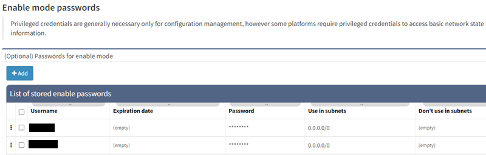

# 02 - Enable mode passwords

## Enabled Mode Passwords

Those credentials are stored in ***Settings → Authentication***.

Privileged credentials are generally only necessary for configuration
management. However, some platforms require privileged credentials to
access basic network state information, such as MST spanning-tree state
or 802.1X session information.

If enable mode is configured with no password and is needed for
discovery, **any enabled password information needs to be set!**
Otherwise, IP Fabric **won’t even try the enable command**.

Please **be careful** to configure enable password only for devices
(subnets) that **need the enable command to be included**.  
We encountered some problems with Cisco ISE. When an incorrect enable
password was entered, the user account was locked and IP Fabric wasn't
able to finish the discovery for those devices.

## Attachments:

[image-20210401-072201.png](attachments/2390032390/2390425605.png)
(image/png)  

[image-20210513-104245.png](attachments/2390032390/2390327305.png)
(image/png)  

