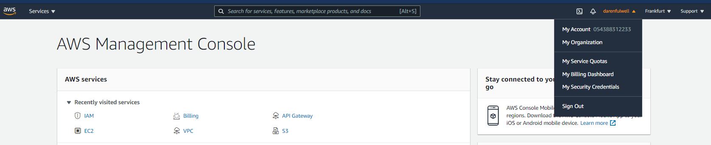
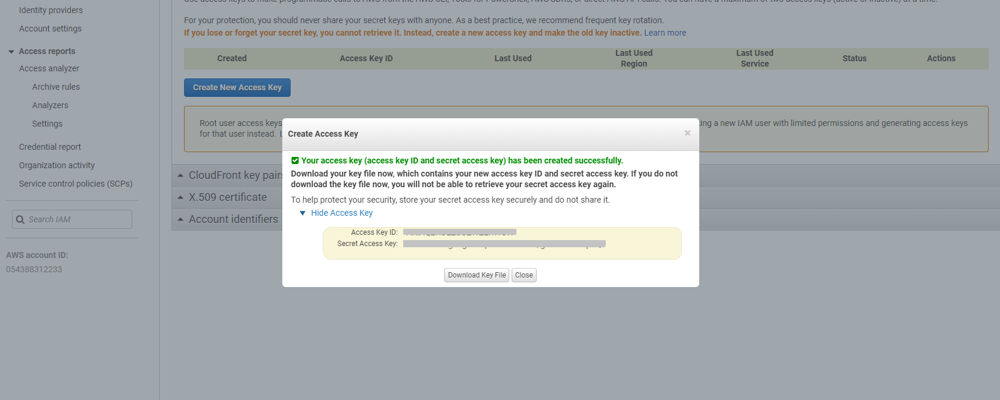

# 07 - Vendors API

## Cisco Meraki

Starting the version 3.5.0, IP Fabric supports API based discovery for
Cisco Meraki.

Meraki requires the following settings to be applied:

-   API key - Generated in [Meraki
    dashboard](https://documentation.meraki.com/zGeneral_Administration/Other_Topics/The_Cisco_Meraki_Dashboard_API)

-   Organizations ID - You can specify which organization will be
    included in the discovery process. If you do not specify, all
    available IDs will be used

-   Version - Meraki currently provides only a v0 version of their API.
    This version has a lot of limitations ([Meraki known
    issues](https://ipfabric.atlassian.net/wiki/spaces/ND/pages/968032257/Meraki))

-   Base URL - URL is supported in the following
    format [https://nXYZ.meraki.com/api.](https://nXYZ.meraki.com/api) Be
    aware that the dashboard can redirect communication to a different
    URL

## Check Point

We use API only to collect information that cannot be retrieved from CLI
logs.

To discover CheckPoint devices, CLI access also needs to be available.

Checkpoint requires the following settings to be applied:

-   API Key - Available in version R80.40 and above (API v1.6). To
    generate the key, use CheckPoint SmartConsole, and select "API Key"
    as user's Authentication method  
    **or**

-   Username - Username to access API data

-   Password - Password to access API data  

-   Base URL - Base URL for API calls
    (ie: [https://management.server.domain.tld).](https://management.server.domain.tld) If
    the API isn't available on the default port 443, add a port part to
    the URL (ie: <https://server:4443/>)

-   Collect following domains - Mandatory only if the "Base URL" points
    to a Multi-Domain Server. Please verify, that all selected domains
    can be accessed by the provided credentials.  

Don't forget to add IPF appliance to the list of allowed clients. In
SmartConsole, go to Manage & Settings \> Blades and click on "Advanced
Settings..." in the “Management API“ section to verify, from where are
API calls allowed. In case that you use setting "All IP addresses that
can be used for GUI clients", don't forget to add IPF appliance address
to Manage & Settings \> Permissions & Administrators \> Trusted Clients.
In case you use Multi-Domain server, all necessary settings are in Multi
Domain menu (ie: Multi Domain \> Blades)

## Versa Networks SD-WAN

Starting version 3.8.0 IP Fabric supports Versa SD-WAN API. API is based
on HTTPS authentication. Versa requires the following settings to be
applied:

-   Username - Username to Versa Director to access API data

-   Password - Password to Versa Director access API data

-   Base URL - Base URL of Versa Director. If the API isn't available on
    the default port 9182, add a port part to the URL (ie:
    <https://server:4443/>)

OAuth authentication credentials to Versa Director are not supported at
the moment to access API  

# AWS (Amazon Web Services)

Starting version 3.8.0 IP Fabric supports AWS API.

To add AWS to the discovery you will need an access key & secret access
key from your AWS account.

Those keys can be found/generated under your account in the AWS
dashboard.

Click on “My Security Credentials” and open “Access keys” tab.

To generate keys click on “Create New Access Key” and your keys will be
generated. These access keys are available globally for all of yours AWS
regions.

Copy those keys to the AWS API settings in your IP Fabric and don't
forget to **fill the region where the devices which you want to discover
are**.

To ensure that IP Fabric can retrieve all the required data to model the
AWS networks, a series of specific policies are required to be applied
to the user account or role used for the API key. The attached file
contains a JSON description of the required IAM policies:

# AWS AssumeRole

From version 4.3, IP Fabric enables you to add AssumeRole to AWS API
configuration. AssumeRole basically sets higher permissions that may be
required for the discovery process in some environments.

AssumeRole is a standard way how to obtain additional rights when
talking to AWS API. It returns a set of temporary security credentials
that you can use to access AWS resources that you might not normally
have access to. These temporary credentials consist of an access key ID,
a secret access key, and a security token. Typically, you use
`AssumeRole` within your account or for cross-account access. For more
information about AssumeRole see
<https://docs.aws.amazon.com/STS/latest/APIReference/API_AssumeRole.html>

## Cisco Viptela SD-WAN

Starting version 4.1.0 IP Fabric supports Viptela API.

Viptela devices are discovered only through API.

To add Viptela to discovery global settings, go to **Settings → Advanced
→ Vendors API** and press **the +Add** button

Afterward, choose Viptela API from the list and fill in

-   **Username and password** used to log in to vManage

-   **Base URL** of vManage server (https://vmanage-ip-address)

  

## VMware NSX-T

Starting version 4.3 IP Fabric supports NSX-T API.

NSX-T devices are discovered only through API.

To add NSX-T to discovery global settings, go to **Settings → Advanced →
Vendors API** and press **the +Add** button

Afterward, choose NSX-T API from the list and fill in

-   **Username and password** used to log in to NSX Manager

-   **Base URL** of NSX Manager server
    ([https://nsx-manager-ip-address](https://vmanage-ip-address))

#### General support information

-   IP Fabric is supporting NSX-T from version 3.0 and higher,
    development was done on version 3.1.2, the latest version is 3.2. We
    are not supporting the 2.x version, there are a lot of differences,
    Vmware’s end of general support was in September 2021.
    <https://lifecycle.vmware.com/#/>

-   NSX-T running as on-premise (there are also cloud versions for AWS
    and Azure, where can NSX-T cloud be deployed on top of AWS/Azure
    infrastructure ), but we don’t support it now

-   We don’t collect any data from vCenter, as NSX-T is multiplatform
    and supports KVM and bare metal servers as well, if those are
    connected to the NSX-T cloud, we will collect information about
    those also.

#### We are supporting those types of devices

-   Tier-0 router

-   Tier-1 router

    -   also supporting VRFs

#### Not supported features

-   Load balancing

-   All security features (IPS/IDS, Distributed FW, Gateway FW, Network
    introspection) - planned to add security features in upcoming
    releases

-   Forwarding policies - planned to add in upcoming releases

-   VPN services

-   NAT

-   EVPN Vxlans

#### External connectivity

We are supporting both external connectivity protocols, which are
implemented in NSX-T, and of course static routes. External connectivity
can be done only on Tier-0 routers.

-   OSPF

-   BGP

# Silver Peak SD-WAN

Starting version 4.3 IP Fabric supports the discovery of Silver Peak
(Aruba) EdgeConnect devices in router mode.

EdgeConnect devices are discovered only through API.

To add EdgeConnect to discovery global settings, go to **Settings →
Advanced → Vendors API** and press **the +Add** button

Afterward, choose Silver Peak from the list and fill in

-   **Username and password** to log in to Unity Orchestrator

if a user has just RO rights, ARP table will NOT be downloaded - this is
not supported by the orchestrator’s API

-   **Base URL** of Unity Orchestrator (https://unity-orchestrator-ip)

# Azure Networking

Starting version 4.3 IP Fabric supports the discovery of the Azure Cloud
infrastructure.

Azure devices are discovered only through API.

To add Azure devices to discovery global settings, go to **Settings →
Advanced → Vendors API** and press **the +Add** button

To discover Azure devices, a subscription ID, tenant ID, client
(application) ID, and client secret are needed.

The IP Fabric covers the IaaS (Infrastructure as a Service) part of the
cloud. Azure Cloud Compute provides an abstract view of the Azure
physical infrastructure.

**Following Azure elements are supported:**

-   Virtual Network
    (<https://docs.microsoft.com/en-us/azure/virtual-network/virtual-networks-overview>)

-   NAT Gateway
    (<https://docs.microsoft.com/en-us/azure/virtual-network/nat-gateway/nat-gateway-resource>)

-   Virtual Network Gateway (both types: VPN
    <https://docs.microsoft.com/en-us/azure/vpn-gateway/> and
    ExpressRoute
    <https://docs.microsoft.com/en-us/azure/expressroute/expressroute-about-virtual-network-gateways>)

and devices related to a Virtual WAN solution
(<https://docs.microsoft.com/en-us/azure/virtual-wan/virtual-wan-about>):

-   Virtual HUB

-   VPN Gateway (the same functionality as VNGw type VPN)

-   ExpressRoute Gateway (the same functionality as VNGw type
    ExpressRoute)

The plan is to add support of Load Balancer
(<https://docs.microsoft.com/en-us/azure/load-balancer/load-balancer-overview>
) in one of next releases.

## Attachments:

[image-20210513-232501.png](attachments/2393342021/2393342031.png)
(image/png)  

