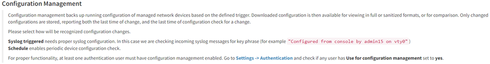

# 08 - Configuration Management

# Configuration Management Setup

There are two ways to detect configuration changes:

## Syslog triggered

IP Fabric checks incoming syslog messages for key phrase (for example
"*Configured from console by admin15 on vty0.*"). This option needs
proper syslog configuration on the device side.

***Syslog*** server listens on port 514/UDP and there is no additional
configuration on the IP Fabric side needed. You can send syslog directly
from network devices ([example for Cisco
IOS](https://community.cisco.com/t5/network-architecture-documents/how-to-configure-logging-in-cisco-ios/tac-p/3132436))
or using syslog forwarder ([example for
syslog-ng](https://support.symantec.com/en_US/article.TECH92854.html)).

**Notes:**

-   The receiving port 514 cannot be modified.

-   The Syslog messages are filtered and are stored in RabbitMQ database
    apart from the main DB and cannot be observed in IP Fabric's GUI

To enable the syslog triggered configuration management go
to ***Settings → Advanced → Configuration Management → Configuration
Management Setup***** **and select ***Syslogtrigger***.

## Schedule

Configuration change is checked at regular intervals as configured by
user.

Schedule can be enabled and configured at ***Settings →
Advanced → Configuration Management → Configuration Management
Setup***** **and select ***Schedule***.

Here is an example for scheduling a check every day at 5:00; 5:30;
10:00; 10:30; 15:00; 15:30; 20:00; 20:30.

Multiple values from the lists can be selected by holding CTRL or SHIFT
key.

## Attachments:

[image-20210513-232715.png](attachments/2393342038/2393342045.png)
(image/png)  

[image-20210513-232726.png](attachments/2393342038/2393505800.png)
(image/png)  

