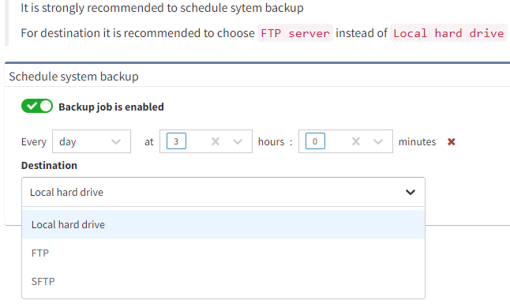
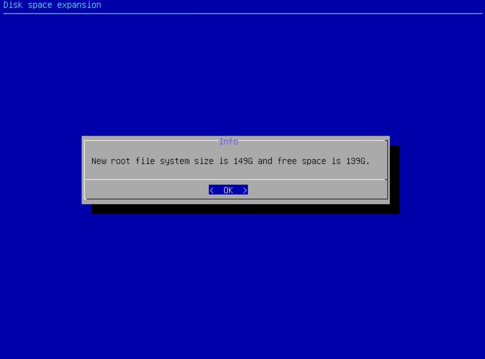
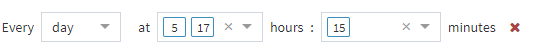

# 09 - Schedule System Backup

## Schedule System Backup

# Backup

Use IP Fabric backup to protect your important data.

There are two types of backup:

-   Local backup

-   Remote backup (FTP, sFTP)

**Security tip**  
Backups are encrypted with *osadmin *user password configured during
the [first boot
wizard](https://ipfabric.atlassian.net/wiki/spaces/ND/pages/78872592).
When you lose *osadmin *user password, backups are also lost!

## Local backup

Local backup saves database, user and system files locally on a
dedicated backup volume. It's highly recommended placing backup volume
on different datastore ideally on different physical storage.

**Backup Disk**  
The backup disk is not present by default! Please add a new virtual disk
to enable local backups. (See steps below)

### Adding a new virtual disk to your IP Fabric VM as a local backup disk

1.  Open your VM platform.

2.  Go to IP Fabric VM settings and add *New* *Hard Disk*

3.  Select size of a new disk

4.  Specify the type of a new disk (for the backup volume it is
    recommended to select a virtual disk on a different datastore
    ideally on different physical storage)  

    

5.  Finish configuration wizard.

6.  Launch Remote (Web) Console.

7.  [Reboot](https://ipfabric.atlassian.net/wiki/spaces/ND/pages/79036518/Service+Interfaces) (*Send
    Ctrl+Alt+Delete *function can be also used) or power on IP Fabric
    VM.

8.  During system boot, a *Disk space expansion* wizard appears.  

    

9.  Select *Yes* to start disk space expansion.

10. Expand the new volume as a backup (Backup is used only for local
    backups).

11. Selected volume is extended.  

    

12. Enter *OK*

## Automatic Local Backups

To schedule automatic local backups do the following steps:

1.  Add dedicated backup volume if not available - see steps above.

2.  Login to the user interface.

3.  Go to ***Settings → Advanced → System → Schedule system backup**.*

4.  Change ***Destination*** to ***Local hard drive***.

5.  Set a backup schedule. See example for "Every day at 3:00".

6.  Enable backup

## Remote backup

Remote backup saves database, user and system files remotely using FTP
or sFTP protocol.

This is a recommended type of backup.

A directory **has to be specified** for FTP and SFTP backups

To set up remote backup do the following steps:

1.  Login to the user interface.

2.  Go to ***Settings → Advanced → System → Schedule system backup**.*

3.  Enable backup

4.  Change ***Destination*** to ***FTP*** or ***SFTP**.*

5.  Set a backup schedule. See example for "Every day at 5:15 and 17:15
    (for setting more options, please, hold SHIFT during selection)".  
    

6.  Change ***Destination*** to ***FTP*** or ***SFTP**.*

7.  Enter remote FTP/SFTP ***Server*** FQDN or IP address. Make sure
    that your DNS client is configured and working properly in case of
    FQDN.

8.  Enter ***Username*** to access FTP/SFTP server.

9.  Enter ***Password*** to access FTP/SFTP server.

10. Specify a ***Directory*** where FTP/SFTP backup should be uploaded.

11. Click ***Save ***(The IP Fabric platform will immediately test the
    connection)

12. IP Fabric tries to reach FTP/SFTP server with configured parameters.

FTP/SFTP user needs read, write, list and delete permissions.

From version 4.1.1 onward we do not check validity of SSL certificates
during FTP backups.

## Trigger a backup manually (on-demand)

Both types of backup can be also triggered manually on demand. This is
useful for example before a system upgrade.

Manual backup can be triggered from IP Fabric Administrative interface:

1.  Login to admin interface (for
    example [https://ipfabric.example.com:8443)](https://nimpee.example.com:8443))

2.  Go to ***Restore or Backup***

3.  Select ***Backup*** from ***Do you wish to proceed with a backup or
    restore?*** drop-down menu.

4.  For local backup select ***Local hard drive*** from the ***Backup
    files destination***.

5.  For remote backup select ***FTP*** or ***SFTP ***from the ***Backup
    files destination***.

    1.  Enter remote FTP/SFTP ***Server*** FQDN or IP address. Make sure
        that your DNS client is configured and working properly in the
        case of FQDN.

    2.  Enter ***Username*** to access FTP/SFTP server.

    3.  Enter ***Password*** to access FTP/SFTP server.

    4.  Specify a **Directory** where FTP/SFTP backup should be
        uploaded.

6.  Click ***Next***

## Attachments:

[image-20210514-105651.png](attachments/2396585999/2396454934.png)
(image/png)  

[image-20210514-105813.png](attachments/2396585999/2396454941.png)
(image/png)  

