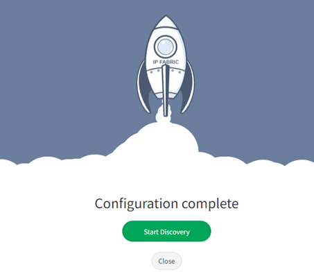

# 11 - Configuration Complete

## Configuration Complete

Congratulations! You have finished configuring IP Fabric, you can now
start the **Discovery**.

## Attachments:

[image-20210514-110749.png](attachments/2396389388/2396553264.png)
(image/png)  

