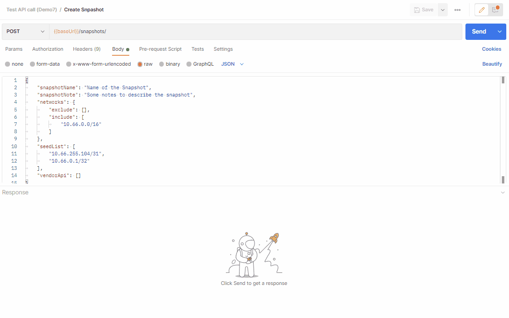

# API Tech Note - Create new snapshots via API

This post is intended to explain how to create a new snapshot using the
API. You may want to create the new snapshot with the existing settings,
or with a different set of settings, if you wanted to have a reduced
scope for example.

## API Endpoints

-   [https://host.domain/api/v1/snapshots](https://host.domain/api/v1/graphs/svg) -
    POST to create a new snapshot

-   [https://host.domain/api/v1/settings](https://host.domain/api/v1/graphs) -
    GET to collect all IP Fabric settings

## Create a new snapshot with the existing settings

If you want to start a discovery, using the existing settings, it is a
simple POST request to
[https://host.domain/api/v1/snapshots](https://host.domain/api/v1/graphs/svg),
without a body.

[Information regarding the Header /
Authentication](https://ipfabric.atlassian.net/wiki/spaces/ND/pages/2785640457/API+Tech+Note+-+IP+Fabric+4.x+Unicast+Path+Lookup#POST-Request)
has already been mentioned in another article. Please refer to this if
needed.


## Create a new snapshot with different settings than the default ones

What if you wanted a snapshot for a smaller scope of your network. For
this, you can use the API to start a new discovery, with some specific
settings used for a specific discovery.

Here is an example of a body to use to perform a discovery with a new
scope (“networks”), new seed devices (“seedList”) and not taking into
account the Vendor API (Checkpoint, Meraki, AWS…) that you may have
configured in your settings. All fields are optional, if not specified,
the value from your settings will be used:

<div class="code panel pdl" style="border-width: 1px;">

<div class="codeContent panelContent pdl">

``` jscript
{
    "snapshotName": "Name of the Snapshot",
    "snapshotNote": "Some notes to describe the snapshot",
    "networks": {
        "exclude": [],
        "include": [
            "10.66.0.0/16"
        ]
    },
    "seedList": [
        "10.66.255.104/31",
        "10.66.0.1/32"
    ],
    "vendorApi": []
}
```

</div>

</div>

Let’s see how it looks when using Postman:



## What settings can I use when creating a new snapshot?

There is a long list of what you can use in the request body to change
the settings for this new discovery. The example above is probably
enough for some use cases. If you wanted to change different settings,
you can collect the settings of your IP Fabric’s instance via a GET on
the endpoint
[https://host.domain/api/v1/settings](https://host.domain/api/v1/graphs)

The response will look like this *(this is just an extract of the
JSON):*

<div class="code panel pdl" style="border-width: 1px;">

<div class="codeContent panelContent pdl">

``` jscript
{
    "fullBgpLimit": {
        "enabled": true,
        "threshold": 500000
    },
    "networks": {
        "exclude": [],
        "include": [
            "10.66.0.0/16"
        ]
    },
    "resolveNames": {
        "discoveryDevices": true
    },
    "scanner": {
        "enabled": false
    },
    "traceroute": {
        "scope": [
            "10.0.0.0/8",
            "100.64.0.0/10",
            "169.254.0.0/16",
            "172.16.0.0/12",
            "192.168.0.0/16"
        ],
        "protocol": "icmp",
        "port": null
    },
    "limitDiscoveryTasks": {
        "alreadyDiscovered": false,
        "sourceOfTasks": [
            "arp",
            "routes",
            "trace",
            "xdp"
        ]
    },
    "allowTelnet": true,
    "timeouts": {
        "login": 20,
        "session": 20
    },
    "cliSessionsLimit": {
        "enabled": false
    },
    "cliRetryLimit": {
        "default": 3,
        "authFail": 0,
        "tacacs": {
            "retry": 0,
            "delay": 1000
        }
    },
    "seedList": [
        "10.66.255.104/31",
        "10.0.0.1/32"
    ],
    [...]
```

</div>

</div>

Most fields can be entered in the body of the request to change the
settings when performing a new discovery.

<div class="panel"
style="background-color: #EAE6FF;border-color: #998DD9;border-width: 1px;">

<div class="panelContent" style="background-color: #EAE6FF;">

This won’t affect the settings for the next scheduled discovery.

</div>

</div>

<div class="pageSectionHeader">

## Attachments:

</div>

<div class="greybox" align="left">


[20220113-1253-scrtogif-20220113-125342.gif](attachments/2858713089/2859073544.gif)
(image/gif)  

[20220113-1624-scrtogif.gif](attachments/2858713089/2858352675.gif)
(image/gif)  

[20220113-1923-scrtogif.gif](attachments/2858713089/2860843009.gif)
(image/gif)  

</div>
