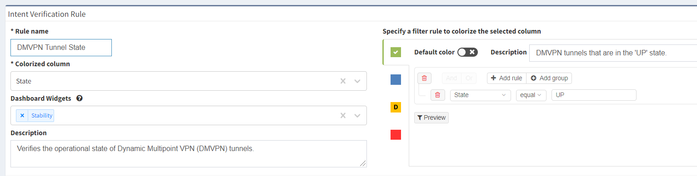

# API Tech Note - Intent Verification Rules

This tech note describes the association between the intent verification
rules and the technology tables and how to read those associations
through the API.

The results of the intent verification checks are identified as
“reports” in the API and are essentially a series of rules by which
columns in the technology tables are coloured.

## Instructions

In order to handle the intent verification checks to be able to act on
them then, there are a series of steps.:

First step is to fetch a list of the reports from the snapshot you’re
interested in. This is a simple GET request to
`/api/v1/reports?snapshot=<id>` where \<id> is ‘$last’ or a valid
snapshot id. The JSON dictionary returned is a list of reports created
in the snapshot, with information about:

-   the table they relate to

-   the columns coloured by the test

-   the conditions for each colour

-   the values used to mark the columns

For example, take this report for DMVPN status:

<div class="code panel pdl" style="border-width: 1px;">

<div class="codeContent panelContent pdl">

``` jscript
    {
        "groups": [
            {
                "id": "318508186",
                "custom": false,
                "name": "Stability"
            }
        ],
        "apiEndpoint": "/v1/tables/security/dmvpn",
        "checks": {
            "0": {
                "and": [
                    {
                        "state": [
                            "eq",
                            "UP"
                        ]
                    }
                ]
            }
        },
        "column": "state",
        "custom": false,
        "defaultColor": 20,
        "descriptions": {
            "checks": {
                "0": "DMVPN tunnels that are in the 'UP' state.",
                "10": "",
                "20": "DMVPN tunnels that are in other than the 'UP' state.",
                "30": ""
            },
            "general": "Verifies the operational state of Dynamic Multipoint VPN (DMVPN) tunnels.\n"
        },
        "name": "DMVPN Tunnel State",
        "webEndpoint": "/technology/security/dmvpn",
        "id": "322178616",
        "status": -1,
        "result": {}
    }
```

</div>

</div>

Breaking this down, we can see that the report

-   is called “DMVPN Tunnel State”

-   is presented in the “Stability” group on the dashboard

-   relates to the technology table accessed through the API endpoint
    `/api/v1/tables/security/dmvpn` or the web UI endpoint
    `/technology/security/dmvpn`

-   sets the colour of the “state” column in that table

-   sets the colour to a value of 0 (which maps to green) if the tunnels
    are in the “up” state, signified by the content of the “state”
    column having the value “UP”, otherwise resorting the default of 20
    (which maps to amber) if the tunnels are in any other state.

We can compare that with the Web UI dialogue for the same check:



So once we have found the report we are looking for, we retrieve the
technology table from the “apiEndpoint” field in the report dictionary,
filtered for the colour that matches the condition we’re interested in
from the validation check. From our above example then, to retrieve the
DMVPN tunnels that are in an “UP” state, we make a POST request to
`/api/v1/tables/security/dmvpn`with the following request payload:

<div class="code panel pdl" style="border-width: 1px;">

<div class="codeContent panelContent pdl">

``` jscript
{
  "columns":["id","sn","hostname","siteKey","siteName","peerNbma","peerTunnel","state","time","attrb"],
  "filters":{"state":["color","eq","0"]},
  "snapshot":"$last",
  "reports":"/technology/security/dmvpn"
}
```

</div>

</div>

This will retrieve a dictionary with the data from the columns listed in
the technology table from the last snapshot, filtered on the value of
the “state” column equalling 0 - which equates to the colour green from
the validation check.

<div>

<div>

Note that snapshot management is referred to in a separate article - the
‘$last’ snapshot may not be the best to query on in all cases.

</div>

</div>

<div class="pageSectionHeader">

## Attachments:

</div>

<div class="greybox" align="left">


[image-20200818-210549.png](attachments/1430487048/1430618134.png)
(image/png)  

</div>
