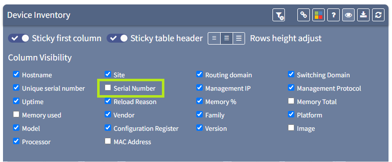
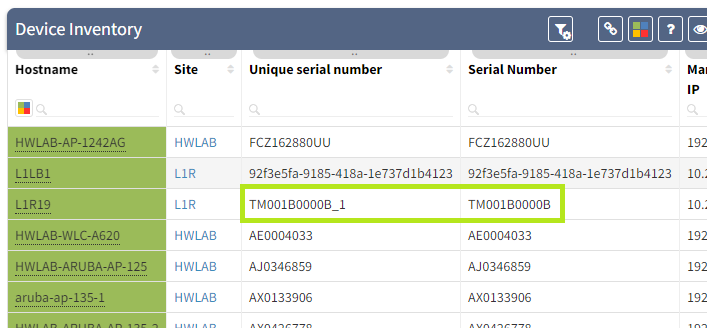

# API Tech Note - Serial numbers

IP Fabric uses the serial number field as a key in its tables for a
device. In some cases, the same serial number may be required to be used
for multiple elements - for example, clusters, stacks or virtualised
platforms) and so the serial number is manipulated in some way -
anything from a virtual context name to a simple “\_1” might be added
for example.

This makes it potentially more difficult to match the serial number with
other platforms outside IP Fabric.

We have added a new column to the device inventory table in v3.7.0, and
renamed the previous one to allow us to work around this issue. For
example - this is now the default view:


Showing the “Unique serial number” column which has been renamed. This
has now been augmented with a new “serial number” column which is the
serial number from the captured state of the device itself:



Note when that is enabled, the difference between the two columns:



The “Serial number” column is the one that will match other external
captures of the serial number in other platforms. In the API, these
columns are defined in the request body as:

<div class="code panel pdl" style="border-width: 1px;">

<div class="codeContent panelContent pdl">

``` jscript
{
  "columns": ["sn","snHw"]
}
```

</div>

</div>

where sn is the “Unique Serial Number” field and snHw is the “Serial
Number” field.

<div class="pageSectionHeader">

## Attachments:

</div>

<div class="greybox" align="left">


[image-20201113-174128.png](attachments/1658978305/1659469829.png)
(image/png)  

[image-20201113-174555.png](attachments/1658978305/1659502595.png)
(image/png)  

[image-20201113-174821.png](attachments/1658978305/1658781714.png)
(image/png)  

[image-20201113-174928.png](attachments/1658978305/1658781720.png)
(image/png)  

[image-20201113-175124.png](attachments/1658978305/1658781726.png)
(image/png)  

</div>
