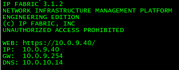

# Command Line Interface

## Command Line Interface

The command-line interface is a secondary service interface in IP Fabric
VM which serves troubleshooting and testing purposes. For example, for
testing authentication credentials from the specific IP address of IP
Fabric VM, in case of address-restricted access. The CLI interface is
the main tool in servicing the system by the support teams.

A first boot wizard can be used to change system settings, such as IP
addressing parameters, domain names, NTP, system proxy settings, or a
user's password. To launch First Boot Wizard again, connect via SSH to
IP Fabric as ***osadmin*** user, launch ipfabric-net-wizard and then
reboot the system.

Command-line also allows the use of the standard networking tools, such
as telnet, ssh, traceroute or ping.

## Troubleshooting VM network problems using IP Fabric CLI

In the event of a VM network connection problem, DNS issues, network
devices connectivity issue, IP Fabric CLI is a useful helper.

CLI can be also used to access system and application logs as well as
snapshot files.

### System and application logs

System and application logs are placed in ***/var/log*** folder.
Specifically IP Fabric application logs can be found in
***/var/log/nimpee***.

### Snapshots

Snapshots are available in ***osadmin*** home directory
***/home/osadmin/snapshots***. Each folder inside represents one
snapshot. Even if snapshots can be copied manually using SCP or SFTP
it's strongly recommended to use the export feature in web UI.

### Checking the network interface settings

When you log in through a VM console or SSH, network settings are
displayed.

<div>

<div>

This content is static, generated when VM boots! When DHCP is used, an
IP address can change in some cases.

</div>

</div>



To display actual IP address use command:

<div class="code panel pdl" style="border-width: 1px;">

<div class="codeContent panelContent pdl">

``` bash
ip addr show
```

</div>

</div>

Default gateway and other routes (if configured) can be check as
follows:

<div class="code panel pdl" style="border-width: 1px;">

<div class="codeContent panelContent pdl">

``` bash
ip r
```

</div>

</div>

### Checking DNS

DNS can be checked using the ***dig*** or ***nslookup*** command.

For example, let's check A record and PTR (reverse) record of some
device using ***dig***.

For A record check ***ANSWER*** which contains requested IP address.
Also ***SERVER*** section below is important as it tell us what DNS
server answered our DNS query.


For PTR record check ***ANSWER*** which contains requested domain name.


If you prefer ***nslookup*** you can achieve the same results.


### Testing connectivity to a network device

The very basic test is ***ping*** or ***traceroute***.

<div>

<div>

### ICMP

Please bear in mind that ICMP packets used by ***ping*** and
***traceroute*** can be blocked by ACL or firewall. It does not mean
that a device cannot be reached using SSH or telnet.

</div>

</div>

To make sure that the network device is available from IP Fabric VM, you
can use the ***telnet*** and ***ssh*** client from the command line.

For SSH use:

<div class="code panel pdl" style="border-width: 1px;">

<div class="codeContent panelContent pdl">

``` bash
ssh userName@device-IP-or-Hostname
```

</div>

</div>

For telnet use:

<div class="code panel pdl" style="border-width: 1px;">

<div class="codeContent panelContent pdl">

``` bash
telnet device-IP-or-Hostname
```

</div>

</div>

### Reboot and shutdown

IP Fabric VM can be also rebooted or shutdown using CLI.

For VM reboot just use ***reboot*** command without any parameters.

For VM shutdown use ***shutdown*** command without any parameters.

  
