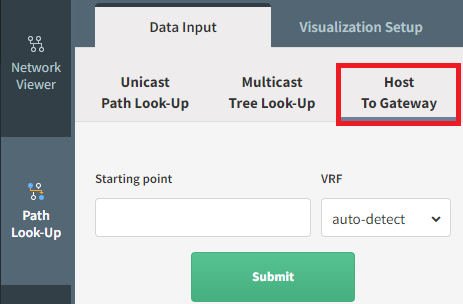

# Diagrams (from v4.0)

# Overview

Diagrams help to visualize the network state information.

We had to change how the diagrams work to bring more functionalities
soon. One of the key changes in the processing of the diagrams is done
in the backend, which means you will be able to collect diagram
information via the API, where it wasn't possible before.

## Diagram Types

### Network

By default, when you click on Network, all networks are displayed and
the relationships between them. They are grouped into sites represented
by a cloud for better visibility. You can double-click on a cloud to
explore further that specific site.

Check this page
<https://ipfabric.atlassian.net/wiki/pages/resumedraft.action?draftId=2491121666>,
for more details on using the diagrams.

### Sites Diagrams

Site diagrams display all devices discovered per site. Sites are
automatically calculated based on the administrative domain boundaries,
such as carrier networks and unmanaged infrastructure. Site boundary
calculation can be [configured in settings](Site_Separation).

The site name can be changed. To rename a site, go to ***Inventory →***
**Sites**, choose the site you would like to rename, click ***Rename
site***, enter a new name, and click ***Rename***.

Check this page
<https://ipfabric.atlassian.net/wiki/pages/resumedraft.action?draftId=2491121666>,
for more details on using the diagrams.

### Routing

Routing diagrams display contiguously, directly interconnected routers
to form a routing domain.

### Switching

Switching diagrams displays individual spanning-tree instances or a
composite switching domain. A unique Root ID identifies spanning-tree
instances. The switching Domain is composed of contiguously connected
spanning-tree instances, representing the maximum possible fault
propagation in a Layer 2 failure domain.

### End to End path

End to End path diagram displays a complete path between any two network
endpoints or networks. Only the actual network path is displayed, and
missing parts denote unavailable network information necessary for
completing the routing process.

The End to end path can be found in ***Diagrams → End to end path*** or
on any diagram using the “Path Look-Up” menu on the left (see picture
below)

Check this page for more details [How to use Path Look-Up (from
v4.0)](How_to_use_Path_Look-Up)

### Host to Gateway path

The host to Gateway path diagram displays the Layer 2 path from every
identified endpoint in the network to its active gateway router.

The Host to Gateway path can be found in ***Diagrams → Host to gateway
path*** or any diagram using the “Path Look-Up” menu on the left and
selecting “Host To Gateway”(see picture below)

Check this page for more details [How to use Path Look-Up (from
v4.0)](How_to_use_Path_Look-Up)

# Network Viewer

When you go to the page ***Diagrams → Network*****,** all networks are
displayed and the relationships between them. They are grouped into
sites represented by a cloud for better visibility. You can double-click
on a cloud to explore further that specific site.

Top-level view with all network:

### **Adding networks to the view**

To display the required information, select on the left side the site
you want to visualize and click on ***Submit***.

One or more sites can be displayed at a time.

For example, to see a diagram of particular sites called *66 Ostrava DC*
and *47 Brno Warehouse*:

1.  Select ***Site name** *from ***Group Devices by*** drop-down menu

2.  Select the site names

3.  Click ***Submit***

### **Removing** **networks**

In a very similar way as to add a site/network to a diagram, to hide it,
just unselect the network and ***Submit.***

### **Manipulating objects and nodes**

Diagrams are generated automatically, and the following supported
operations can change their layout:

-   *Pinch to zoom: touch & desktop (if supported by the trackpad)*

-   Mouse wheel to zoom: desktop

-   Two-finger trackpad up or down to zoom: desktop

-   Tap to select: touch & desktop

-   Tap background to deselect: desktop

-   Multiple selections via modifier key (shift, command, control,
    alt) + tap: desktop

-   Box selection: touch (three-finger swipe) & desktop (modifier key +
    mouse down then drag)

-   Grab and drag nodes: touch & desktop

The ***Center View*** button can also center the screen view.

### **Hide/Collapse Items in the view**

After selecting a set of devices, or cloud, if you do a right-click, you
have the option to collapse the selected items into a new cloud, or hide
them:

### **Save User-defined**

After editing the layout, you will see the green box, this allows you to
save the changes as the default view. Click on the green box, this will
open a menu ***Select Diagram Layout Settings*** and the last entry is
the ***User-Defined Layout**. B*y clicking on the floppy disk icon you
will update the default view (see below).

### **Use User-defined layout as the default layout**

Once you have created a user-defined layout, you probably want to use
this as the default layout. For this, click on the icon of the site you
want to update, then select the User-Defined layout and click **Save**

From now on, this will be the default layout for this site:

### **Choose a specific layout for a selection of devices**

You can now specify which layout you want to use for a set of devices:

### **Choose a layout to apply for the whole site**

Similarly, you can select a layout for the whole site, using the layout
selection.

-   Circular Layout can be used only for 500 nodes or less.

## **Save, load, and share view**

Each object can have multiple views that can be saved and loaded again
later.

#### **Save view**

Click the floppy icon on the menu on the right end side:

Enter a name for that view and click save.

The view saved in this way is not the default view for that object.

#### **Load view**

The view can be loaded by clicking the folder icon.

Select the desired view and click to load.

#### **Share view**

By clicking here, an URL will be displayed, which you can share with
other users, and they will be able to see this view.

### **Export current view to SVG/PNG**

The view can be exported in the form of a SVG or PNG image by clicking
on ***Export ***and selecting the format you want

The SVG file can be imported into a Visio diagram, or on other drawing
application

### **Search**

Search looks up any text currently present on the diagram. Typing query
filters the view and clicking on the search button focuses and zooms in
on the item.

If you hover your mouse on one entry, you will see the device on the
diagram:

## **Protocols**

The user can filter connection protocols between devices of the second
and third layer of ISO OSI by using filters in the ***Network Viewer /
Visualization Setup / Protocols ***menu.

You can decide which layer/protocol you want to display/hide and
group/ungroup

#### **Default Protocols View**

By default, all discovered protocols will be grouped based on the layer
they belong to. This is the “**System**” view. You can edit this, which
means you are able to ungroup certain protocols. For this click on the
Settings icon:

Drag and drop protocols you want to put to a custom group to the “Other
Protocols”, click on Save as and give a name to the new protocol view.

With the example below, you are now able to hide only the DGW protocol,
without affecting the other Layer3 protocols:

**Link grouping**

Link grouping means that protocols of the specific layer are not shown
as separate lines but together as a single line.

#### **Layer grouping**

Layer Grouping collapses groups of devices according to the types of
links that connect these, either in Layer 2 or 3 groups. Devices
connected with different layer protocols can't be grouped together.

## **Devices**

You can select/un-select the type o devices you want to see on the
diagram.

### **Device information deep dive**

After right-clicking on the device, it is possible to display additional
information about it by selecting “show detail”:

# How to use Path Look-Up

## Unicast Path-Lookup

Enter the details:

-   Source IP / CIDR (it can be a network, but the total number of IPs
    has to be less than 255 including source and destination IPs.
    Subnets are also supported.)

-   Port (Source Port)

-   VRF (Virtual Routing and Forwarding Instance)

-   Destination IP / CIDR

-   Port (Destination Port)

-   Protocol: TCP/UDP/ICMP

-   Flags: None/ACK/FIN/SYN/RST/PSH/URG

If you’ve used a network instead of a single IP, you will have the
option between:

– **Network Mode**: simulation stats and ends with whole networks,
individual hosts are not considered

– **Host Mode**: simulation starts and ends with each host. It is
limited to 255 hosts, source and destination combined.

Then click on submit:

## Path Controls

## Understand the path selection

To understand the decision taken by a device, right-click on the device
and “show detail”. You will then be presented with the details. If you
have more than one interface where the flow can come from, you will need
to select the interface you want to look at. Similarly, if you have
several interfaces that can be used to forward the traffic, you will
have to choose one. Then in the middle of the table, you will see the
forwarding decision:

In this example, we are looking at the device L33R4, which has 2
incoming interfaces and one forwarding for this flow:

## Multicast Tree Look-Up

You want to understand how a certain multicast flow is used, you can use
the Multicast Tree Look-Up. For that, just select the correct option and
enter the relevant details

You will then see the Multicast Tree:

And you will have access to a lot of information regarding the Multicast
forwarding decision:

## Host To Gateway

To find out more details between a host and its network gateway, you can
use this menu: Host To Gateway. You only need to provide the host, and
you will the details:

## Visualization Setup

You can set up what you want to prioritize in the view. Just simply move
the bars up or down.

## **Intent Checks**

You can overlay the Intent Verification Rules on top of any diagrams.

**Intent Check** includes the Built-In checks (Single Points of Failure,
Non-Redundant Links) and the Custom Checks. The Custom Checks are all
the Verification Rules in IP Fabric: the default checks and the ones you
have created.

## Path Checks

Patch checks serve for checking of source and destination ports. Simply
add source and destination and a diagram will be displayed.

# Compare Snapshot

It can be very useful to have a quick look at the topology and observe
what has changed from one snapshot to another. To compare, you just need
to click on “Compare Snapshots” and select the snapshot you want to
compare your active snapshot with, and you will see the result.

In the example above, we notice that 3 devices have been removed in the
Demo day 4 Snapshot, and they were there in the Demo day 3 Snapshot.

## Attachments:

[2018-08-28 13_23_37-Sites - IP Fabric network infrastructure controller
- IPFabric.png](attachments/2548891682/2548891696.png) (image/png)  

[2018-08-28 09_41_20-IP Fabric network infrastructure controller -
IPFabric.png](attachments/2548891682/2548891699.png) (image/png)  

[2018-08-28 08_48_40-IP Fabric network infrastructure controller -
IPFabric.png](attachments/2548891682/2548891702.png) (image/png)  

[2018-08-28 08_41_18-IP Fabric network infrastructure controller -
IPFabric.png](attachments/2548891682/2548891705.png) (image/png)  

[2018-08-28 08_41_08-IP Fabric network infrastructure controller -
IPFabric.png](attachments/2548891682/2548891708.png) (image/png)  

[image-20210615-091856.png](attachments/2548891682/2550988801.png)
(image/png)  

[image-20210615-105431.png](attachments/2548891682/2550792202.png)
(image/png)  

[image-20210615-105901.png](attachments/2548891682/2550956067.png)
(image/png)  

