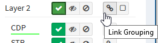
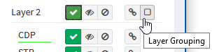

# Diagrams (up to 3.8.x)

## Overview

Diagrams help to visualize the network state information.

## Diagram Types

### Network

The network overview also referred to as “Walk”, shows sites connected
via the routing edge. An overview serves as a general representation of
all sites in the network and individual sites can be double-clicked for
more detail.

### Sites

Site diagrams display all devices discovered on the site. Sites are
automatically calculated based on the administrative domain boundaries,
such as carrier networks and other unmanaged infrastructure. Site
boundary calculation can be [configured in settings](Site_Separation).

The site name can be changed when ***Routing and switching domain***
site separation is used (see [Site separation settings](Site_Separation)
for more information). To rename a site go to ***Diagrams →***
**Sites**, choose the site you would like to rename, click ***Rename
site***, enter a new name and click ***Rename***.

### Routing

Routing diagrams display contiguously, directly interconnected routers
to form a routing domain.

### Switching

Switching diagrams displays individual spanning-tree instances or a
composite switching domain. Spanning tree instances are identified by a
unique Root ID. The switching Domain is composed of contiguously
connected spanning-tree instances, representing the maximum possible
fault propagation in a Layer 2 failure domain.

### End to End path

End to End path diagram displays a complete path between any two network
endpoints. The reverse-path forwarding check verifies the path's
viability. Only the actual network path is displayed, and missing parts
denote unavailable network information necessary for completing the
routing process.

The End to end path can be found in ***Diagrams → End to end path*** or
on any diagram using three dots (see picture below).

#### Using the End to End path lookup

Go to ***Diagrams → End to end path*** or open the lookup using three
dots on any diagram (see above). Enter ***Protocol***, optionally ***TCP
Flags***, ***Source*** address and port and ***Destination*** address
and port. Click ***Submit***. An End to End path is generated and shown.
This lookup will take into consideration if an ACL or firewall is in the
way.

  

### Host to Gateway path

Host to Gateway path diagram displays the Layer 2 path from every
identified endpoint in the network to its active gateway router.

The Host to Gateway path can be found in ***Diagrams → Host to gateway
path*** or on any diagram using three dots (see picture below).

#### Using Host to Gateway path lookup

Go to ***Diagrams → Host to gateway path ***or open it using three dots
on any diagram (see above). Enter end ***Host*** IP address and click
***Submit***. The end host must exist in the IP Fabric database.

  

## Working with diagrams

### Objects

Diagrams are composed of objects, nodes and the relationships between
them. If no object is added to the ***Objects*** menu then all objects
are displayed which is the default when the ***Diagrams → Network***
page is opened. If all objects are displayed, the objects are grouped
into smaller groups (clouds) for better visibility. You can double click
the object group to explore further.

Top-level view with all objects:

### Adding objects

To display the required information, select on the right side
***Objects → Add Objects → Object** **type*** and ***Object instance***.

One or more objects can be displayed at a time.

For example, to see a diagram of particular sites called L41 and L33:

1.  Select ***sites*** from ***Object type*** drop-down menu
2.  Select site name *L41* for ***Object instance***
3.  Click ***Add***
4.  Repeat steps 1-3 for site *L33*.

******

### Removing objects

Objects can be removed from the diagram by:

1.  using the **X** button for a specific object
2.  using the **X** button on the ***Remove Objects*** menu
3.  using the ***Remove All*** button to remove all objects from the
    diagram

### Manipulating objects and nodes

Diagrams are generated automatically, but the following supported
operations can change their layout:

-   Pinch to zoom: touch & desktop (if supported by the trackpad)
-   Mouse wheel to zoom: desktop
-   Two-finger trackpad up or down to zoom: desktop
-   Tap to select: touch & desktop
-   Tap background to deselect: desktop
-   Multiple selections via modifier key (shift, command, control,
    alt) + tap: desktop
-   Box selection: touch (three-finger swipe) & desktop (modifier key +
    mouse down then drag)
-   Grab and drag nodes: touch & desktop

The ***Center*** button can also center the screen view.

### Save default layout (view)

After editing the layout, you can save the changes as the default by
using the floppy disk icon at the top left corner of a particular object
(see below).

### Save and load view

Each object can have multiple views that can be saved and loaded again
later.

**Save view**

Click the floppy icon to save the view.

Enter a name for that view and click save.

The view saved in this way is not the default view for that object.
Please check *Save default layout* above.

**Load view**

The view can be loaded by clicking the folder icon.

Select the desired view and click to load (the white arrow down in the
green square).

### Export current view to PNG

The view can be exported in the form of a PNG image by clicking on
***...*** and selecting ***Export PNG***:

### Search

Search looks up any text currently present on the diagram. Typing query
filters the view and clicking on the search button focuses and zooms in
on the item.

### Filtering protocols

The user can filter connection protocols between devices of the second
and third layer of ISO OSI by using filters in the ***Protocols*** menu.

It is possible to use predefined filters or a filter according to your
own specific requirements. Predefined filters can be selected from the
drop-down menu.

Individual protocols can be ***show*** (show them on the diagram),
***fade*** (show them but without any description in grey) or ***hide***
(do not show them).

**Link grouping**

****

Link grouping means that protocols of the specific layer are not shown
as separate lines but together as a single line.

**Layer grouping**

Layer Grouping collapses groups of devices according to the types of
links that connect these, either in Layer 2 or 3 groups. Devices
connected with different layer protocols can't be grouped together.

**Ignore filters**

All filters can be turned off using **Ignore filters **checkbox.

### Device information deep dive

After clicking on the device, it is possible to obtain additional
information about it and the protocols used on this device.

### Additional display options

-   Display wired hosts - displays an aggregated view of wired end hosts
    connected to the network. End hosts can be expanded by clicking on
    the edge device hosts are connected to and then ***Expand wired
    hosts*** button.
-   Display access points - displays wireless access points.
    -   Display wireless hosts - adds wireless end hosts to access
        points view.
-   Display unmanaged neighbours - displays devices discovered using
    CDP/LLDP with a management IP address, but IP Fabric cannot login to
    them.
-   Show FEX - displays fabric extenders.
-   Show site edge - displays site edge and connection to the transit
    networks.
-   Hide boundary
-   Hide Interface Labels
-   Hide Protocol Labels
-   Show ACL & ZBF
-   Show QoS
-   Show FHRP
-   Show utilization - device average rate/site average rate. Min=0%,
    max=100%.
-   Nonredundant devices - highlights in red the devices whose failure
    will cause unavailability of part of the network.
-   Nonredundant links - highlights in red the links with no path
    redundancy.
-   MTU Check - checks if MTU is properly set on the end of both links.
-   Hub meshing - creates an aggregate hub for full and partial mesh
    topologies for improved viewing clarity.

------------------------------------------------------------------------

Practical examples:

[How to use IP Fabric - working with diagrams and technology
tables](https://ipfabric.atlassian.net/wiki/spaces/NK/pages/88014871/How+to+use+IP+Fabric+-+working+with+diagrams+and+technology+tables)

------------------------------------------------------------------------

# Site Separation

The site represents a separate collection of devices. A site can be a
branch, a factory, a production floor, a campus, or anything that might
represent a logical group for a user.

By default, the Site distribution is generated automatically after the
discovery process ends and is based on the rules described below. It can
also be triggered manually without the need for the whole discovery
process by going to ***Settings → Advanced → Discovery → Site
separation*** **<u>(</u>In global or Snapshot settings<u>)</u>**. 

## Routing and switching domain

With this setting, you can manually edit the distribution of sites
later. Sites can be also renamed.

By default, the site is comprised of the topology of all contiguously
interconnected protocols, and the boundary of a site is formed by the
network protocol relation that is not under management using the
provided authentication credentials. The default separation is useful
for MPLS networks where directly connected routing infrastructure at the
site’s edge is not accessible. For situations where an inaccessible
routed firewall is used at the site (i.e. device under different
management team), an option “***Firewall at site***” can be turned on so
the infrastructure before and behind the firewall is not separated into
two different sites.

For networks that have direct routing connectivity between sites, such
as DMVPN or Leased Lines (usually over Serial or MFR interfaces), an
option to separate the site using ***tunnel*** and/or
***serial** the *interface should be selected.

For configuration go to ***Settings → Advanced → Discovery → Site
separation***.

## RegEx based on hostname

Site distribution cannot be changed manually when regex rules are used.
Sites cannot be renamed.

Alternatively, site separation can follow a specific Regular Expression
(RegEx) where separation will be performed based on portion of a device
hostname.

Go to ***Settings → Advanced → Discovery → Site separation*** and change
***Site boundary calculation*** to ***RegEx based on hostname***.

**Transform hostname** is used to normalize site names based on
hostname:

-   Upper case (default) - first hostname "PRAGUE-RTR1", second hostname
    "prague-rtr2" => result is that both devices in one site named
    "PRAGUE"

-   Lower case - first hostname "PRAGUE-RTR1", second hostname
    "prague-rtr2" => result is that both devices in one site named
    "prague"

-   No transformation - first hostname "PRAGUE-RTR1", second hostname
    "prague-rtr2" =>result is that each device has its own site named
    "PRAGUE" and "prague"

In the last step, introduce the ***Regular Expression***. Use [this
tool](https://regex101.com/) for validation and parentheses to extract
the site from the hostname correctly.

If you cannot cover the names of the sites with one regex, you can use
logical ***or***. Use **\|** (pipe) the character between RegEx rules.

The change in the regex is displayed as a live preview.

Once the regex is ready, click '***Site overview with this RegEx'*** and
observer results. ***Save*** (in the upper right corner).

**RegEx example**:

We have several locations whose name is logically designed as one letter
with one to three numbers. From the point of view of a regex, such a
site can generally be expressed as
"**^(\[a-zA-Z\]\\d{1,3})**". Unfortunately, we have two other sites that
do not fit into this schema. These sites can be defined with their own
regex and this can be added to the original one using the logical
operator ***or***:

***^(\[a-zA-Z\]\\d{1,3}\|HWLAB\|static\\d{1})*** - 1st option OR 2nd
option OR 3rd option  

For devices that do not match the RegEx, IP Fabric automatically adds
those to the site based on protocol relation (CDP, LLDP, STP, L3) under
the condition that there's only a single relation to one particular
site. This feature is especially useful for Access Points and similar
devices, that do not follow the standard naming conventions and are
linked to one specific location.

## Manual Site Separation

With this setting, you can manually edit the distribution of sites.

The Manual Site Separation option is complementary to two previous
options and provides the users with full flexibility. It can be enabled
in **Inventory \> Sites \> Manual Separation** where any device's site
can be adjusted based on more attributes.

  

  

## Attachments:

[2018-08-28 08_41_08-IP Fabric network infrastructure controller -
IPFabric.png](attachments/78872710/112852993.png) (image/png)  

[2018-08-28 08_41_18-IP Fabric network infrastructure controller -
IPFabric.png](attachments/78872710/112951300.png) (image/png)  

[2018-08-28 08_48_40-IP Fabric network infrastructure controller -
IPFabric.png](attachments/78872710/112853001.png) (image/png)  

[2018-08-28 09_41_20-IP Fabric network infrastructure controller -
IPFabric.png](attachments/78872710/113311745.png) (image/png)  

[2018-08-28 13_23_37-Sites - IP Fabric network infrastructure controller
- IPFabric.png](attachments/78872710/113868804.png) (image/png)  

