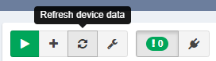

# How Snapshots Work

Network snapshots record the state of the network in time, enabling to
retrieve historical information, follow network state changes, analyze
connectivity, and more. A network snapshot is a fully functional
software copy of the network, including all configuration and state
data. Active network view displays information from a network snapshot
which can be selected using Snapshot selector drop-down menu in the top
left corner of the Main User Interface.

# Snapshot Management

Up to five (5) snapshots can be loaded simultaneously into active
memory. When the snapshot is active it is considered "loaded". Other
snapshots can be stored on HDD, with only free HDD space being the
limiting factor.

Locking active snapshot will always keep snapshot in memory.

Unloading snapshot will move network state information from RAM to HDD.
It usually takes several minutes to load and unload the snapshot,
depending on the network size.

Snapshots can be downloaded for external storage, which can be later
uploaded back to the system.

Snapshots can be cloned to accommodate change management practices, for
example when change comparison is desired but only a small part of the
network is affected by the change. A snapshot can be restricted to a
specific portion of the network through IP Scope in Advanced Settings
menu. This will enable visual comparison of a portion of the network,
and provide historical data for the collected portion of the network.
However when comparing partial snapshot with full network snapshot, a
number of false positives will appear, because large portion of the
network will be missing.

Snapshots can be also permanently deleted from the system.

# Snapshot Manipulation

New network state snapshots can be created from the Discovery page using
the start button.

To add devices to existing snapshot, use
the  button.
When adding devices, no data is overwritten.

To refresh network state data for specific devices in existing snapshot,
use  button.

## Attachments:

[image2019-2-7_15-56-53.png](attachments/474677271/474775561.png)
(image/png)  

[image2019-2-7_15-59-44.png](attachments/474677271/475037701.png)
(image/png)  

[image2019-2-7_16-41-21.png](attachments/474677271/474710044.png)
(image/png)  

[image2019-2-7_16-42-22.png](attachments/474677271/475136030.png)
(image/png)  

