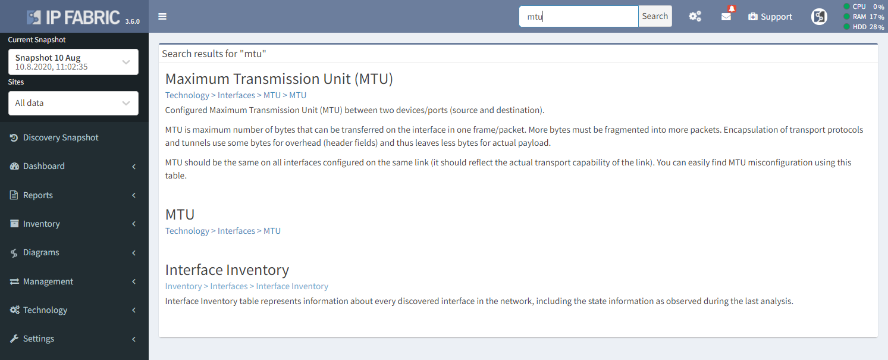

# How To Search Technologies

## Search

The user interface includes numerous views which cover a range of
technologies. To find a specific page or a technology table, use the
Search function located in the top ribbon.

IP Fabric provides quick navigation for its technology tables rather
than supporting a full-text search for all database values. For
example, *the search* does not return results for "1500", but searching
for "MTU" will return the appropriate technology view, which can then be
filtered for specific MTU values. Similarly, *the search* will not
return results for an IP address, however first looking for hosts or
endpoints or devices will point to the right technology view, which can
then be filtered for specific search intent.

  

## Attachments:

[2018-08-02 10_19_30-Search - NIMPEE Docs -
Confluence.png](attachments/86343685/86343689.png) (image/png)  

[image2020-8-13_14-13-39.png](attachments/86343685/1408729105.png)
(image/png)  

