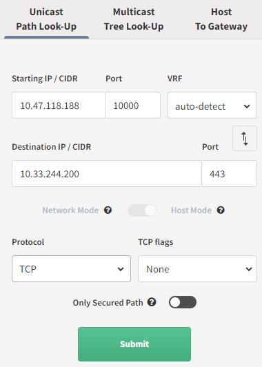
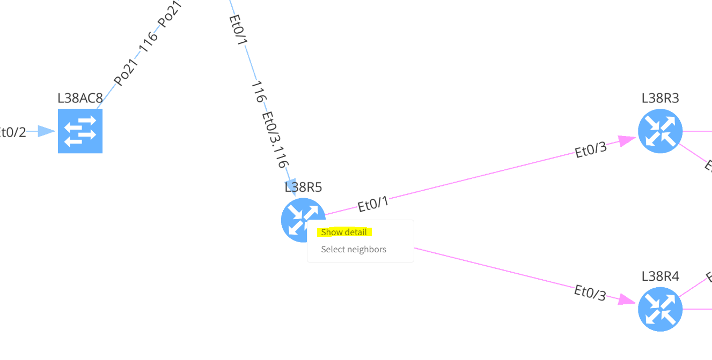
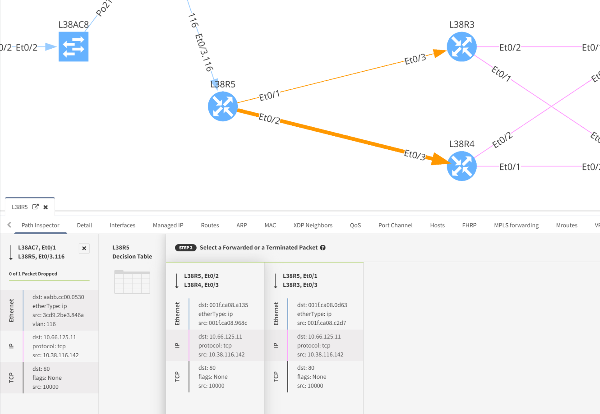
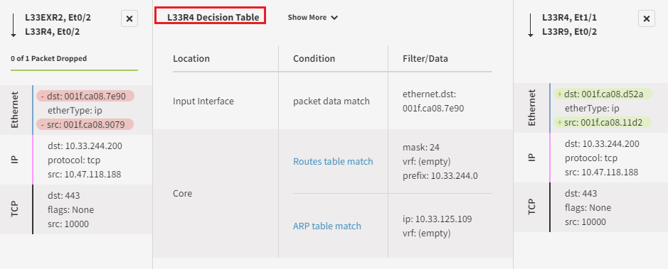
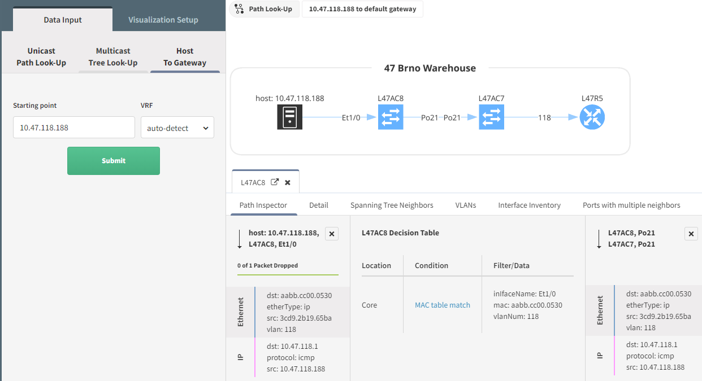

# How to use Path Look-Up

# How to use Path Look-Up

## Unicast Path-Lookup

Enter the details:

-   Source IP / CIDR (it can be a network, but the total number of IPs
    has to be less than 255 including source and destination IPs)

-   Port (Source Port)

-   VRF (Virtual Routing and Forwarding Instance)

-   Destination IP / CIDR

-   Port (Destination Port)

-   Protocol: TCP/UDP/ICMP

-   Flags: None/ACK/FIN/SYN/RST/PSH/URG

If you’ve used a network instead of a single IP, you will have the
option between:

– **Network Mode**: simulation stats and ends with whole networks,
individual hosts are not considered

– **Host Mode**: simulation starts and ends with each host. It is
limited to 255 hosts, source and destination combined.

Then click on submit:

## Path Controls

## Understand the path selection

To understand the decision taken by a device, right-click on the device
and “show detail”. You will then be presented with the details. If you
have more than one interface where the flow can come from, you will need
to select the interface you want to look at. Similarly, if you have
several interfaces that can be used to forward the traffic, you will
have to choose one. Then in the middle of the table, you will see the
forwarding decision:

In this example, we are looking at the device L33R4, which has 2
incoming interfaces and one forwarding for this flow:

## Multicast Tree Look-Up

You want to understand how a certain multicast flow is used, you can use
the Multicast Tree Look-Up. For that, just select the correct option and
enter the relevant details

You will then see the Multicast Tree:

And you will have access to a lot of information regarding the Multicast
forwarding decision:

## Host To Gateway

To find out more details between a host and its network gateway, you can
use this menu: Host To Gateway. You only need to provide the host, and
you will the details:

## Attachments:

[image-20210615-132637.png](attachments/2548858900/2551480336.png)
(image/png)  

[image-20210615-135636.png](attachments/2548858900/2551087161.png)
(image/png)  

[image-20210615-135841.png](attachments/2548858900/2551676955.png)
(image/png)  

[E2E-doc-02.gif](attachments/2548858900/2551054367.gif) (image/gif)  

[image-20210615-145444.png](attachments/2548858900/2551480347.png)
(image/png)  

[image-20210615-145508.png](attachments/2548858900/2551054377.png)
(image/png)  

[image-20210615-150741.png](attachments/2548858900/2550923289.png)
(image/png)  

[image-20210615-150822.png](attachments/2548858900/2551414811.png)
(image/png)  

[image-20210615-150903.png](attachments/2548858900/2551611428.png)
(image/png)  

[image-20210615-150948.png](attachments/2548858900/2551021598.png)
(image/png)  

[image-20210615-151011.png](attachments/2548858900/2548826136.png)
(image/png)  

[image-20210615-151057.png](attachments/2548858900/2551644173.png)
(image/png)  

[image-20210615-151130.png](attachments/2548858900/2548858922.png)
(image/png)  

[image-20210615-151356.png](attachments/2548858900/2551644179.png)
(image/png)  

[image-20210629-134606.png](attachments/2548858900/2613673995.png)
(image/png)  

[image-20210629-134859.png](attachments/2548858900/2615345159.png)
(image/png)  

