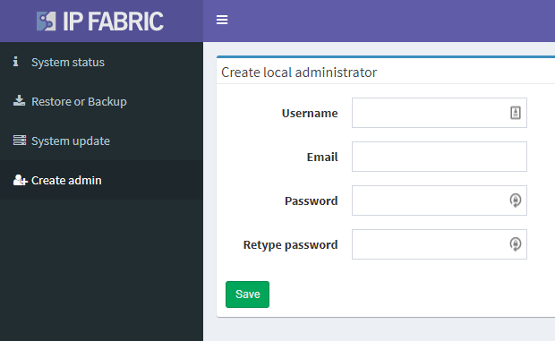

# Invalid default username and password

Default username and password to the main IP Fabric user interface is
***admin/netHero!123***.

For an unknown reason, it might happen that on the first start-up
default system username and password is not working. To fix this issue,
please login to the System administration on an
address [https://ipfabric.example.com:8443](https://ipfabric.company.com:8443/) and
after login as **osadmin **user go to ***Create admin*** and there
create a new local administrator account.

With this new account, you can login to the main IP Fabric user
interface and change a password to the default admin account or delete
him. This can be done in *Setting → User Management* menu. Also, other
user accounts can be created here.

## Attachments:

[image-20210126-082922.png](attachments/1921843213/1922072581.png)
(image/png)  

[image-20210126-083331.png](attachments/1921843213/1922334723.png)
(image/png)  

