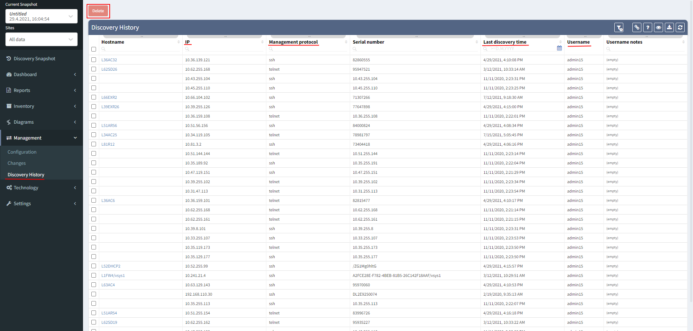

# Management

  

# Configuration Management

## Overview

Configuration management **backs up the running configuration** of
managed network devices based on the defined trigger. Downloaded
configuration is then available for viewing in full or sanitized
formats, or for comparison. **Only changed configurations** are stored,
and these report both the time of the **last change** and the **time of
the last** configuration **check** for a change.

Link: https://\[nimpee_address\]/management/configuration/first

### Credential Requirements

Network access **credentials allowing** **the “show run” command** (or
equivalent) **are necessary** for configuration storage and
configuration management to work properly. These credentials are set-up
in ***Setting → Authentication*** menu. These elevated credentials need
***Use for configuration management*** box checked. See
[Authentication](https://ipfabric.atlassian.net/wiki/spaces/ND/pages/1934983169/Authentication)

### Trigger

Trigger archiving can be [configured in
settings](https://ipfabric.atlassian.net/wiki/spaces/ND/pages/102334657/Configuration+Management) and
can be based on a **syslog message** or a **timed event**.

## Configuration

Configuration can be retrieved in **full** or **sanitized forms**.
**Sanitization removes all of the passwords and network identification
information** from the configuration to prevent sharing of sensitive
information.

### Configuration Comparison Table

**Stored configurations are displayed in a table** that shows
information such as the serial number of the device, the device host
name, the time when configuration change was detected (“Last change”
column), and the last time a particular configuration was saved in the
“Last check” column.

The table can be used to compare between two different configurations
directly from the user interface. This is done by selecting the “Before”
and “After” states to compare, and the resulting differences can be
displayed side-by-side, inline with all rows, or inline with only rows
where the changes have occurred.

  

# Change Management

## Overview

**Snapshots** at different time intervals **can be compared to find
dynamic changes in the network** when a snapshot of the network
(discovery run) completes successfully.

**To enable a periodic discovery run** check the [*Timed
Snapshots*](https://ipfabric.atlassian.net/wiki/spaces/ND/pages/102367300/Snapshots)* *configuration.

## Comparing changes

To control changes between two discovery runs, go to ***Management →
Changes***.

First select the more distant point in time (older snapshot) and then
select the second step point after the first one (newer snapshot).

There are four tables available:

### Devices

This table shows devices that were added, removed, or not changed in a
given time period (between two snapshots).

### Part numbers

This is where you can check for changes in individual device components,
especially useful for modular devices, and the status can be added,
removed, or not changed.

### Managed IP

Changes in addressing can cause problems, especially if they are not
well communicated between teams, and any changes to the IP address can
be seen in this table. Status can be added, removed, or not changed.

### Connectivity Matrix

Loss of connection, redundancy or part of the connection capacity can
also cause problems. Changes in the connections between devices can be
checked here and status can be added, removed, or not changed.

# Discovery History

This table shows every device that has ever been discovered in all
snapshots (their ***Hostname***, ***IP address***, ***Management
protocol** used* for discovery, ***Serial Number***, ***Username*** used
for discovery and ***Last discovery time*** filed).

All of this is important for keeping track of all discovered devices.
Also, information about these devices are used in every snapshot and
devices from this list are marked in the Connectivity Report as
previouslyDiscovered devices.

Sometimes it can be helpful for troubleshooting purposes to delete some
of the already discovered devices. All discovered devices can be found
in this table and any or all of them can be deleted by selection and
delete button on the top.

