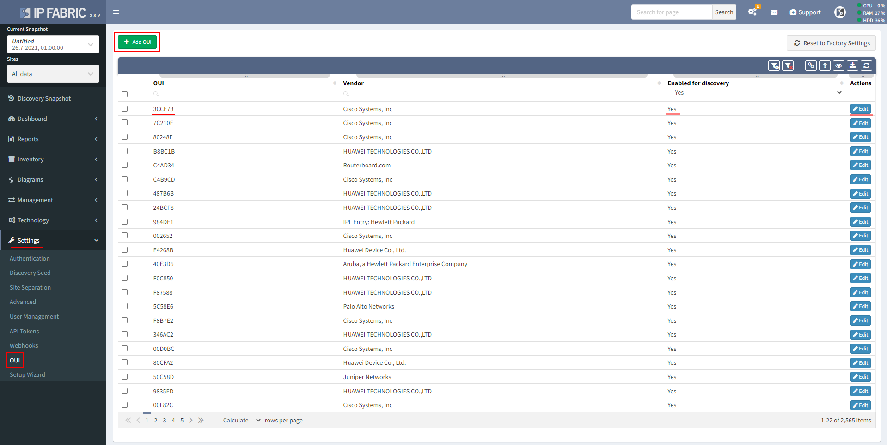

# OUI

IP Fabric includes an OUI (organizationally unique identifier) MAC table
of network device manufacturers and uses it during the discovery process
whenever there is a network device discovered through the ARP table.

This table can be found in the Settings → OUI menu.

It contains OUI (start of a MAC address of a device), vendor to whom
this OUI belongs and if it is enabled (can be used) during the discovery
process.

Custom OUIs can be added via Add OUI button.

All OUIs can be enabled or disabled for discovery through the Edit
button.

If there are network devices in your infrastructure that were found as
hosts and IP Fabric did not try to connect to them during the discovery,
please refer to this table and check if OUIs of those devices are
enabled for discovery.

## Attachments:

[image-20210728-133952.png](attachments/2704179211/2704375830.png)
(image/png)  

