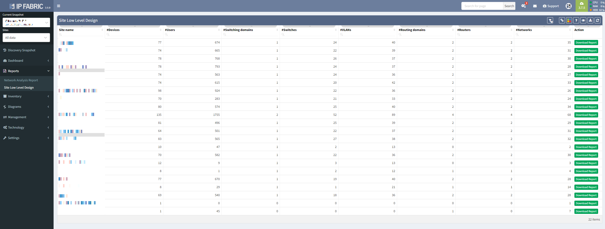

# Reports

## Overview

Report exports provide the facility to export network state information
as a word document.

## Network Analysis Report

Network Analysis report documents provide an overview of the current
network performance, capacity, and risks, and provide technical detail
of the top issues in each category.

## Site Low Level Design

Site low-level design documents provide a snapshot of the network state
of the site and provide sufficient information for reconstruction. All
reports are downloadable.

  

## Attachments:

[SLLD.PNG](attachments/79265870/1926299655.png) (image/png)  

