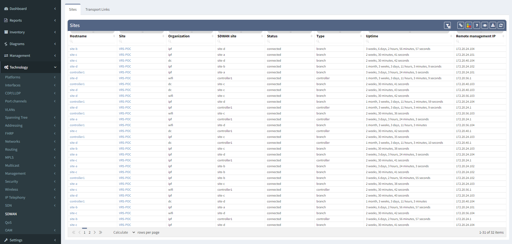
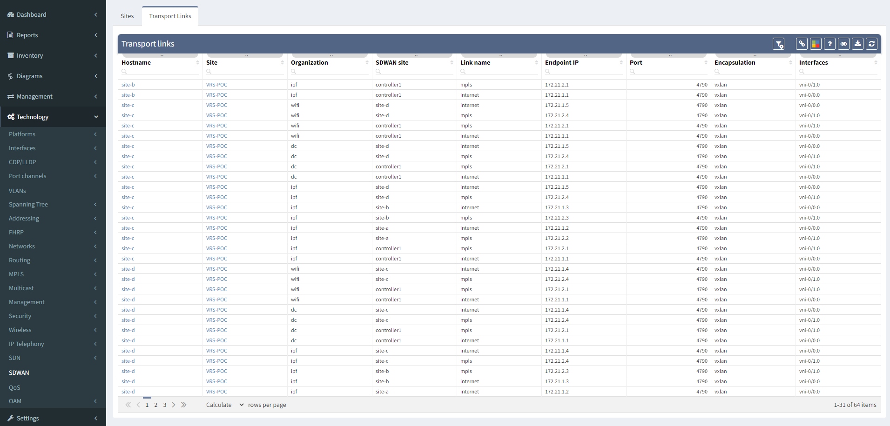

# SDWAN

## Sites table

SDWAN Sites table contains connectivity matrix between all sites
(Controllers, Branches and Hubs).

## Transport Links

Transport links table shows underlay connections between these sites.

## Attachments:

[sdwan_menu.png](attachments/2260369441/2258599956.png) (image/png)  

[sdwan_menu2.png](attachments/2260369441/2262630403.png) (image/png)  

