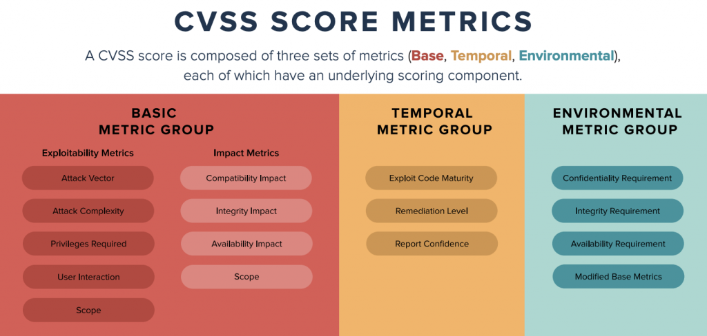

# Security incident/event response

## Initial source of information

-   We can ingest information about security incident from multiple
    sources. Main ingestion points for customers' submitted reports are:

    -   email: `security@ipfabric.io`

    -   IPFabric customers' support portal (Atlassian Service Desk –
        [NDS](https://ipfabric.atlassian.net/servicedesk/customer/portals))

    -   to the office phone `+420 720 022 997`

-   CVE database for sw vulnerabilities

-   internal monitoring (doesn’t cover the customers’ deployments)

-   `debian-security` mailing list

-   Other security relevant sources

## Classification

We use industry standard
[CVSS](https://en.wikipedia.org/wiki/Common_Vulnerability_Scoring_System)
scoring for classification of the reported / discovered vulnerabilities.

We follow our standard service SLA for releasing workaround/fix/update
(depending on upstream):

|                |                        |                |                          |                |
|----------------|------------------------|----------------|--------------------------|----------------|
| **CVSS Score** | **Qualitative Rating** | **SLA Rating** | **Reaction Time**        | **Escalation** |
| 0.0            | None                   |                |                          |                |
| 0.1 – 3.9      | Low                    |                |                          |                |
| 4.0 – 6.9      | Medium                 | Normal         | Next two working days    | VPE, SRE       |
| 7.0 – 8.9      | High                   | High           | Next working day         | CTO, VPE, SRE  |
| 9.0 – 10.0     | Critical               | Critical       | 4h during business hours | CTO, VPE, SRE  |

## Tracking

Every security incident has to have a tracking ticket, which in addition
to
<https://ipfabric.atlassian.net/wiki/pages/createpage.action?spaceKey=ST&title=Guidelines%20for%20Filing%20an%20Issue>
has to contain:

-   CVSS score

-   CVE number / link (when applicable)

-   Affected customers (if specific)

-   It has to have `security` tag assigned.

-   In case that this covers an **incident**, e.g. security was
    breached, data was stolen, somebody was impersonated etc. also add
    `incident` tag.

Also notify `#security` Slack channel. A dedicated channel can be
created if the mitigation is going to be complex or is imposing
immediate operational issue.

We select one person to coordinate internal communication and serve as
an interface to the work outside of Engineering. Typical candidates:
DevOps TL, Head of Development, VPE, CTO

## Attachments:

[image-20211116-130657.png](attachments/2807332872/2808283157.png)
(image/png)  

