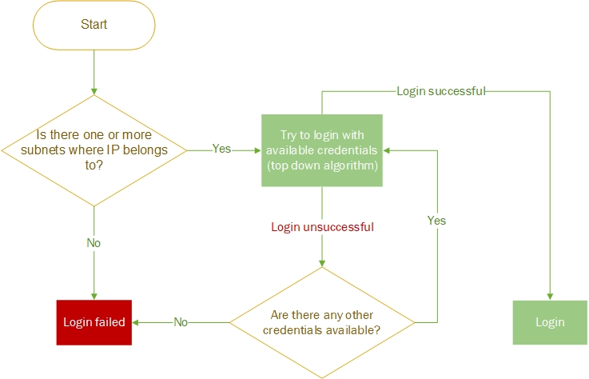
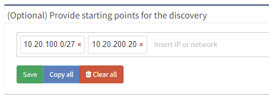

# Settings

# Authentication

Platform interacts with the network infrastructure devices by running
show commands through CLI using SSH or Telnet. Credentials added in the
Authentication section will be used by IP Fabric to access the CLI of
the network devices.

## Credential Selection Logic

If more credentials are specified, a top-down algorithm is used when
trying to login to a network device or the credentials priority can be
changed using drag and drop.  

## Configure Network Infrastructure Access

Read-only (Privilege 1) credentials are sufficient for basic
functionality. Security sensitive operations and advanced functionality
might require higher privilege. See the [full list of used command in
the
documentation](https://ipfabric.atlassian.net/wiki/spaces/ND/pages/80019486/Used+CLI+commands+for+Discovery).

When adding new credentials, you can limit the validity of the
credentials just for a part of your network using *Use in subnets*
and *Don't use in subnets* fields.

Provided credentials can be used for configuration change tracking and
saved configuration consistency (i.e. they allow commands such as *show
run* and *show start*).

To use this credentials for configuration change tracking,
please check [*Use for configuration
management*](https://ipfabric.atlassian.net/wiki/spaces/ND/pages/79003762/Configuration)* *box.

## (Optional) Passwords for enable mode

Privileged credentials are generally only necessary for configuration
management. However, some platforms require privileged credentials to
access basic network state information, such as MST spanning-tree state
or 802.1X session information.

  

# Discovery Seed

If you know a particular starting point for discovering the network, the
information can be entered at *Settings → Discovery Seed*. This option
does not exclude any networks from discovery.

The starting points can be management IP addresses of network devices or
network subnets. Existing inventory data can also be imported.

If no seed information is entered, the discovery will begin from the
current default gateway.

It is recommended to provide multiple IP addresses of core routers as a
starting point for discovery.

# Site Separation

The site represents a separate collection of devices. A site can be a
branch, a factory, a production floor, a campus, or anything that might
represent a logical group for a user.

By default, the Site distribution is generated automatically after the
discovery process ends and is based on the rules described below. It can
also be triggered manually without the need for the whole discovery
process by going to ***Settings → Advanced → Discovery → Site
separation*** **<u>(</u>In global or Snapshot settings<u>)</u>**. 

## Routing and switching domain

With this setting, you can manually edit the distribution of sites
later. Sites can be also renamed.

By default, the site is comprised of the topology of all contiguously
interconnected protocols, and the boundary of a site is formed by the
network protocol relation that is not under management using the
provided authentication credentials. The default separation is useful
for MPLS networks where directly connected routing infrastructure at the
site’s edge is not accessible. For situations where an inaccessible
routed firewall is used at the site (i.e. device under different
management team), an option “***Firewall at site***” can be turned on so
the infrastructure before and behind the firewall is not separated into
two different sites.

For networks that have direct routing connectivity between sites, such
as DMVPN or Leased Lines (usually over Serial or MFR interfaces), an
option to separate the site using ***tunnel*** and/or
***serial** the *interface should be selected.

For configuration go to ***Settings → Advanced → Discovery → Site
separation***.

## RegEx based on hostname

Site distribution cannot be changed manually when regex rules are used.
Sites cannot be renamed.

Alternatively, site separation can follow a specific Regular Expression
(RegEx) where separation will be performed based on portion of a device
hostname.

Go to ***Settings → Advanced → Discovery → Site separation*** and change
***Site boundary calculation*** to ***RegEx based on hostname***.

**Transform hostname** is used to normalize site names based on
hostname:

-   Upper case (default) - first hostname "PRAGUE-RTR1", second hostname
    "prague-rtr2" => result is that both devices in one site named
    "PRAGUE"

-   Lower case - first hostname "PRAGUE-RTR1", second hostname
    "prague-rtr2" => result is that both devices in one site named
    "prague"

-   No transformation - first hostname "PRAGUE-RTR1", second hostname
    "prague-rtr2" =>result is that each device has its own site named
    "PRAGUE" and "prague"

In the last step, introduce the ***Regular Expression***. Use [this
tool](https://regex101.com/) for validation and parentheses to extract
the site from the hostname correctly.

If you cannot cover the names of the sites with one regex, you can use
logical ***or***. Use **\|** (pipe) the character between RegEx rules.

The change in the regex is displayed as a live preview.

Once the regex is ready, click '***Site overview with this RegEx'*** and
observer results. ***Save*** (in the upper right corner).

**RegEx example**:

We have several locations whose name is logically designed as one letter
with one to three numbers. From the point of view of a regex, such a
site can generally be expressed as
"**^(\[a-zA-Z\]\\d{1,3})**". Unfortunately, we have two other sites that
do not fit into this schema. These sites can be defined with their own
regex and this can be added to the original one using the logical
operator ***or***:

***^(\[a-zA-Z\]\\d{1,3}\|HWLAB\|static\\d{1})*** - 1st option OR 2nd
option OR 3rd option  

For devices that do not match the RegEx, IP Fabric automatically adds
those to the site based on protocol relation (CDP, LLDP, STP, L3) under
the condition that there's only a single relation to one particular
site. This feature is especially useful for Access Points and similar
devices, that do not follow the standard naming conventions and are
linked to one specific location.

## Manual Site Separation

With this setting, you can manually edit the distribution of sites.

The Manual Site Separation option is complementary to two previous
options and provides the users with full flexibility. It can be enabled
in **Inventory \> Sites \> Manual Separation** where any device's site
can be adjusted based on more attributes.

  

  
