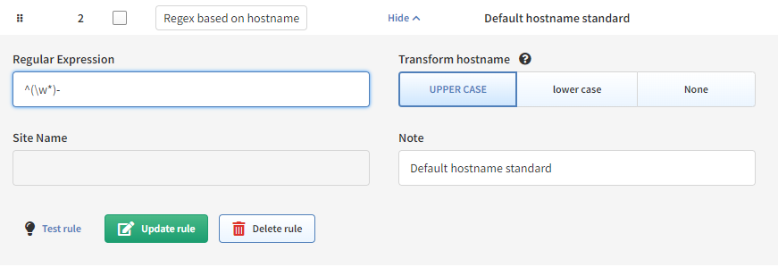

# Site Separation (from 4.3)

## Regular Expression Site Separation

Site distribution cannot be changed manually when regex rules are used.
Sites cannot be renamed.

Alternatively, site separation can follow a specific Regular Expression
(RegEx) where separation will be performed based on portion of a device
hostname or SNMP location.

If you cannot cover the names of the sites with one regex, you can use
logical ***or***. Use **\|** (pipe) the character between RegEx rules or
use the Device Attributes method shown below.

### Hostname Regex

Go to ***Settings → Site separation*** and change ***Routing & Switching
Domain*** to ***RegEx based on hostname*** or create a new rule by **Add
rule** button.

**Transform hostname** is used to normalize site names based on
hostname:

-   Upper case (default) - first hostname "PRAGUE-RTR1", second hostname
    "prague-rtr2" => result is that both devices in one site named
    "PRAGUE"

-   Lower case - first hostname "PRAGUE-RTR1", second hostname
    "prague-rtr2" => result is that both devices in one site named
    "prague"

-   No transformation - first hostname "PRAGUE-RTR1", second hostname
    "prague-rtr2" =>result is that each device has its own site named
    "PRAGUE" and "prague"

In this example the regular expression will match items such as PRAGUE-,
LONDON-, etc.

### SNMP Location Regex

Go to ***Settings → Site separation*** and change ***Routing & Switching
Domain*** to ***RegEx based on SNMP location*** or create a new rule by
**Add rule** button.

### Testing

The UI now allows you to edit and test your rules directly in the
browser when selecting the **Test rule** option. Here you can see a live
preview of devices that will match the regex you created.

You can also test SNMP location rules:

### RegEx example:

We have several locations whose name is logically designed as one letter
with one to three numbers. From the point of view of a regex, such a
site can generally be expressed as
"**^(\[a-zA-Z\]\\d{1,3})**". Unfortunately, we have two other sites that
do not fit into this schema. These sites can be defined with their own
regex and this can be added to the original one using the logical
operator ***or***:

***^(\[a-zA-Z\]\\d{1,3}\|HWLAB\|static\\d{1})*** - 1st option OR 2nd
option OR 3rd option  

## Device Neighborship

This option will try to define a device based on its neighbor
relationship if a device does not match any previous rule.  Perhaps you
have devices in your environment that do not follow the normal standard
like in a DMZ zone or Day 0 devices that have not been fully
configured.  If that device is connected to a device that did match a
rule, IP Fabric will intelligently group it to the correct site. 

## Manual Site Separation (Device Attributes)

The Manual Site Separation enables the **Device Attributes** feature to
create manual separation if a device does not follow a standard hostname
rule or perhaps the hostname is duplicated in multiple locations.

To configure **Device Attributes** first enable the toggle in the Site
Separation Menu and select Configure or the Device Attributes menu under
settings.

### Device Attributes

-   **Serial Number is IP Fabric’s “Unique Serial Number” (API column
    “sn”); this is not the column “Serial Number” which represents the
    Hardware SN (API column “snHw”)**

    -   *Devices discovered via API can also be assigned using Device
        Attributes.*

-   **Hostname** is populated by IP Fabric when a device matching the
    **Serial Number** is found

-   **Attribute** is the Device Attribute to assign, since we want to
    set the Site based on the serial number set it to **Site name**

-   **Value** is the attribute’s value to assign, in this case we want
    to split site L35 into separate sites named 35COLO, 35PRODUCTION,
    35HEADOFFICE

#### Creating rules in the UI

You are able to create rules in the UI by selecting the **Add
attribute** button. This will provide you a form to fill out.

The dropdown is intuitive and will let you search based on SN or
hostname. *Currently there is an issue where IP Fabric will not search
for devices discovered via an API in the UI. Even though it appears no
devices match the SN it will still perform the site separation correctly
on the next snapshot.*

  

#### Creating rules via the API

This is the preferred method of creating rules as it allows for bulk
importing.

<table class="confluenceTable" data-layout="default" data-local-id="b1440cf5-e6bc-45d3-8f16-fe4def824d35">
<tbody>
<tr class="odd">
<td class="confluenceTd">
Method
</td>
<td class="confluenceTd">
PUT
</td>
</tr>
<tr class="even">
<td class="confluenceTd">
URL
</td>
<td class="confluenceTd">
https://&lt;IPF_URL&gt;/api/v1/attributes/global
</td>
</tr>
<tr class="odd">
<td class="confluenceTd">
Data
</td>
<td class="confluenceTd">
{"attributes": [

{"sn": "&lt;IPF SERIAL NUMBER&gt;", "value": "&lt;SITE NAME&gt;", "name": "siteName"}

]
</td>
</tr>
</tbody>
</table>

#### Creating Rules with python-ipfabric package

Please see example at the following GitHub location:

<https://github.com/community-fabric/python-ipfabric/blob/main/examples/settings/attributes.py>

## Rule Priority

Rule precedence are followed in a top down manner.

1.  **Manual site separation** (if enabled) will look at the **Device
    Attributes** and try to first assign a device based on serial number
    if a match is found.

2.  Rules you define. In the example above it will check the following

    1.  If SNMP Location matches “IPFABRIC, (LAB01)” → Site LAB01

    2.  If Hostname matches “^L21” → Site MPLS

    3.  If Hostname matches “^(L\\d{1,2})” → Site L2-99

3.  **Try to assign devices without sites based on device neighborship**
    (if enabled)

    1.  <https://ipfabric.atlassian.net/wiki/spaces/ND/pages/2887647267/Site+Separation+from+4.3#Device-Neighborship>

## Attachments:

[image2020-1-10_16-57-15.png](attachments/2887647267/2887647276.png)
(image/png)  

[image2020-1-10_16-56-3.png](attachments/2887647267/2887647279.png)
(image/png)  

[image-20220208-132404.png](attachments/2887647267/2888695813.png)
(image/png)  

[image-20220208-132456.png](attachments/2887647267/2887417896.png)
(image/png)  

[image-20220208-132819.png](attachments/2887647267/2888859659.png)
(image/png)  

[image-20220208-133412.png](attachments/2887647267/2887712791.png)
(image/png)  

[image-20220208-133503.png](attachments/2887647267/2888597511.png)
(image/png)  

[image-20220208-135358.png](attachments/2887647267/2888728582.png)
(image/png)  

[image-20220208-135645.png](attachments/2887647267/2888663043.png)
(image/png)  

[image-20220208-140632.png](attachments/2887647267/2888630298.png)
(image/png)  

[image-20220214-184001.png](attachments/2887647267/2896232449.png)
(image/png)  

[image-20220214-184024.png](attachments/2887647267/2896297985.png)
(image/png)  

[image-20220214-184104.png](attachments/2887647267/2896330753.png)
(image/png)  

[image-20220214-184804.png](attachments/2887647267/2896265219.png)
(image/png)  

