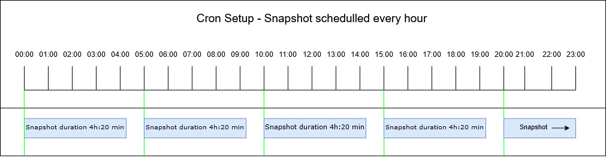

# Snapshots

## Snapshots

For ***[change management](Changes)***, regularly running IP Fabric
discovery is necessary. A periodic discovery run can be scheduled
at ***Settings → Advanced → Snapshots → Timed Snapshots.***

Here is an example for an automatic discovery run at 10 minutes past
every hour (0:10; 1:10; 2:10; 3:10, etc.).

**How scheduling work in IPF:**

Let's assume that snapshot is scheduled for every hour and snapshot
takes 4h:20min to be created, then the next snapshot will be scheduled
once the previous snapshot finishes. The scheduled time will be set at
the next possible period according to the cron setup.

  

  

  

  

  

  

  

  

  

  

  

  

  

  

  

  

  

  

  

## Attachments:

[2018-08-27 09_37_26-Settings - IP Fabric network infrastructure
controller - IPFabric.png](attachments/102367300/102564017.png)
(image/png)  

[IPF-cron.jpg](attachments/102367300/1405059074.jpg) (image/jpeg)  

