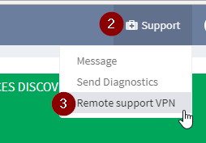
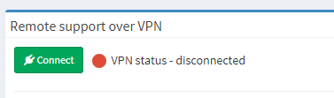

# Support VPN

Starting IP Fabric version 1.0.3 customer is able to establish remote
SSL VPN to IP Fabric DC. Support VPN uses OpenVPN software.

Network requirements

Support VPN requires access to
*[remote.ipfabric.io](http://remote.ipfabric.io)* (194.228.111.174)
remote port 443/TCP. IP Fabric image must be also configured with
functional DNS server.

Connection through proxy servers is also supported but not guaranteed.

## How to establish support VPN​

Security tip

VPN is always established and teared down by customer. VPN connection
cannot be triggered externally! 

1.  Login to IP Fabric web ui.

2.  At top right corner click *Support.*

3.  Select *Remote support VPN.*  
      
      

4.  On newly opened page click the *Connect* button.  
      
      

5.  VPN status should change to connected and also you should see
    assigned IP address.

## How to tear down support VPN​

1.  Repeat steps 1 - 3 from *How to establish support VPN*​ part (see
    above)
2.  On newly opened page click the Disc*onnect* button.
3.  VPN status should change to disconnected.

## Attachments:

[supp-vpn1.png](attachments/1878327298/1877737482.png) (image/png)  

[supp-vpn2.png](attachments/1878327298/1877737486.png) (image/png)  

[supp-vpn3.png](attachments/1878327298/1877737490.png) (image/png)  

