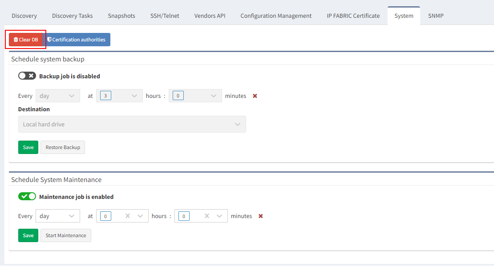
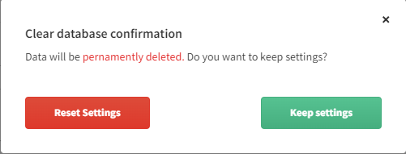

# System

## Clear DB

### Backup

Before erasing databases, make sure that the [backup](Backup) is
available!

In rare cases, it may be necessary to delete and recreate the IP
Fabric's database. Go to ***Settings → Advanced → System ***and click
***Clear DB***.

When running Clear DB, all loaded snapshots are automatically unloaded
and the database recreated.

We recommend unloading all your snapshots before running Clear DB.

There is two-way confirmation.

In the second screen, you can choose from clear (reset) everything or
keep settings.

We recommend keeping settings.

Discovery settings data will be lost and the system setting will be
reset to defaults **except**:

-   Certification authorities

-   [User settings](User_Management)

-   [LDAP settings](LDAP_Authentication)

-   [Custom filters and colors](Navigate_in_Tables)

-   [Custom URL (custom view)](Navigate_in_Tables)

-   Reports settings

-   Dashboard settings

## Certification authorities

By default, the IP Fabric only trusts certificates issued by CAs listed
in the
[nodejs](https://github.com/nodejs/node/blob/master/src/node_root_certs.h). Because
internal systems typically use certificates signed by an internal CA,
the root certificate of this certification authority needs to be
uploaded.

For example, establishing a secure connection between IP Fabric and LDAP
server requires a trusted certificate chain.

**Upload root CA certificate**

1.  Go to ***Settings → Advanced → System → Certification
    Authorities**.*

2.  Click ***Upload CA***.

3.  Enter root CA certificate ***Name*** (it's only your overview)

4.  ***Choose file***

5.  Click ***Save***

**Delete root CA certificate**

1.  Go to ***Settings → Advanced → System → Certification
    Authorities**.*

2.  Select certificate and click ***Delete*** on the right.

3.  Confirm delete using the ***Delete*** button.

**Rename root CA certificate**

1.  Go to ***Settings → Advanced → System → Certification
    Authorities**.*

2.  Select certificate and click ***Edit ***on the right.

3.  Change ***Name***

4.  Click ***Save***

## Attachments:

[image2021-12-8_15-24-38.png](attachments/102432867/2828599305.png)
(image/png)  

[image2021-12-8_15-26-3.png](attachments/102432867/2829352961.png)
(image/png)  

