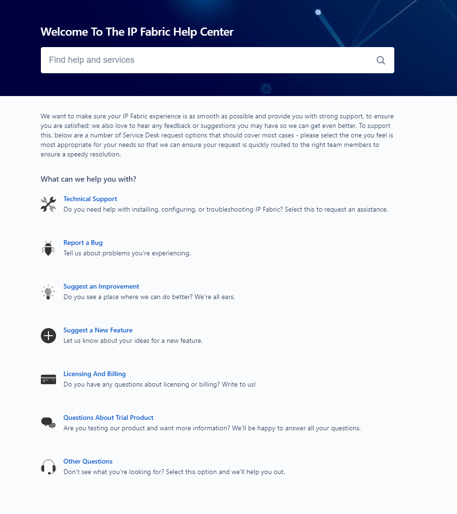

# Technical Support

## Support

IP Fabric is provided as a fully managed solution. In case of an issue,
please contact our support teams at
[support.ipfabric.io](https://support.ipfabric.io).

Detailed error reports can be submitted manually by generating
[Techsupport](Techsupport) file and uploading it through support portal
or dedicated upload page in case of large techsupport files.

Send diagnostics
to [callhome.ipfabric.io](http://callhome.ipfabric.io) we will be
pleased to help you. 

# IP Fabric Help Center

Is a support portal where you can contact our support teams in case of
any issue with IP Fabric.

  

We want to make sure your IP Fabric experience is as smooth as possible
and provide you with strong support, to ensure you are satisfied. To
achieve that choose one of icons.

-   Technical Support
-   Report a bug
-   Suggest an Improvement
-   Suggest a new feature
-   Licensing and Billing
-   Questions about trial product
-   Other questions

  

## Technical Support 

-   Select this feature when you are having technical issues such as
    problem with installation, upgrade, backup, configuring or other
    technical related troubleshooting of IP Fabric

  

##  Report a Bug

-   Select this feature to tell us about problems you have found or
    experiencing 

##  Suggest and Improvement

-   Do you have a suggestion for us where we can do better or what we
    can do better  - tell us. We will be pleased by your suggestion.

##  Suggest a New Feature 

-   Do you have any idea for new features which can be added to IP
    Fabric? Tell us, we are all ears! 
-   Suggest an idea which can be added in the next IP Fabric update 

## Licensing and Billing

-   In case you are having issues with licensing or billing choose this.
-   This is not only for issues but also for any question about
    licensing and billing 

## Questions about Trial Product 

-   This feature should be used if you are having question about our
    product in case you are testing it and want more information about
    it.

## Other Questions

-   You still don't see what you are looking for? Select this feature.
-   For inquiries which are not related to any other option on support
    portal 

  

  

  

  

  

  

  

  

  

  

## Attachments:

[image2021-1-12_15-17-48.png](attachments/80019475/1871708161.png)
(image/png)  

[image2021-1-12_15-34-22.png](attachments/80019475/1871478801.png)
(image/png)  

[image2021-1-12_15-34-52.png](attachments/80019475/1871478806.png)
(image/png)  

[image2021-1-12_15-36-50.png](attachments/80019475/1871118343.png)
(image/png)  

[image2021-1-12_15-45-41.png](attachments/80019475/1870626829.png)
(image/png)  

[image2021-1-12_15-48-3.png](attachments/80019475/1871937537.png)
(image/png)  

[image2021-1-12_15-50-47.png](attachments/80019475/1870856219.png)
(image/png)  

[image2021-1-12_15-55-3.png](attachments/80019475/1871773706.png)
(image/png)  

[image2021-1-12_15-57-52.png](attachments/80019475/1870594071.png)
(image/png)  

[image2021-1-12_16-3-47.png](attachments/80019475/1870561286.png)
(image/png)  

