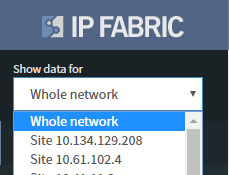

# Technology verification and analysis

## Technology verification and analysis

Technology information is presented in descending OSI layers from the
physical link layer, through to the network and management layers.
Individual sections contain detailed state information that is
represented in tables and graphs, either for the whole network or
per-site as selected in the left-hand drop-down menu.
