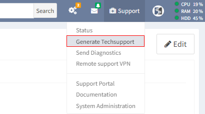

# Techsupport

The Techsupport file from the IP Fabric is one of many ways how you can
share the discovered data with our support team and engineers. This
quick tutorial demonstrates how to generate the file and share it with
us. The Techsupport file is encrypted. Only IP Fabric support staff is
able to decrypt the data.

## GUI Tutorial

1.  **Go to Support -> Generate Techsupport**  

    

2.  **Select data to be included in a Techsupport file (leave in default
    when in doubt)**  

    

## Video Tutorial

## Uploading a Techsupport file

### WEB / HTTPS

**Server:** [**https://upload.ipfabric.io**](https://upload.ipfabric.io)

User and password provided by technical support.

### FTP

**Server: **[**ftp://upload.ipfabric.io**](ftp://upload.ipfabric.io)

User and password provided by technical support.

##  LEGEND

1.  **System logs** - Includes syslog, dmesg, rabbitmq, mongodb,
    arangodb and IP Fabric API service logs. Customer data are NOT
    included.

2.  **Service logs** - Includes IP Fabric discovery service logs without
    CLI. Customer data are limited, only IP addresses which were used
    during discovery and serial numbers of devices.

3.  **Current Snapshot** - Includes selected snapshot.

    1.  **Remove CLI logs from snapshot** - Removes devices CLI logs
        from snapshot

    2.  **Database dump** - Includes database dump of selected snapshot.

4.  **Complete database dump** - Includes database dump of all snapshots
    which are loaded in memory

5.  **Database dump without devices data** - Removes all collected data
    from devices. Dump contains only error and service tables.

Snapshot and database dump doesn’t include any customer sensitive
credentials (passwords, keys etc.)

  

  

  

## Attachments:

[techsupport_3.png](attachments/1878327320/1878327337.png) (image/png)  

[teschsupport_2.png](attachments/1878327320/1878327340.png)
(image/png)  

[techsupport_1.png](attachments/1878327320/1878327343.png) (image/png)  

[image2021-1-27_13-42-33.png](attachments/1878327320/1924268048.png)
(image/png)  

[image2021-1-27_13-53-45.png](attachments/1878327320/1927348242.png)
(image/png)  

[image-20210330-133051.png](attachments/1878327320/2146467843.png)
(image/png)  

