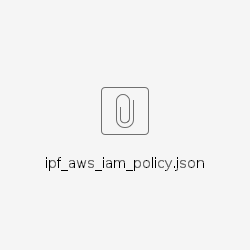
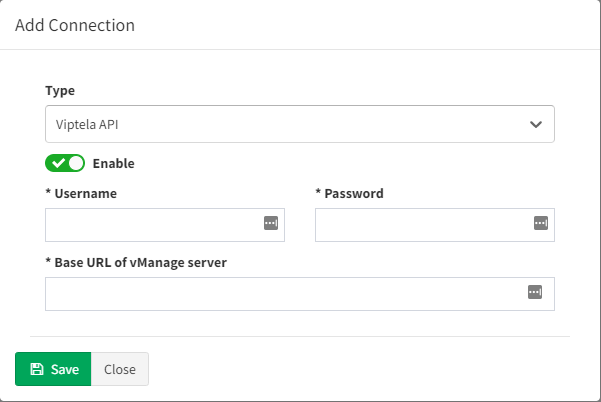

# Vendor API

## Meraki API

Starting the version 3.5.0, IP Fabric supports API based discovery for
Cisco Meraki.

Meraki requires the following settings to be applied:

-   API key - Generated in [Meraki
    dashboard](https://documentation.meraki.com/zGeneral_Administration/Other_Topics/The_Cisco_Meraki_Dashboard_API)

-   Organizations ID - You can specify which organization will be
    included in the discovery process. If you do not specify, all
    available IDs will be used

-   Version - Meraki currently provides only a v0 version of their API.
    This version has a lot of limitations ([Meraki known
    issues](https://ipfabric.atlassian.net/wiki/spaces/ND/pages/968032257/Meraki))

-   Base URL - URL is supported in the following
    format [https://nXYZ.meraki.com/api.](https://nXYZ.meraki.com/api) Be
    aware that the dashboard can redirect communication to a different
    URL

## CheckPoint API

We use API only to collect information that cannot be retrieved from CLI
logs.

To discover CheckPoint devices, CLI access also needs to be available.

Checkpoint requires the following settings to be applied:

-   API Key - Available in version R80.40 and above (API v1.6). To
    generate the key, use CheckPoint SmartConsole, and select "API Key"
    as user's Authentication method  
    **or**

-   Username - Username to access API data

-   Password - Password to access API data  

-   Base URL - Base URL for API calls
    (ie: [https://management.server.domain.tld).](https://management.server.domain.tld) If
    the API isn't available on the default port 443, add a port part to
    the URL (ie: <https://server:4443/>)

-   Collect following domains - Mandatory only if the "Base URL" points
    to a Multi-Domain Server. Please verify, that all selected domains
    can be accessed by the provided credentials.  

Don't forget to add IPF appliance to the list of allowed clients. In
SmartConsole, go to Manage & Settings \> Blades and click on "Advanced
Settings..." in the “Management API“ section to verify, from where are
API calls allowed. In case that you use setting "All IP addresses that
can be used for GUI clients", don't forget to add IPF appliance address
to Manage & Settings \> Permissions & Administrators \> Trusted Clients.
In case you use Multi-Domain server, all necessary settings are in Multi
Domain menu (ie: Multi Domain \> Blades)

## VERSA API

Starting version 3.8.0 IP Fabric supports Versa SD-WAN API. API is based
on HTTPS authentication. Versa requires the following settings to be
applied:

-   Username - Username to Versa Director to access API data

-   Password - Password to Versa Director access API data

-   Base URL - Base URL of Versa Director. If the API isn't available on
    the default port 9182, add a port part to the URL (ie:
    <https://server:4443/>)

OAuth authentication credentials to Versa Director are not supported at
the moment to access API  

## AWS (Amazon Web Services) API

Starting version 3.8.0 IP Fabric supports AWS API.

To add AWS to the discovery you will need an access key & secret access
key from your AWS account.

Those keys can be found/generated under your account in the AWS
dashboard.

Click on “My Security Credentials” and open “Access keys” tab.

To generate keys click on “Create New Access Key” and your keys will be
generated. These access keys are available globally for all of yours AWS
regions.

Copy those keys to the AWS API settings in your IP Fabric and don't
forget to **fill the region where the devices which you want to discover
are**.

To ensure that IP Fabric can retrieve all the required data to model the
AWS networks, a series of specific policies are required to be applied
to the user account or role used for the API key. The attached file
contains a JSON description of the required IAM policies:

## Viptela API

Starting version 4.1.0 IP Fabric supports Viptela API.

Viptela devices are discovered only through API.

To add Viptela to discovery global settings, go to **Settings → Advanced
→ Vendors API** and press **+Add** button

Afterwards, choose Viptela API from the list and fill in

-   **Username and password** used to log in to vManage

-   **Base URL** of vManage server (https://vmanage-ip-address)

  

## Attachments:

[mds-user.png](attachments/1005649930/1646329857.png) (image/png)  

[Screenshot 2021-05-04
165124.png](attachments/1005649930/2336817155.png) (image/png)  
 [image
(8).png](attachments/1005649930/2336915465.png) (image/png)  
 [image
(10).png](attachments/1005649930/2336849923.png) (image/png)  
 [image
(11).png](attachments/1005649930/2336915471.png) (image/png)  

