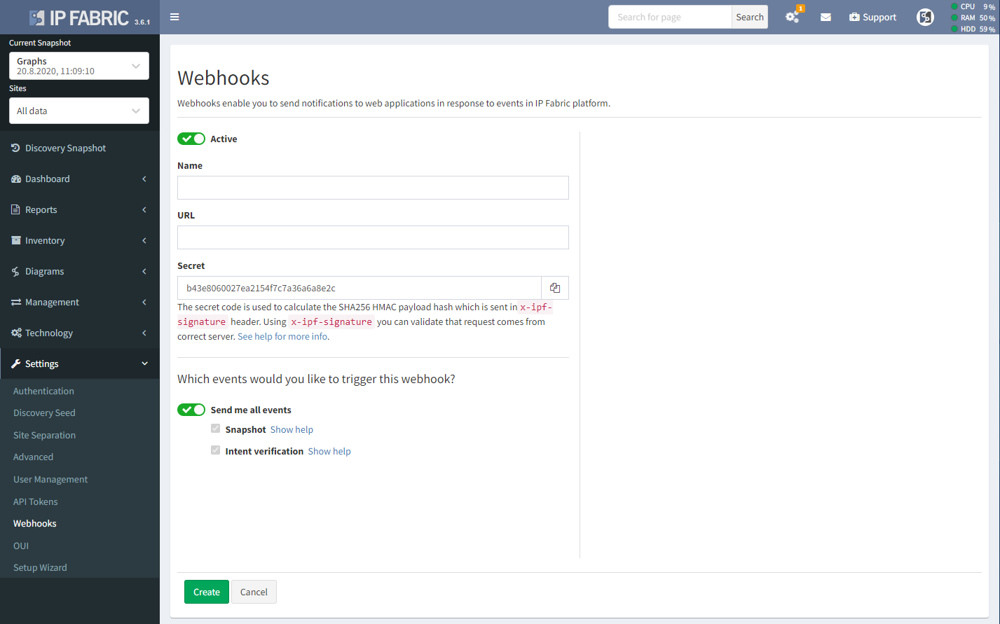

# Webhooks

Webhooks allow you to build or set up integrations, which subscribe to
certain events on IP Fabric platform. When one of those events is
triggered, we'll send a HTTP POST payload to the webhook's configured
URL. Webhooks can be used to send notifications to messaging tools of
your choice or update an external issue tracker. You're only limited by
your imagination.

To setup a webhook, please navigate to `Settings / Webhooks`



## Events

Whenever IPF system generates an event, we check the list of active
webhooks and determine, which of them (if any) are subscribed to the
event that has just occurred. Then we send the webhook payload to
corresponding URLs. The receiving party should confirm the payload with
HTTP Status 2xx in response and can processed the payload as needed. In
case the receiving party doesn’t confirm the payload (because it is not
reachable, it returns bad status code, or the delivery times out), we
retry delivering the webhook payload again in 1, 2, 5, and 10 minutes
since the initial delivery. In case we cannot delivery the webhook in
these five attempts, we give up. All delivery attempts are recorded in
the webhook delivery history (in webhook edit view).

## Payload hash

Since the webhook payload might be delivered over untrusted networks,
each webhook message is accompanied with SHA256 HMAC payload hash
signature. You configure the HMAC secret when configuring the webhook in
UI. To validate the webhook payload (i.e. to make sure the webhook
payload is really sent from IPF platform and was not altered in
transit), calculate the hash signature of raw webhook payload on the
receiving end (with the same password), and compare it with the hash
calculated by the server (sent in `X-IPF-Signature` HTTP header of the
webhook message).

<div class="code panel pdl" style="border-width: 1px;">

<div class="codeContent panelContent pdl">

``` js
// JavaScript validation code

const hmac = createHmac('sha256', secret);
hmac.update(bodyString);
const verified = (hmac.digest('hex') === request.headers['x-ipf-signature']);
```

</div>

</div>

To test your webhook (even an inactive one), use the Test button in UI.
Pick the webhook type and action and confirm the popup dialog. We’ll
send dummy payload corresponding to the selected webhook. To be able to
distinguish the testing payloads from the real ones, we add `test: true`
property to the testing messages.

Currently, we the following webhook types are triggered by IPF platform:

### snapshot

The event is triggered upon network discovery and when manipulating
snapshots.

<div class="code panel pdl" style="border-width: 1px;">

<div class="codeContent panelContent pdl">

``` jscript
{
  "type": "snapshot",
  "action": "discover" | "clone" | "delete" | "download" | "load" | "unload",
  "status": "started" | "completed" | "failed" | "resumed" | "resumed (stopping)" | "stopped",
  "reason"?: string,
  "requester": "cron" | "user:<id>",
  "snapshot"?: {
    "id": string,
    "name"?: string,
    "cloneId"?: string,
    "file"?: string,
  }
  "timestamp": number,
  "test"?: boolean
}
```

</div>

</div>

In case the action has `failed`, the payload includes top-level `reason`
field with string describing why the action has failed.

`snapshot` object is missing completely when the snapshot is not known
yet, e.g. when network discovery has just `started`.

When `clone` action is `completed`, the `snapshot` object contains also
`cloneId` field with the id of newly created (cloned) snapshot.

When `download` action is `completed`, the `snapshot` object includes
also `file` field with filename of the created snapshot archive.

In case you are testing the webhook, the `test` field is set to `true`.

### intent-verification

The event is triggered when intent verification is calculated.

<div class="code panel pdl" style="border-width: 1px;">

<div class="codeContent panelContent pdl">

``` jscript
{
  "type": "intent-verification",
  "action": "calculate",
  "status": "started" | "completed" | "failed" | "resumed" | "resumed (stopping)" | "stopped",
  "reason"?: string,
  "requester": "cron" | "user" | "snapshot:<action>",
  "reportId"?: string,
  "snapshotId"?: string,
  "timestamp": number,
  "test"?: boolean
}
```

</div>

</div>

In case the action has `failed`, the payload includes top-level `reason`
field with string describing why the action has failed.

When the intent verification is related to:

-   a report, its id is available as `reportId`,

<!-- -->

-   a snapshot, its id is available as `snapshotId`.

In case you are testing the webhook, the `test` field is set to `true`.

<div class="pageSectionHeader">

## Attachments:

</div>

<div class="greybox" align="left">


[obrazek-20200901-092927.png](attachments/1456537601/1458176001.png)
(image/png)  

[obrazek-20200901-093009.png](attachments/1456537601/1458241537.png)
(image/png)  

[obrazek-20200901-101651.png](attachments/1456537601/1458405377.png)
(image/png)  

</div>
