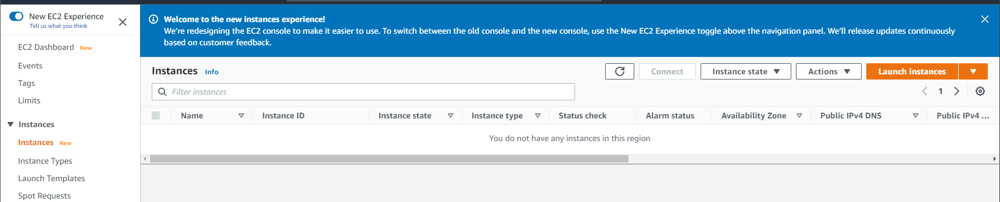
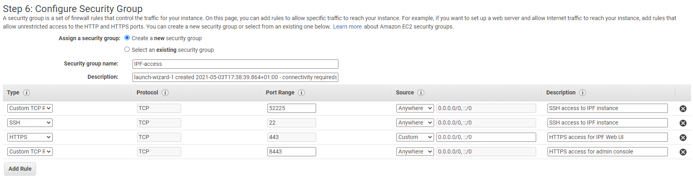

# Deploying Amazon AWS EC2 instance

## **Deploying IP Fabric AWS EC2 instance**

!!! info Usefull info
    In order to deploy IP Fabric into your AWS VPC, you will need the AMI to be shared with the AWS account in question.
    
    Contact the [IP Fabric support team](mailto:support@ipfabric.io) with your AWS account details and the region in which you want to deploy instance, and the team will ensure the AMI is available to you to install.  
    
    Access to AWS AMI instance is restricted to registered customers only. Please contact our [sales representative](mailto:sales@ipfabric.io) if you are interested in a trial of IP Fabric

## **Deployment And Configuration Of The AMI**

### Pre-requisites

!!! note
    Before you are begin the deployment:
    1.  IP Fabric uses SSH, telnet and REST API over http/https in order to access network devices and controllers and carry out its discovery.
    Please ensure that the VPC subnet chosen for the deployment has the appropriate level of access and routing in order to complete the discovery.
    2. The IP Fabric AMI uses SSH for CLI console access, and HTTPS on ports 443 and 8443 for Web UI and system console access respectively.
    Security groups will need the appropriate configuration to allow inbound access to the AMI.

### Deployment Steps

1.  Login to the AWS console for the account provided to the IP Fabric support team.
2.  Select the region for the VPC where you want to deploy IP Fabric:  

3.  From the “Services” menu at the top left, select “EC2”

4.  Then choose “Instances” in the left hand menu, and hit the “Launch Instances” button on the right:

Select “My AMIs”, then under “Ownership”, select “Shared with me”. The IP Fabric AMI should show up here. “Select” it.

5.  Choose the most appropriate instance type:

| Devices | CPU | RAM    | HDD (will need to be set in step #8) | Example EC2 Instance Type |
|:-------:|:---:|:-------|:------------------------------------:|:--------------------------|
| 500     | 4   | 16 GB  | 90 GB                                | c5.2xlarge                |
| 1 000   | 4   | 32 GB  | 100 GB                               | r5.xlarge                 |
| 2 000   | 8   | 64 GB  | 200 GB                               | r5.2xlarge                |
| 5 000   | 12  | 64 GB  | 300 GB                               | r5.2xlarge or r5.4xlarge  |
| 10 000  | 16  | 128 GB | 550 GB                               | r5.4xlarge                |
| 20 000  | 18  | 256 GB | 1000 GB                              | r5.8xlarge                |

Since AWS is often changing/adding instance types and their resources, please follow this table when determining correct EC2 instace type [Host Hardware Requirements](Host_Hardware_Requirements)

Selecting an appropriate instance type is necessary to achieve a stable and reliable system! Please double-check if your Instance settings are proper for your environment size.

6. Select “Configure Instance Details”, then ensure the correct VPC and subnet are selected for the IP Fabric instance.
(Create a new VPC and subnet if required):

7. Then select “Add Storage”, add 80G to the additional amount from the table above for the root volume:

!!! example
    For example, the instance **c5.4xlarge** should have 200G in total.
    

8. Select “Edit Security Groups” to make sure that IP Fabric will have the connectivity it requires to function:

9. Confirm the details with the [IP Fabric Connectivity Requirements](Network_Connectivity_Requirements). The security group rules should look something like:

Note that you can only select incoming rules at this point! By default the security group allows access to everything over any protocol and port: you will need to revisit once the instance has launched if you need to restrict access at source.

10. Click “Review and Launch”

11. At this point, if you never used Debian in AWS before, subscription alert can appear. If requires, please follow instruction and open hyperlink in Error message: “In order to user this AWS Marketplace product….“

12. On new page, please click “Continue to Subscribe”

13. When done, please click “Launch” button once again.

14. Please confirm “Key pair” information and click “Launch Instance”*.*

15. Your Instance will appear in the instances list, and it will be started automatically by AWS:

16. You can now [access the Web UI, install the license file](Access_User_Interface_and_Install_License) and login to the instance to run the Configuration Wizard.

17. There is a bug in the latest version and you will need to setup traceroute in the IPFabric in order to run Discovery. Traceroute must be setup to - [127.0.0.1/32](http://127.0.0.1/32)

This is going to be fixed in the future.

