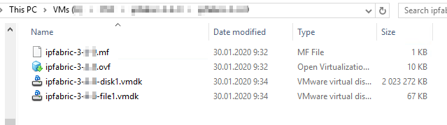
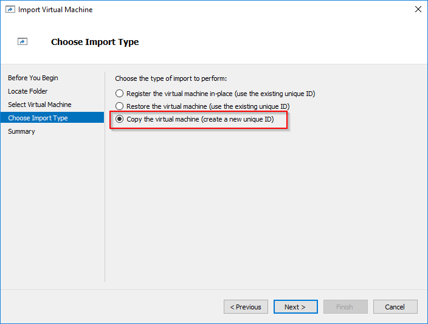
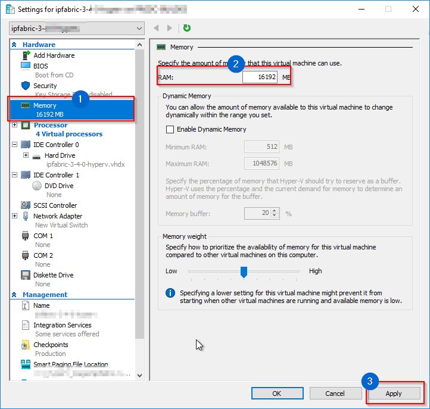
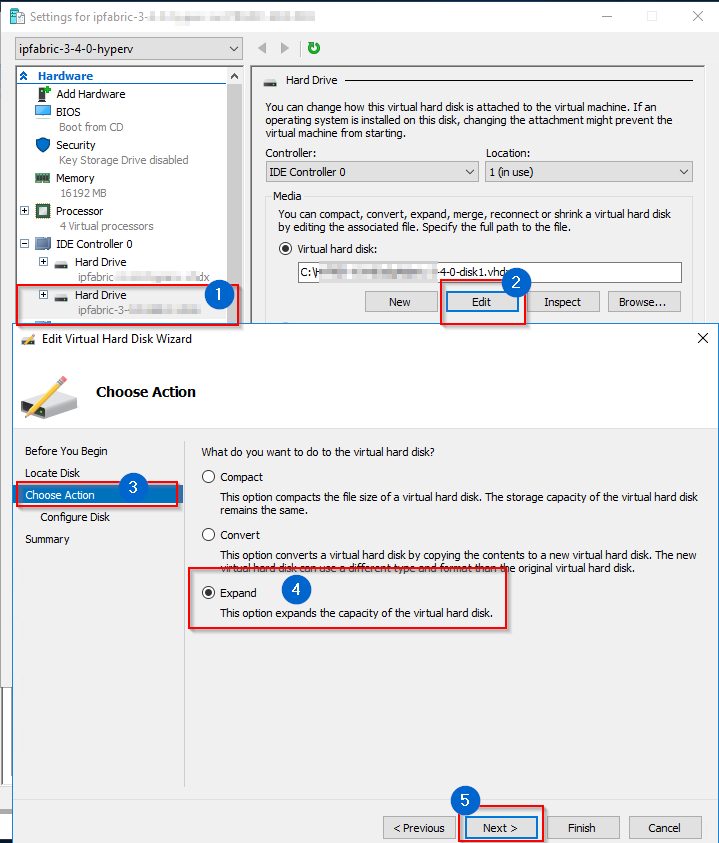

# Deploying Nutanix Virtual Machine

## **Deploying IP Fabric Nutanix Image**

!!! info Usefull info
    The virtual appliance image is available at [releases.ipfabric.io/ipfabric/#current](https://releases.ipfabric.io/ipfabric/#current)
    
    Access to Nutanix image is restricted to registered customers only. Please contact our [sales representative](mailto:sales@ipfabric.io) if you are interested in a trial of IP Fabric.

### Deploy And Configure VM

Nutanix image is based on Virtual Disks of VMware vSphere OVA image. As Nutanix officially supports import of VMware VM’s, below instructions are based on the same image available at [Deploying VMware OVA virtual machine](Deploying_VMware_OVA_Virtual_Machine)

Please bear in mind that IP Fabric uses CLI access (SSH or telnet) to connect to devices for data collection. It's important to place the VM in the proper network segment to prevent high ACL or firewall configuration overhead.

1.  Download **'ipfabric-3-x-x-.OVA'** file from official source.

2.  Extract previously downloaded OVA file using 7-zip or any similar software, structure of extracted files should look like below
    

3.  Import .VMDK files to Nutanix hypervisor, following Nutanix official documentation here [**Nutanix import OVA**](https://portal.nutanix.com/#page/kbs/details?targetId=kA03200000099TXCAY) and here [**Quick tip how to deploy a VM from OVF to AHV**](https://next.nutanix.com/installation-configuration-23/quick-tip-how-to-deploy-a-vm-from-an-ovf-to-ahv-33613)

4.  Edit Nutanix VM hardware settings and adjust them according to the network environment size (check requirements in [Host Hardware Requirements](Host_Hardware_Requirements) )

!!! info Image configuration
    1.  Change CPU count
    
    2.  Change memory size
    
    3.  Extend system disk if necessary
    
    4.  Add a new empty virtual disk if necesery > [Increase disk space](Increase_disk_space)

5.  ***Start*** VM and check if system starts without any interrupts.

Proper hardware setup is necessary to achieve stable and reliable system ! Please double-check if your VM settings are proper for your environment size !

### Complete First Boot Wizard

The *First Boot Wizard* starts when IP Fabric is run for the first time and configures system options. The wizard can also be re-run later from the service interface to modify basic system parameters.

1.  Assign hostname.

2.  Assign domain name.

3.  Choose IP address acquisition method.

4.  If a static method is used, configure IP address, netmask, default GW, and DNS servers.

5.  Configure NTP servers or just click OK to continue if not using NTP.

6.  Select time zone.

7.  Configure Internet Proxy if used.

8.  Set shell user password of *osadmin *user. The password is used to access the IP Fabric administrative interface and system shell (not for the GUI access, the GUI is accessible with the '**admin**' username by default, for more information, please, read: [Access User Interface and Install License](Access_User_Interface_and_Install_License) and also for encrypting system backups.

9.  Optionally define organization parameters for the local SSL certificate.

10. After rebooting, the console login screen will display the assigned IP address of the system and provide a link to access the user interface.

Remember password from point 8. ! IP Fabric support engineers are able to reset *osadmin *user passwords but **encrypted backups will be lost**!

A trusted certificate can replace a self-signed SSL certificate using IP Fabric web UI.