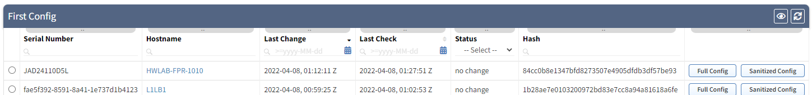

# Troubleshooting Discovery

Documentation on most commonly seen discovery issues and how to resolve them.

## Settings

The below topics will be describing the Global Settings however users
can make adjustments to specific Snapshots. Making changes to the Global
Settings and then testing them in a previous snapshot may not apply your
changes. Here are two methods for testing settings.

- Make your changes in the Snapshot specific Settings and then
  `Add Devices` (or `Rediscover timed out devices`). If these changes
  fixed your issue, then apply them globally.

    

- Make your changes globally and then run a new Snapshot. You could
  also filter the allowed discovery scope in the Snapshot specific
  Settings to a subset of /32 addresses to speed up discovery. In the
  example below I am telling discovery only to test 1 device.

    

### Discovery Seed

These are self-defined IP Addresses that IP Fabric will try to connect
to and discover. If a device is successfully discovered it will check
the settings in the Discovery Tasks Settings to see what technologies to
use to discover neighbors.

If you have remote locations possibly through a WAN that is not owned by
you, this would be the location to put the IP Addresses of some of your
devices so IP Fabric can discover and crawl that site.

!!! important
    Adding new devices here will only discover them if `Limit discovery to already discovered devices` is not enabled in the Discovery Tasks Settings.

### Management > Discovery History

The Discovery History table is also used by IP Fabric as the seed
addresses. Once a device is discovered in a snapshot it will be placed
in this table for use in other snapshots.

- The username last successfully used for a device will be recorded
  here and be the first one tried in a future snapshot. If
  unsuccessful it will check the *Settings > Authentication* list and
  go back through the decision tree. This may cause the next snapshot
  to take longer due to authentication failures but once this table is
  updated with the new username the discovery time will return to
  normal.

- If you have removed devices from your network IP Fabric will still
  try to connect to them because the IP addresses are defined as seeds
  in this Discovery History table. To speed up discovery you could
  delete stale records. You can also filter on `Last discovery time`
  and delete records older than X months.

### Settings > Advanced

#### Discovery -- IP Scope

IP Scope tells IP Fabric which networks to include or exclude in the
discovery process. The default is set to include everything (0.0.0.0/0).
When IP Fabric discovers a neighbor in this network it will try to log
in and discover it. If the IP address is not in the include or is in the
exclude list then it will not try to connect and discover the device.

The exclude list is a great way to exclude networks managed by a
different department or perhaps vendors or devices that IPF does not
currently support. For instance a customer had discovery hanging due to
it trying to log into a terminal server which IPF could not understand;
once added to the exclude list the discovery completed successfully.

!!! important
    Do not confuse the Include List with the Seed list. Include will only
    try to discover an IP if it is found through the Discovery task or the
    IP in the seeds. Also note IP Fabric does not do any ICMP pings to find
    hosts so having a /16 here will not send massive amounts of pings.

#### Discovery Tasks Settings

Discovery Tasks Settings is where the magic happens for automated
discovery of new devices on your network.

- **If you are not finding new devices in your snapshot ensure**
  `Limit discovery to already discovered devices` **is not enabled**.
  If this is enabled then only devices in the *Discovery History*
  table will be added to the snapshot and no new devices (**even if
  those devices are manually added to the Settings > Discovery
  Seed**).

    - If you want to limit to only discovered devices but want to add
      new devices this is still possible by going to *Discovery
      Snapshot* and manually adding devices into a snapshot which it
      will then be added to the *Discovery History* table and picked
      up in future snapshots.

- `xDP (neighbors)` signifies using CDP or LLDP information to
  discover devices in your network.

- `ARP` uses the ARP and MAC Address OUI information to find devices.
  If the OUI is set for `Enabled for discovery` in the *Settings >
  OUI* table then IP Fabric will attempt to connect and discover the
  device.

- `Routing Table` will try to connect to next-hop devices.

- `Trace` signifies using traceroute to RFC1918 addresses to help
  discover your internal network. This is helpful for the VM as IPF
  might not be able to log into the default gateway (vRouter) but
  using traceroute it can find some other physical devices in the
  network to use as starting points.

#### SSH/Telnet

Please see [SSH/TELNET](../../../IP_Fabric_Settings/advanced/SSH_telnet.md) for explanation of these settings.

#### Vendors API

Please see [Vendors API](../../../IP_Fabric_Settings/advanced/Vendors_API/index.md) as each vendor has different
requirements.

### Settings > Authentication

Authentication is where you define the username and password IP Fabric
uses to connect a physical device (devices discovered through the API
are managed through *Advanced > Vendors API*). Ensure that you have a
username configured for all scopes of the network you wish to discover
or set to the default of `0.0.0.0/0`.

!!! tip
    If you are having issues with Configuration Backup not pulling data ensure that you have `Use for configuration management` set on the proper usernames.

Further information can be located at [Authentication](../../../IP_Fabric_Settings/authentication.md).

## Troubleshooting Missing Devices

There can been a numerous amount of reason why IP Fabric did not
discover a device from Day 0 or incorrectly configured devices, AAA
outage, or insufficient authorization privileges to name a few. First we
will take a look at some tables to help you find these and then show how
to use the *Connectivity Report* to debug them.

### Technology Tables

#### CDP/LLDP > Unmanaged neighbors

This is the best table to start as not only do you see the local host
and interface names but also the remote hostname, interface name, and
remote IP. Since devices can connect to multiple other devices it is
possible of duplicate remote hostnames in this list.

You are able to export this view to CSV and then remove duplicate
hostnames to get a unique list of devices. For instance in this demo I
see a total of 59 unmanaged neighbors but only 40 unique remote
hostnames.

#### Interfaces > Connectivity matrix > Unmanaged Neighbors Detail

This table shows you unmanaged neighbors based many protocols and has a
built-in default Intent Check for you.

- RED: Provides a list of unmanaged CDP/LLDP neighbors
  (`cdp|lldp|mndp`). This does not provide you with the remote
  hostname which is why it is recommended to look at this table
  second.

- AMBER: Is a list of unmanaged Interior Gateway Protocols
  (`eigrp|ospf|rip|isis|pim|vxlan|cef`). It is specified as such
  because if you have a neighbor adjacency with an iGP it is assumed
  it is under the control of your network.

    !!! tip
        Check this table for help locating rogue devices in your network.

- BLUE: Is the default rule if the protocol does not match any
  other regex.

- GREEN: Is defined for the Exterior Gateway Protocol BGP.

### Auditing using an External Network Management System

Perhaps you would like to audit IP Fabric (or vice versa) using an NMS.
This can be done as all the tables can return the data in CSV format via
the UI or JSON using the API. This would perhaps help you find other
missing devices IP Fabric could not discover.

!!! tip
    Don’t forget to audit your NMS or alarming systems inventory from what IP
    Fabric discovered on the network. Many customers have found devices that
    were not being monitored.

!!! Note "Note on Management IP"
    In IPF v4.3.5 or below the UI in many places has a column of
    `Management IP`; in v4.4 this has been renamed to `Login IP` to avoid
    confusion and to match the API column name of `loginIp`.

    Since IP Fabric is an automated discovery process it will try to log
    into any IP address found during the discovery tasks processes. This
    value could be a Loopback, management, physical, or virtual interface.
    Auditing your external NMS will need extra care as in many cases the
    IP’s will not match.

    One solution is to export your NMS inventory to Excel and the
    *Technology > Addressing > Managed IP* table to CSV and then perform
    vlookups between the two datasets. Since the *Managed IP* contains all
    the IP addresses found on devices the NMS data should find a match.

    Another option is to use the device’s Serial Number. Serial numbers are
    not always unique and there is a chance of overlap so please take this
    into account.

!!! Note "Note on Serial Numbers"
    IP Fabric records two Serial Numbers for the device. The column name
    `Serial Number` is the actual hardware serial number of the device which
    is why it is labeled `snHw` in the API.

    The column name `Unique serial number` is an IP Fabric unique identifier
    and primary key for the device. This API column name is `sn` so it is
    easy to confuse the two if you were not aware. The main time there are
    differences between the two is seen in firewalls with virtual contexts,
    vdoms, etc.

### Connectivity Report

The *Connectivity Report* is a per Snapshot report stating the successes
or errors of IP addresses that IP Fabric tried to discover. Once you
have a list of IP Addresses from the unmanaged neighbor tables above or
perhaps an external Network Management System this is where you would
start your troubleshooting process.

The most common reason why a new installation of IP Fabric will not
connect is due to the `connect ECONNREFUSED XX.XX.XX.XX:22` error which
signifies the traffic is being blocked by an ACL or Firewall. This is
why it is recommend having IP Fabric in your management subnet which is
already allowed for remote access to devices so you do not have to
re-configure all your ACLs. Another option is to use a jumphost and
documentation can be found at [Jumphost settings](../../../IP_Fabric_Settings/advanced/SSH_telnet.md).

Another common error is due to Authentication or Authorization errors. Please
ensure that the username configured has the correct permissions. There is also
[a list of CLI commands](https://matrix.ipfabric.io) used which can help ensure
authorization is correct.

If you find other errors you can refer to this document [Connectivity
report - Type of Error](common_problems/connectivity_report.md) and the CLI
output of the device is usually helpful as well.

If you need further assistance please feel free to reach out to your
Systems Engineer or open a ticket following the [Technical
Support](../../../support/techsupport.md) instructions.

Finally another option for testing devices is to log into the IP Fabric
CLI using the `osadmin` account and manually trying SSH’ing into your
devices preferably using the username and password the system was
configured to use. If you cannot open a connection this is due to an
external reason.

Further information can be found at [No Devices Discovered](common_problems/no-devices-discovered.md).

## Troubleshooting Configuration Management

Configuration Management is a separate process from discovery. First a
device must be discover in a Snapshot and placed in the *Management >
Discovery History* table. Once in this table then next time IP Fabric is
scheduled to pull configs it should be populated in the list.

Example:

- *Settings > Advanced > Snapshots* is set to periodically create
  snapshots every day at 6AM

- *Settings > Advanced > Configuration Management* is set to
  periodically create snapshots every day at 11PM

- New device will be found at 6AM but since the config mgmt is
  scheduled for 11PM you will need to wait until the next day to
  ensure it was pulled.

Other troubleshooting tips:

- Please ensure that in *Settings > Authentication* you have enabled
  the correct usernames to `Use for configuration management`, if no
  usernames have this enabled then configs will not be backed up.

- Ensure the users have proper authorization for pulling configs.
