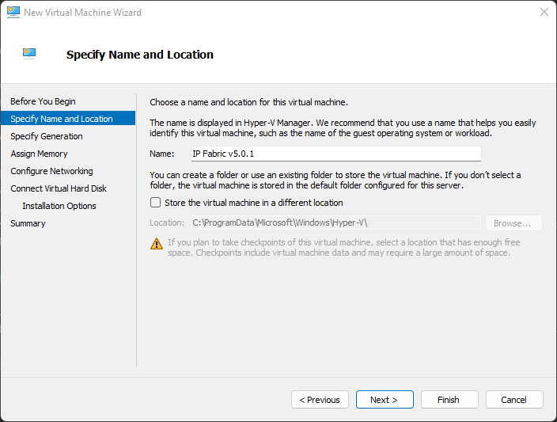
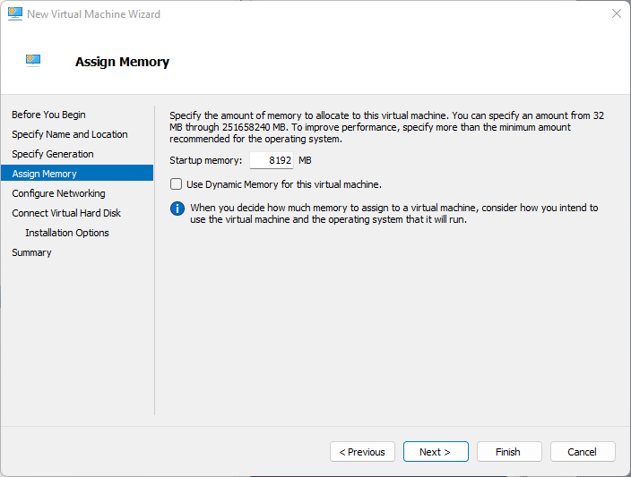
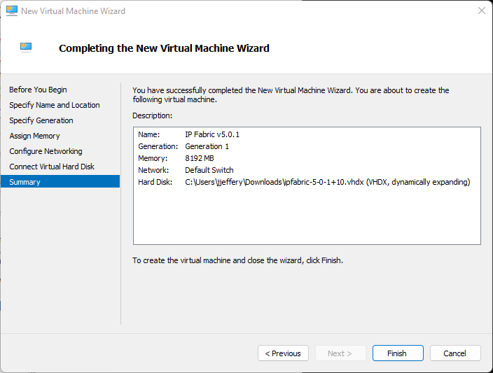
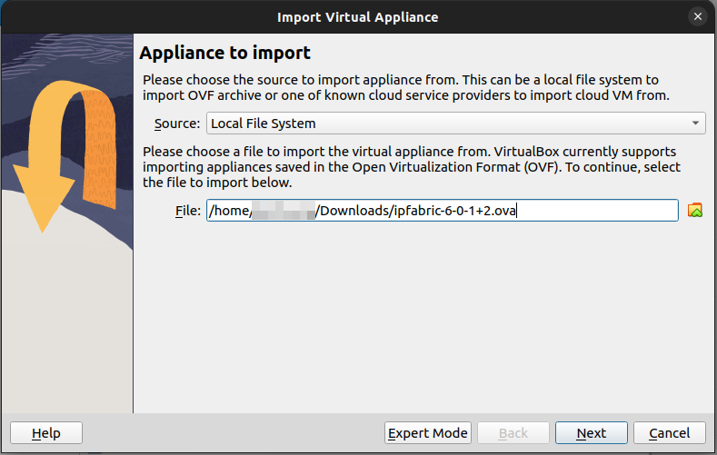
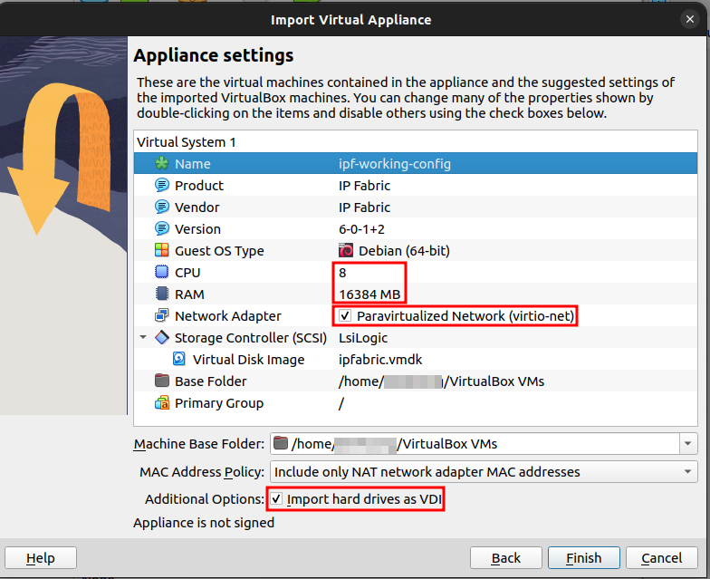
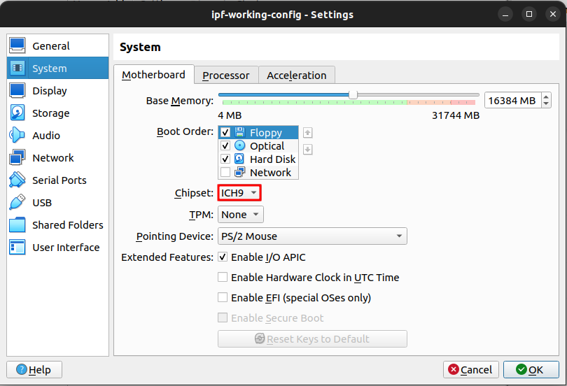
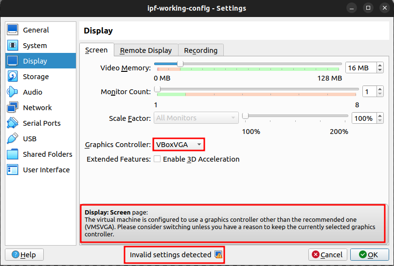
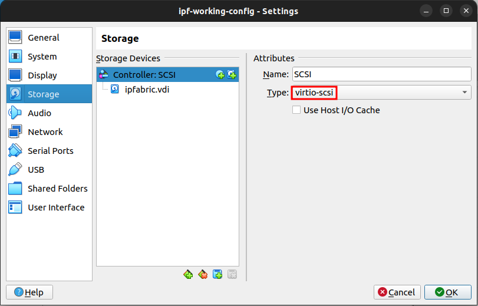
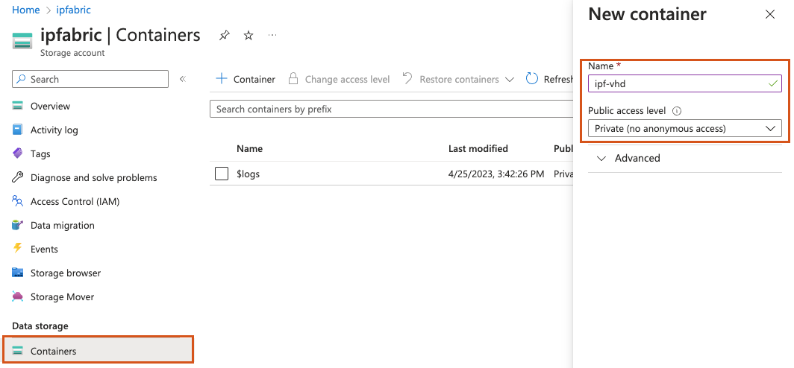
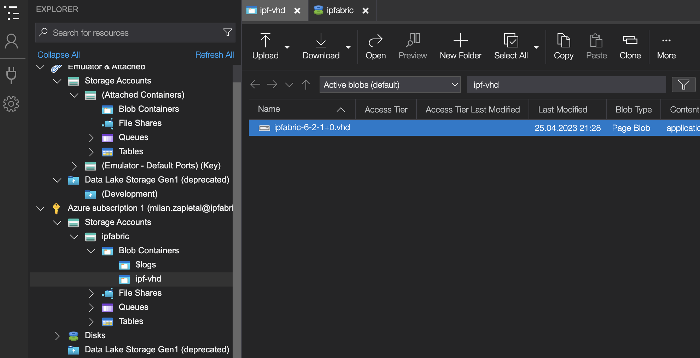

# Deploying the IP Fabric Virtual Machine (VM)

All virtual appliance images are available at  [https://releases.ipfabric.io/ipfabric/#current](https://releases.ipfabric.io/ipfabric/#current). Access is restricted to registered customers only. Please contact our [sales representative](mailto:sales@ipfabric.io) if you are interested in a trial of IP Fabric.

!!! important

    Please bear in mind that IP Fabric uses CLI access (SSH or telnet) to connect to devices for data collection. It's important to place the VM in the proper network segment to prevent high ACL or firewall configuration overhead.

## Deploying on VMware OVA Virtual Machine

1. Deploy OVA to your vSphere environment as described at [Deploy an OVF or OVA
   Template](https://docs.vmware.com/en/VMware-vSphere/6.5/com.vmware.vsphere.vm_admin.doc/GUID-17BEDA21-43F6-41F4-8FB2-E01D275FE9B4.html).
2. [Edit VM settings](https://docs.vmware.com/en/VMware-vSphere/6.5/com.vmware.vsphere.vm_admin.doc/GUID-4AB8C63C-61EA-4202-8158-D9903E04A0ED.html) and adjust according to your network size as described in the [operational requirements section](../Overview/index.md#operational-requirements).
   1. Change CPU count.
   2. Change memory size.
   3. [Add a new empty virtual disk or resize the main system disk](../../System_Administration/increase_disk_space.md)
3. Power on VM and [complete Boot Wizard](#complete-first-time-boot-wizard).

!!! note "Invalid OVF checksum algorithm: SHA256"

    Importing OVA on older vSphere/ESXi hosts may error stating the OVF checksum
    is invalid.  Please see [this documentation](../../support/known_issues/IP_Fabric/error_messages/invalid_ovf_checksum.md)
    on how to resolve this.

## Deploying on Hyper-V Virtual Machine

The `QCOW2` disk image file can be converted to different formats.
Using this method we will create a `VHDX` usable on Microsoft Hyper-V and manually create a new VM.

1. Download `ipfabric-*.qcow2` from the official source.
2. Convert `QCOW2` image to `VHDX` (Be sure to change the filenames in the command examples below.)
   - Windows instructions:
     1. Download [QEMU disk image utility for Windows](https://cloudbase.it/qemu-img-windows/)
     2. Unzip `qemu-img-windows`
     3. Run `qemu-img.exe convert ipfabric-<*>.qcow2 -O vhdx -o subformat=dynamic ipfabric-<*>.vhdx`
   - Linux instructions:
     1. Install `qemu-utils` `sudo apt install qemu-utils`
     2. Convert file: `qemu-img convert -f qcow2 -o subformat=dynamic -O vhdx ipfabric-<*>.qcow2 ipfabric-<*>.vhdx`
3. Create New Hyper-V Virtual Machine and Specify Name and Location

   

4. Specify Generation as `Generation 1`

   

5. Assign Memory (check requirements in [operational requirements section](../Overview/index.md#operational-requirements))

   

6. Configure Networking

   

7. Connect the Virtual Hard Disk

   

8. Verify the Summary and Finish

   

9. Wait for the VM to be created

10. Edit the VM CPU settings (check requirements in [operational requirements section](../Overview/index.md#operational-requirements))

    

    

11. Optionally increase Hard Disk Size based on [operational requirements section](../Overview/index.md#operational-requirements)

    1. [Extend the system disk or add a new empty virtual disk](../../System_Administration/increase_disk_space.md#increase-disk-space-for-hyper-v) if necessary.

12. Close the VM Settings window

13. Start the VM.

## Deploying a Virtual Machine to Nutanix

!!! note

    The Nutanix image is based on Virtual Disks of VMware vSphere OVA image. As Nutanix officially supports import of VMware VM’s, below instructions are based on the same image as used at [VMware deployment section](#deploying-on-vmware-ova-virtual-machine).

1. Download the `ipfabric-*-.OVA` file from official source.
2. Extract the previously downloaded OVA file using 7-zip or any similar software. The structure of extracted files should look like below

   

3. Import `.vmdk` files to Nutanix hypervisor and follow Nutanix' official documentation -- [Nutanix import OVA](https://portal.nutanix.com/#page/kbs/details?targetId=kA03200000099TXCAY) and [Quick tip how to deploy a VM from OVF to AHV](https://next.nutanix.com/installation-configuration-23/quick-tip-how-to-deploy-a-vm-from-an-ovf-to-ahv-33613).

4. Edit VM hardware settings and adjust according to the network environment size (check requirements in [operational requirements section](../Overview/index.md#operational-requirements)).

   1. Change CPU count
   2. Change memory size
   3. [Extend the system disk or add a new empty virtual disk](../../System_Administration/increase_disk_space.md) if necessary.

5. Start the VM and check if the system starts without any interrupts.

## Deploying a Virtual Machine on KVM

We have currently the limitation that drives need to be `/dev/sdx`. Usually Linux hypervisors are using the `virtio-blk` driver which is represented as `/dev/vdx` in the guest system. To overcome this limitation use the `virtio-scsi` as drive controller.

1. Download `qcow2` system disk to your KVM hypervisor.
2. Resize the `qcow2` data-disk that corresponds to [your network needs](../Overview/index.md#operational-requirements) if necessary. Use the following command:

   ```shell
   qemu-img resize ipfabric-disk1.qcow2 100G # (up to 1000G for 20 000 devices)
   ```

3. Deploy the VM to your hypervisor with the virt-install utility by issuing the following command (chose CPU and RAM size according to the size of your network):

   ```shell
   virt-install --name=IP_Fabric --disk path=<path to the disk>.qcow2 --graphics spice --vcpu=4 --ram=16384 --network bridge=virbr0 --import
   ```

4. This command deploys a new virtual machine with IP_Fabric name, system `qcow2` disk, 4 CPU cores, 16GB of RAM and will connect VM to the internet through the `virtbr0` interface (if your machine has a different bridge interface name or you want to connect it straight through the device network card to the internet you need to change the `--network` parameter).

5. This command also starts up the VM.

6. Additionally, you can [create and add a new empty virtual disk if needed](../../System_Administration/increase_disk_space.md).

## Deploying a Virtual Machine on VirtualBox

!!! warning

    Deploying IP Fabric on VirtualBox is currently not officially supported -- it is not tested and we cannot guarantee that it will work.

1.  Download the `OVA` image.

2.  Import the `OVA` image via **File --> Import Appliance...**:

    

3.  In the next step of the **Import Virtual Appliance** guide:

    - set CPU and RAM as per the [hardware requirements](../Overview/index.md#hardware-requirements) for your use-case
    - set the Network Adapter to `Paravirtualized Network (virtio-net)`
    - keep the `Import hard drives as VDI` option checked for importing the disk image in the default VirtualBox format, otherwise the disk image will be imported as VDMK (the default format of VMware)

    

4.  Right-click the newly-created virtual machine and select its **Settings...**

5.  In the **System** section, select `ICH9` as the Chipset:

    

6.  In the **Display** section, select `VMSVGA` as the Graphics Controller:

    

    - or to what VirtualBox suggests when an invalid Graphics Controller is selected:

    

    - !!! warning

          When an invalid Graphics Controller is selected, it can lead to issues in the virtual machine and even on the host machine.

7.  In the **Storage** section, select `virtio-scsi` as the Controller Type:

    

8.  In the **Network** section, select `Bridged Adapter` and re-check in **Advanced** that the Adapter Type is `Paravirtualized Network (virtio-net)`:

    

9.  Start the virtual machine.

## Deploying a Virtual Machine on Microsoft Azure

1. Log into the Microsoft Azure portal and create a resource group

   In the [Microsoft Azure documentation](https://learn.microsoft.com/en-us/azure/azure-resource-manager/management/manage-resource-groups-portal#what-is-a-resource-group), a **resource group** is defined as:

   > ... a container that holds related resources for an Azure solution. The resource group can include all the resources for the solution, or only those resources that you want to manage as a group. You decide how you want to allocate resources to resource groups based on what makes the most sense for your organization. Generally, add resources that share the same lifecycle to the same resource group so you can easily deploy, update, and delete them as a group.

   Please follow the instructions at [Create resource groups](https://learn.microsoft.com/en-us/azure/azure-resource-manager/management/manage-resource-groups-portal#create-resource-groups).

   

2. Create a storage account for IP Fabric

   A storage account is an Azure Resource Manager resource. Resource Manager is the deployment and management service for Azure.

   For more information, see [Azure Resource Manager overview](https://learn.microsoft.com/en-us/azure/azure-resource-manager/management/overview) and [Creating Storage Account](https://docs.microsoft.com/en-us/azure/storage/common/storage-account-create?tabs=azure-portal#create-a-storage-account-1).

   

3. Create a Storage Blob container

   Azure Blob Storage allows you to store large amounts of unstructured object data. You can use Blob Storage to gather or expose media, content, or application data to users. Because all blob data is stored within containers, you must create a storage container before you can begin to upload data. To learn more about Blob Storage, read the [Introduction to Azure Blob storage](https://learn.microsoft.com/en-us/azure/storage/blobs/storage-blobs-introduction).

   

4. Upload VHD image to storage account

   IP Fabric provides the QCOW image. For converting QCOW to VHD, you may for instance use a utility from [QEMU](https://www.qemu.org/download/). The recommended way to convert the image is then:

   ```
   qemu-img convert -f qcow2 -o subformat=fixed,force_size -O vpc ipfabric-5_0_1+6.qcow2 ipfabric-5_0_1+6.vhd
   ```

   To [upload the VHD image](https://learn.microsoft.com/en-us/azure/virtual-desktop/set-up-customize-master-image#upload-master-image-to-a-storage-account-in-azure), one need to download and install the [Azure Storage Explorer](https://azure.microsoft.com/en-us/products/storage/storage-explorer/).
   The image needs to be uploaded to the previously created Blob container.

   

5. Create image from VHD

   Creating a managed image in Azure is as simple as loading the necessary files. The [Create a legacy managed image of a generalized VM in Azure](https://learn.microsoft.com/en-gb/azure/virtual-machines/capture-image-resource) documentation section contains all the needed clues.

   

6. Deploy VM from image

   Ensure that you follow the [resource requirements matrix](../Overview/index.md#hardware-requirements) when sizing the virtual machine on Azure.
