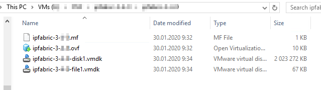

# Deploying the IP Fabric Virtual Machine (VM)

All virtual appliance images are available at  [https://releases.ipfabric.io/ipfabric/#current](https://releases.ipfabric.io/ipfabric/#current). Access is restricted to registered customers only. Please contact our [sales representative](mailto:sales@ipfabric.io) if you are interested in a trial of IP Fabric.

!!! important

    Please bear in mind that IP Fabric uses CLI access (SSH or telnet) to connect to devices for data collection. It's important to place the VM in the proper network segment to prevent high ACL or firewall configuration overhead.

## Deploying on VMware OVA Virtual Machine

1.  Deploy OVA to your vSphere environment as described at [Deploy an OVF or OVA
    Template](https://docs.vmware.com/en/VMware-vSphere/6.5/com.vmware.vsphere.vm_admin.doc/GUID-17BEDA21-43F6-41F4-8FB2-E01D275FE9B4.html).
2.  [Edit VM settings](https://docs.vmware.com/en/VMware-vSphere/6.5/com.vmware.vsphere.vm_admin.doc/GUID-4AB8C63C-61EA-4202-8158-D9903E04A0ED.html) and adjust according to your network size as described in the [operational requirements section](../Overview/index.md#operational-requirements).
    1.  Change CPU count.
    2.  Change memory size.
    3.  [Add a new empty virtual disk or resize the main system disk](../../System_Administration/increase_disk_space.md)
3.  Power on VM and [complete Boot Wizard](#complete-first-time-boot-wizard).

## Deploying on Hyper-V Virtual Machine

Hyper-V image has been created using Hyper-V Configuration Version 8.0. Before deploying, please check if your Hyper-V server supports it.[Virtual Machine version on Windows or Windows Server](https://docs.microsoft.com/en-us/windows-server/virtualization/hyper-v/deploy/upgrade-virtual-machine-version-in-hyper-v-on-windows-or-windows-server)

1.  Download `ipfabric-*-hyperv.zip` from official source.
2.  Extract previously downloaded archive `ipfabric-*-hyperv.zip`.
3.  Import HyperV image to your hypervisor server. [Export and Import virtual machines (Microsoft docs)](https://docs.microsoft.com/en-us/windows-server/virtualization/hyper-v/deploy/export-and-import-virtual-machines)
4.  During **Choose Import Type** part, check option **Copy the virtual machine(create a new unique ID)**:

    

5.  Wait until import process ends.
6.  Edit VM hardware settings and adjust according to the network environment size (check requirements in [operational requirements section](../Overview/index.md#operational-requirements)). Right click on VM -- choose **Settings**:

    

    1.  Change CPU count

        

    2.  Change memory size

        

    4.  [Extend the system disk or add a new empty virtual disk](../../System_Administration/increase_disk_space.md) if necessary.

    5.  Close VM Settings window

7.  Start VM.

## Deploying to Nutanix Virtual Machine

!!! note

    Nutanix image is based on Virtual Disks of VMware vSphere OVA image. As Nutanix officially supports import of VMware VM’s, below instructions are based on the same image as used at [VMware deploytment section](#deploying-on-vmware-ova-virtual-machine).

1.  Download `ipfabric-*-.OVA` file from official source.
2.  Extract previously downloaded OVA file using 7-zip or any similar software, structure of extracted files should look like below

    

3.  Import `.vmdk` files to Nutanix hypervisor, following Nutanix official documentation -- [Nutanix import OVA](https://portal.nutanix.com/#page/kbs/details?targetId=kA03200000099TXCAY) and [Quick tip how to deploy a VM from OVF to AHV](https://next.nutanix.com/installation-configuration-23/quick-tip-how-to-deploy-a-vm-from-an-ovf-to-ahv-33613).

4.  Edit VM hardware settings and adjust according to the network environment size (check requirements in [operational requirements section](../Overview/index.md#operational-requirements)).

    1.  Change CPU count
    2.  Change memory size
    4.  [Extend the system disk or add a new empty virtual disk](../../System_Administration/increase_disk_space.md) if necessary.

5.  Start VM and check if system starts without any interrupts.

## Deploying on KVM Virtual Machine

We have currently limitation with drives to be `/dev/sdx`. Usually Linux hypervisors are using `virtio-blk` driver which is represented as `/dev/vdx` in guest system. To overcome this limitation use `virtio-scsi` as drive controller.

1.  Download `qcow2` system disk to your KVM hypervisor.
2.  Resize the `qcow2` disk for data with size that corresponds to [your network needs](../Overview/index.md#operational-requirements) if necessary with the following command:

    ```shell
    qemu-img resize ipfabric-disk1.qcow2 100G # (up to 1000G for 20 000 devices)
    ```

3.  Deploy VM to your hypervisor through virt-install utility by issuing the following command (chose CPU and RAM size according to size of your network):

    ```shell
    virt-install --name=IP_Fabric --disk path=<path to the disk>.qcow2 --graphics spice --vcpu=4 --ram=16384 --network bridge=virbr0 --import
    ```

4.  This command deploys a new virtual machine with IP_Fabric name, system `qcow2` disk, 4 CPU cores, 16GB of RAM and will connect VM to the internet through `virtbr0` interface (if your machine has a different bridge interface name or you want to connect it straight through the device network card to the internet you need to change `--network` parameter).

5.  This command also starts up just created VM.

6.  Additionally, you can [create and add a new empty virtual disk if needed](../../System_Administration/increase_disk_space.md).

---

## Complete (first-time) Boot Wizard

The *First Boot Wizard* starts when IP Fabric is run for the first time and configures system options. The wizard can also be re-run later from the service interface to modify basic system parameters.

1.  Assign hostname.
2.  Assign domain name.
3.  Choose IP address acquisition method.
4.  If a static method is used, configure IP address, netmask, default GW, and DNS servers.
5.  Configure NTP servers or just click OK to continue if not using NTP.
6.  Select time zone.
7.  Configure Internet Proxy if used.
8.  Set shell user password of `osadmin` user. The password is used to access the IP Fabric administrative interface and system shell (not for the GUI access, the GUI is accessible with the `admin` username by default, for more information, please, read: [Access User Interface and Install License](02-access_ui.md) and also for encrypting system backups.
9.  Optionally define organization parameters for the local SSL certificate.
10. After rebooting, the console login screen will display the assigned IP address of the system and provide a link to access the user interface.

!!! warning

    Remember password from step 8! IP Fabric support engineers are able to reset `osadmin` user passwords but **encrypted backups will be lost**!

!!! info

    A trusted certificate can replace a self-signed SSL certificate using IP Fabric web UI.
