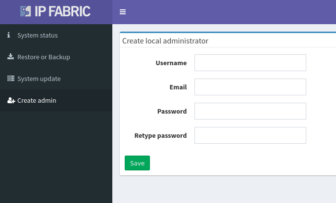
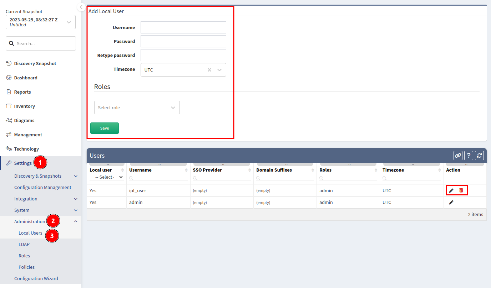
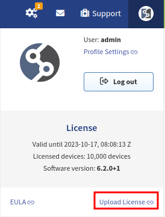
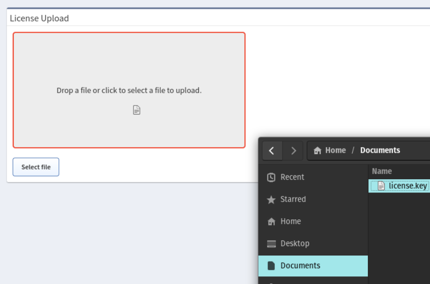
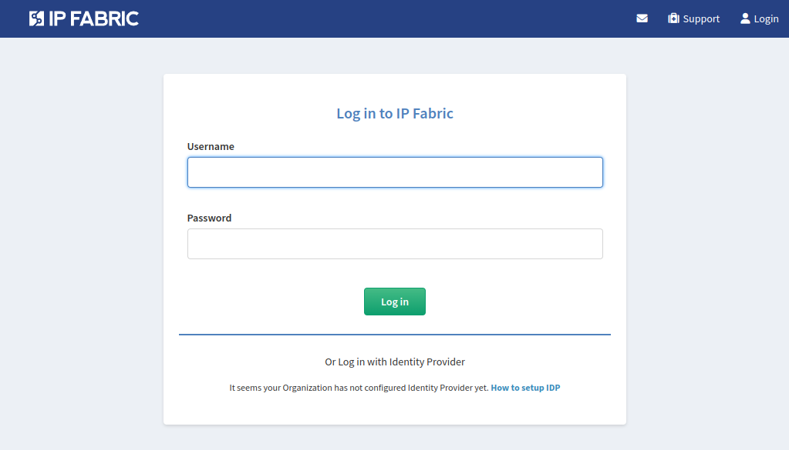

# Access User Interface And Install License

## Creating The First IP Fabric User

To create the first user, please log in to the System administration running on port `8443`.

After logging in as the `osadmin` user, go to **Create admin** menu and set up a new local administrator account.

!!! Info

	By default there is no user to present to the main GUI on a clean IP Fabric installation. It is mandatory to create a new local administrator account.

With this new account, you will be able to log in to the main IP Fabric user
interface and change a password to the default `admin` account or delete
it. This can be done in **Setting --> User Management** menu.

In addition, other local user accounts can be created here.

## Accessing The Main User Interface

Type IP Fabric VM's address into a web browser and allow HTTPS exceptions in case of a warning.

!!! note "Trusted certificate"

	You can replace a self-signed SSL certificate with a trusted one in the web UI.

The system requires a license file that uniquely identifies the system and links it to the dedicated support channels.
Keep the license file safe, as the license file is also used as part of the key to encrypt sensitive information.
Drag the license.key file into the web interface, or click **Select file** and browse to the license file.
If the license installation fails, contact the IP Fabric support team.

Once the license is validated, the system will present a login screen.

Login with the account created in [Creating The First IP Fabric User](#creating-the-first-ip-fabric-user)

