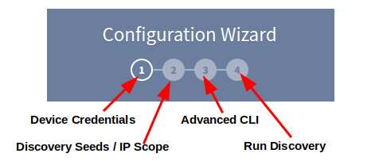

# Configuration Wizard

After logging in for the first time, you will be presented with the **Configuration
Wizard**. It will guide you throughout the initial setup, in order to start the
first discovery.

1. [Device Credentials](../../IP_Fabric_Settings/Discovery_and_Snapshots/Discovery_Settings/device_credentials.md#configure-network-infrastructure-access)
2. [Discovery Seeds](../../IP_Fabric_Settings/Discovery_and_Snapshots/Discovery_Settings/discovery_seeds.md) / [IP Scope](../../IP_Fabric_Settings/Discovery_and_Snapshots/Discovery_Settings/discovery/ip_scope.md)
3. [Advanced CLI](../../IP_Fabric_Settings/Discovery_and_Snapshots/Discovery_Settings/advanced_cli.md#fine-tune-sshtelnet-cli-parameters)
4. Run Discovery
