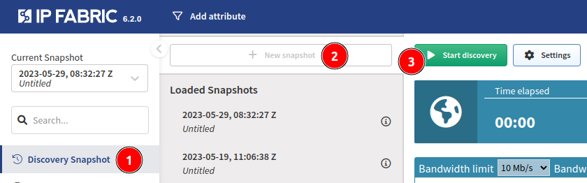

# Initial Discovery

!!! note

    Now that you have entered the essential details, you can start the discovery!

## Option 1 -- via the Setup Wizard

If you haven’t yet, you can click on **Start Discovery** from [11 of the Setup Wizard](../Configuration_Wizard/11_-_Configuration_Complete/).

## Option 2 -- via the Discovery Snapshot page

At the **Discovery Snapshot** page, click on **New snapshot** and start the discovery:

IP Fabric will attempt to connect to the default gateway of the VM and any provided Seed IP Addresses. Once connected to a device, IP Fabric will fingerprint the vendor, model, and version, and adjust accordingly to run the [necessary commands](../Overview/vendors_features.md#cli-commands-used-during-discovery). You can read more about discovery process at [How Discovery Works](../Overview/How_Discovery_Works/CLI_discovery.md).

After the discovery is completed, all of the state data is available and you can start exploring [IP Fabric GUI](../../../IP_Fabric_GUI/Discovery_Snapshot/).

**Enjoy using IP Fabric!**

If no devices are discovered, or something is missing, check this [documentation page](../../Overview/How_Discovery_Works/common_problems/no-devices-discovered/) for known cases or contact our support team.
