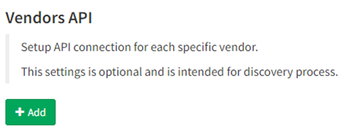

# 07 - Vendors API

IP Fabric supports discovery of network devices via dedicated vendors' APIs.

They are frequently complementary to CLI based discovery process for the established networking vendors, but completely essential for SD-WAN or cloud vendors.

For more information about how to configure API for each vendor, follow [Vendor API configuration section](../../../IP_Fabric_Settings/advanced/Vendors_API/index.md).

