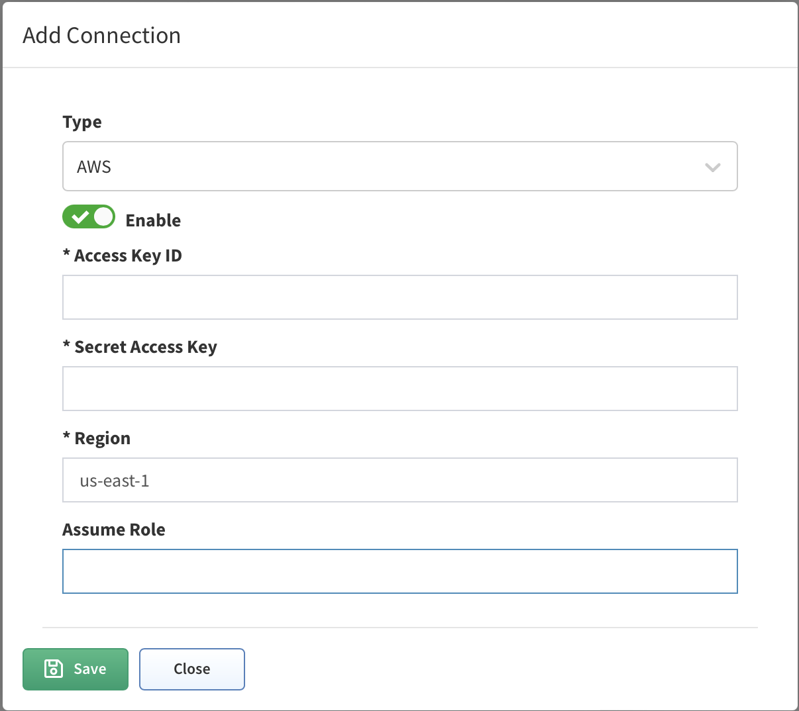
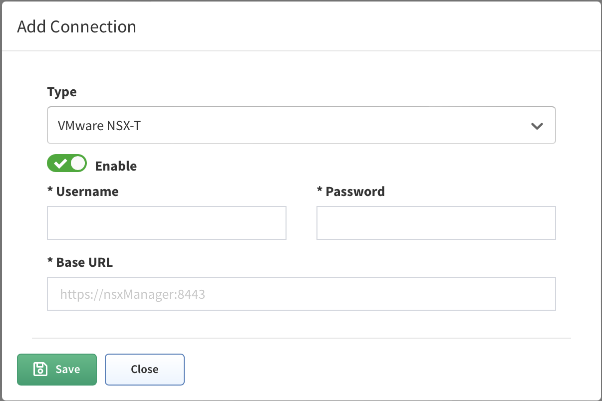
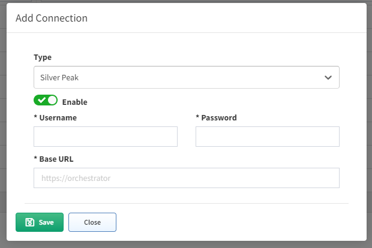
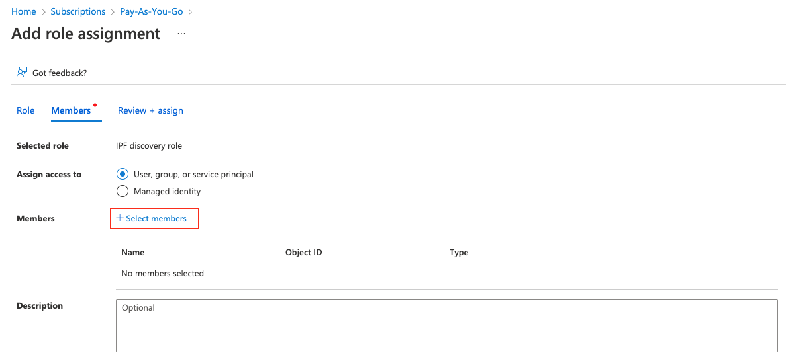
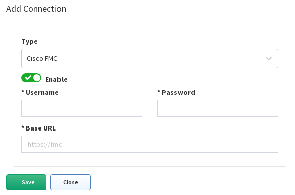

# 07 - Vendors API


## Cisco Meraki
Starting the version 3.5.0, IP Fabric supports API based discovery for Cisco Meraki.
Meraki requires the following settings to be applied:
- API key - Generated in [Meraki dashboard](https://documentation.meraki.com/zGeneral_Administration/Other_Topics/The_Cisco_Meraki_Dashboard_API)
- Organizations ID - You can specify which organization will be included in the discovery process. If you do not specify, all available IDs will be used
- Version - Meraki currently provides only a v0 version of their API. This version has a lot of limitations ([Meraki known issues](https://ipfabric.atlassian.net/wiki/spaces/ND/pages/968032257/Meraki))
- Base URL - URL is supported in the following format https://nXYZ.meraki.com/api. Be aware that the dashboard can redirect communication to a different URL
### Management IP for Cisco Meraki

For the CLI (SSH/Telnet) discovery, the Management IP represents the login IP address that the platform used to discover the device. Cisco Meraki is discovered via API and therefore different logic is used to create management IP parameters for Meraki devices

```
LAN IP is considered to have the highest priority
  setIps('lanIp');
wan1Ip has the 2nd highest priority
  setIps('wan1Ip');
wan2Ip has the 3rd highest priority
  setIps('wan2Ip');
publicIp has the lowest priority
  setIps('publicIp');
```

!!! info 
    `PublicIP` parameter can have multiple occurrences as more devices can be accessed via the same public IP address. It can also be inaccurate (e.g. when WAN circuit fails over to secondary it can take quite longe until the device public IP is refreshed in dashboard. PublicIp property is currently not provided by organizationsDevices.

To understand what is being sent from Meraki’s Dashboard, we need to look into the Discovery Snapshot and download the Tasker information:


The Tasker file contains complete communication between IP Fabric and Meraki Dashboard. We can use the device hostname to locate the JSON source:
```

{
   "name":"mx01-dl1",
   "serial":"Q2QN-Q6EY-NP7J",
   "mac":"0c:8d:db:b0:c2:dc",
   "networkId":"L_783626335162466320",
   "model":"MX65",
   "address":"",
   "lat":37.4180951010362,
   "lng":-122.098531723022,
   "notes":"",
   "tags":"",
   "wan1Ip":"192.168.128.4",
   "wan2Ip":null,
   "configurationUpdatedAt":"2022-03-05T15:07:48Z",
   "firmware":"wired-15-44",
   "url":"https://XXX.meraki.com/DevNetLab-applia/n/xaNlkcig/manage/nodes/new_list/456789654858"
}
```
## CheckPoint
!!! info
    We use API only to collect information (security policies) that cannot be retrieved from CLI logs.
    To discover CheckPoint devices, CLI access is essential as well.
Checkpoint requires the following settings to be applied:

- API Key - Available in version R80.40 and above (API v1.6). To generate the key, use CheckPoint SmartConsole, and select "API Key" as user's Authentication method **or**

- Username - Username to access API data
- Password - Password to access API data

- Base URL - Base URL for API calls `https://management.server.domain.tld`. If the API isn't available on the default port 443, add a port part to the URL (ie: `https://server:4443/`).

- Collect following domains - Mandatory only if the "Base URL" points to a Multi-Domain Server. Please verify, that all selected domains can be accessed by the provided credentials.

Don't forget to add IPF appliance to the list of allowed clients. In SmartConsole, go to **Manage & Settings > Blades** and click on **Advanced Settings...** in the **Management API** section to verify, from where are API calls allowed. In case that you use setting **All IP addresses that can be used for GUI clients**, don't forget to add IPF appliance address to **Manage & Settings > Permissions & Administrators > Trusted Clients**. In case you use Multi-Domain server, all necessary settings are in Multi Domain menu (e.g. **Multi Domain > Blades**).

## VERSA Networks SD-WAN

Starting version 3.8.0 IP Fabric supports Versa SD-WAN API. API is based on HTTPS authentication. Versa requires the following settings to be applied:

- Username - Username to Versa Director to access API data

- Password - Password to Versa Director access API data

- Base URL - Base URL of Versa Director. If the API isn't available on the default port 9182, add a port part to the URL (ie: `<https://server:4443/`).

!!! warning

    OAuth authentication credentials to Versa Director are not supported at the moment to access API.

## AWS (Amazon Web Services)

Starting version 3.8.0 IP Fabric supports AWS API.

To add AWS to the discovery you will need an access key & secret access key from your AWS account. Those keys can be found/generated under your account in the AWS dashboard.


Click on **My Security Credentials** and open **Access keys** tab.


To generate keys click on “Create New Access Key” and your keys will be
generated. These access keys are available globally for all of yours AWS
regions.


Copy those keys to the AWS API settings in your IP Fabric and don't forget to **fill the region where the devices which you want to discover are**.


!!! info To ensure that IP Fabric can retrieve all the required data to model the AWS networks, a series of specific policies are required to be applied to the user account or role used for the API key. Example configuration with all required IAM policies:

[ipf_aws_ami_policy](/ipf_aws_ami_policy.json)

### AWS AssumeRole
From version 4.3, IP Fabric enables you to add AssumeRole to AWS API configuration. AssumeRole basically sets higher permissions that may be required for the discovery process in some environments.

AssumeRole is a standard way how to obtain additional rights when talking to AWS API. It returns a set of temporary security credentials that you can use to access AWS resources that you might not normally have access to. These temporary credentials consist of an access key ID, a secret access key, and a security token. Typically, you use AssumeRole within your account or for cross-account access. For more information about AssumeRole see https://docs.aws.amazon.com/STS/latest/APIReference/API_AssumeRole.html

## Cisco Viptela SD-WAN
Starting version 4.1.0 IP Fabric supports Viptela API.

Viptela devices are discovered only through API.

To add Viptela to discovery global settings, go to **Settings → Advanced → Vendors API** and press **the +Add** button

Afterward, choose Viptela API from the list and fill in

- **Username and password** used to log in to vManage

- **Base URL** of vManage server (https://vmanage-ip-address)

| Caveats | |
----------|-|
|**Version:** |4.3.5+1|
|**ID:**|NIM-7437|
|**Description:**| Discovery with added NSX-T Vendor API can get stuck and doesn’t finish|
|**Status:**| Root cause analysis in progress
|**Workaround:**| Stop discovery and disable NSX-T Vendor API

## VMware NSX-T
Starting version 4.3 IP Fabric supports NSX-T API.

NSX-T devices are discovered only through API.

To add NSX-T to discovery global settings, go to **Settings → Advanced → Vendors API** and press **the +Add** button

Afterward, choose NSX-T API from the list and fill in

- **Username and password** used to log in to NSX Manager

- **Base URL** of NSX Manager server (https://nsx-manager-ip-address)

### General support information
- IP Fabric is supporting NSX-T from version 3.0 and higher, development was done on version 3.1.2, the latest version is 3.2. We are not supporting the 2.x version, there are a lot of differences, Vmware’s end of general support was in September 2021. https://lifecycle.vmware.com/#/

- NSX-T running as on-premise (there are also cloud versions for AWS and Azure, where can NSX-T cloud be deployed on top of AWS/Azure infrastructure ), but we don’t support it now

- We don’t collect any data from vCenter, as NSX-T is multiplatform and supports KVM and bare metal servers as well, if those are connected to the NSX-T cloud, we will collect information about those also.

### We are supporting those types of devices
- Tier-0 router
- Tier-1 router
    - also supporting VRFs

### Not supported features
- Load balancing
- All security features (IPS/IDS, Distributed FW, Gateway FW, Network introspection) - planned to add security features in upcoming releases
- Forwarding policies - planned to add in upcoming releases
- VPN services
- NAT
- EVPN VXLANs

### External connectivity
We are supporting both external connectivity protocols, which are implemented in NSX-T, and of course static routes. External connectivity can be done only on Tier-0 routers.
- OSPF
- BGP

## Silver Peak SD-WAN
Starting version 4.3 IP Fabric supports the discovery of Silver Peak (Aruba) EdgeConnect devices in router mode.

EdgeConnect devices are discovered only through API.

To add EdgeConnect to discovery global settings, go to **Settings → Advanced → Vendors API** and press the +Add button

Afterward, choose Silver Peak from the list and fill in

- **Username and password** to log in to Unity Orchestrator

!!! info
    if a user has just RO rights, ARP table will NOT be downloaded - this is not supported by the orchestrator’s API
- **Base URL** of Unity Orchestrator (https://unity-orchestrator-ip)


## Azure Networking
- Azure Networking  // missing links to documentation
- Azure support in IP Fabric  // missing links to documentation
- Azure Setup  // missing links to documentation
    - Register an App  // missing links to documentation
    - Subscription & Access Control  // missing links to documentation
    - Role definitions for IP Fabric (JSON)  // missing links to documentation

### Azure support in IP Fabric
Starting version 4.3 IP Fabric supports the discovery of the Azure Cloud infrastructure. Azure devices are discovered only through API. The IP Fabric covers the IaaS (Infrastructure as a Service) part of the cloud. Azure Cloud Compute provides an abstract view of the Azure physical infrastructure.

- Virtual Network (https://docs.microsoft.com/en-us/azure/virtual-network/virtual-networks-overview)
- NAT Gateway (https://docs.microsoft.com/en-us/azure/virtual-network/nat-gateway/nat-gateway-resource)
- Virtual Network Gateway (both types: VPN https://docs.microsoft.com/en-us/azure/vpn-gateway/ and ExpressRoute https://docs.microsoft.com/en-us/azure/expressroute/expressroute-about-virtual-network-gateways)

and devices related to a Virtual WAN solution (https://docs.microsoft.com/en-us/azure/virtual-wan/virtual-wan-about):

- Virtual HUB
- VPN Gateway (the same functionality as VNGw type VPN)
- ExpressRoute Gateway (the same functionality as VNGw type ExpressRoute)
The plan is to add support of Load Balancer (https://docs.microsoft.com/en-us/azure/load-balancer/load-balancer-overview ) in one of next releases.

### Azure Setup
To add Azure devices to discovery global settings, go to **Settings → Advanced → Vendors API** and press **the +Add** button

IP Fabric needs the following data in order to connect to the Azure API - Tenant ID, Subscription ID, Application ID, and Application secret. Follow these steps to get the required data.

First login to the Azure portal (https://portal.azure.com/ )

### Register an App
Search for “Active Directory“.
1. From the left menu, click on “App registrations“, then click on “+ New registration”.
2. Fill in the name of the application (e.g. “IP Fabric”). From the “Supported account types“, select the first option “Single Tenant“. Leave other options blank
3. Once you click on “Register“, you’ll be redirected to the App overview page. Note the “Application (client) ID” and **“Directory (tenant) ID“**
4. Click on “Certificates & Secrets“ and select the “Client secrets (0)“ tab, click “+ New secret“, select Expiration and then click “Add“.
5. Copy the created **client secret** to the clipboard (column Value). **You won’t be able to see it again.**

### Subscription & Access Control
Search for “Subscriptions“ and select the subscription you like to add to IPF (IPF can do discovery per subscription)
1. On the overview page note the **Subscription ID.**
2. From the left menu, click on Access control (IAM), click on “+ Add” and “Add custom role“. Fill in the role name. IP Fabric requires specific permissions in order to make API calls. Select “Start from JSON“ and upload JSON file with the required permissions (find it at the very bottom of this page). Click on the Next button to continue.

3. Review the permissions and click Next. Now you have to assign a scope for this role. Click on “Add assignable scopes“ and from the right panel select Type: Subscription and than click on the Subscription you want to assign

4. Click on “Review + Create“
5. Now you have to assign the newly created Role to the Registered App. From the left menu, select again “Access control (IAM)“ and then click “+ New“ and “Add role assignment“.
6. Find the previously created role, click “Next“ and then click on “+ Select members“. Find the app you created before. Click “Review + Assign“


### Role definitions for IP Fabric (JSON)
Following JSON format applies for IP Fabric version 4.3 and above:
[azure role](/vendors_api_azure_role_azure_4_3.json)

## Cisco FMC (FTD)
Starting version 4.3 IP Fabric collects zone firewall-related data for Cisco Firepower devices **ONLY through Cisco FMC API**.

Cisco Firepower devices are still discovered via SSH so if Cisco Firepower devices are not managed via FMC they will still be discovered but **without** security-related information.

To discover Cisco Firepower security policies and use the Zone Firewall feature in IP Fabric it is necessary to control Cisco Firepower through Cisco FMC (Firewall Management Center) and add Cisco FMC in global vendor API settings.

Go to **Settings → Advanced → Vendors API** and press **the +Add** button

Afterward, choose Cisco FMC API from the list and fill in
- **Username and password** used to log in to Cisco FMC
- **Base URL** of Cisco FMC server (https://cisco-fmc-ip-address)

