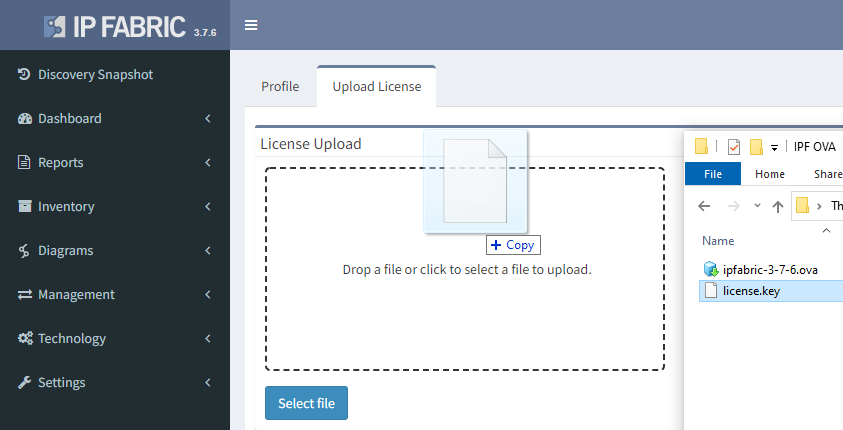
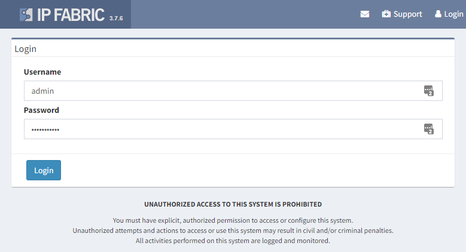

# Access User Interface and Install License

Type IP Fabric VM's address into a web browser and allow HTTPS exceptions in case of a warning.

!!! note "Trusted certificate"

    You can replace a self-signed SSL certificate with a trusted one in the web UI.

The system requires a license file that uniquely identifies the system and links it to the dedicated support channels. Keep the license file safe, as the license file is also used as part of the key to encrypt sensitive information. Drag the license.key file into the web interface, or click **Select file** and browse to the license file. If the license installation fails, contact the IP Fabric support team.

Once the license is valid, the system will present a login screen. The default system username is `admin` and the password is `netHero!123`. The admin account can be used as a regular account to run the system or to create and manage other users.

!!! hint "Invalid default admin credentials"

    In case that that default system username and password are not working, please gin to the System administration running on port `8443`. After login as `osadmin` user go to **Create admin** and create a new local administrator account. With this new account, you can login to the main IP Fabric user interface and change a password to the default admin account or delete him. See [Create Local Administrator](../../system_administration/admin_ui/create_local_administrator.md) page.
