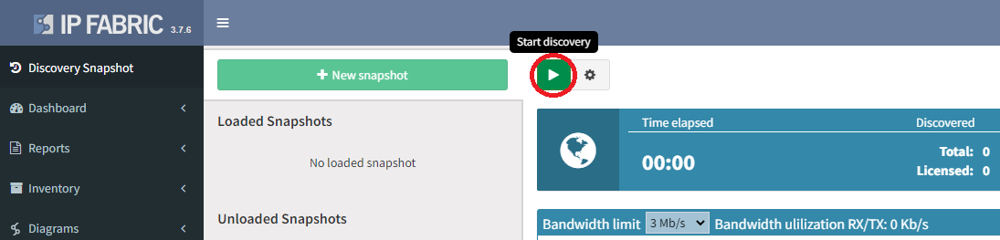

# Initial discovery

!!! note

    Now that you have entered the essential details, you can start the discovery!

## Option 1 -- via the Setup Wizard

If you haven’t yet, you can click on **Start Discovery** from [11 of the Setup Wizard](11_-_Configuration_Complete).

## Option 2 -- via the Discovery Snapshot page

At the **Discovery Snapshot** page, click on **New snapshot** and start the discovery:

IP Fabric will attempt to connect to the default gateway of the VM and any provided Seed IP Addresses. Once connected to a device, IP Fabric will fingerprint the vendor, model, and version, and adjust accordingly to run the [necessary commands](../overview/vendors_features.md#cli-commands-used-during-discovery). You can read more about discovery process at [How Discovery Works](../overview/discovery.md).

After the discovery is completed, all of the state data is available in structured [Technology tables](Technology_Tables), [Diagrams](Diagrams_up_to_3.8.x_), a [MS Word Document Reports](Reports), or through API. Technology tables can be colored for specific [verification or reporting](Technology_verification_and_analysis) using the FIXME button on the table heading row, which can then be displayed in a [dashboard](Dashboard). At least two discovery runs are required to compare changes or to see rates and the delta counter data.

**Enjoy using IP Fabric!**

If [no devices are discovered](https://ipfabric.atlassian.net/wiki/spaces/NK/pages/79986690/No+devices+discovered), or something is missing, check the [knowledge base](https://kb.ipfabric.io) for known cases or [contact support](https://ipfabric.atlassian.net/servicedesk/customer/portals).
