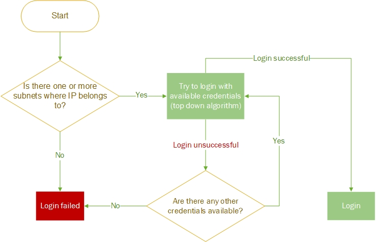

# 01 - Configure Credentials

Network infrastructure credentials are stored in **Settings → Authentication**. These credentials use IP Fabric to access the CLI of the network devices. Read-only (privilege level 1) credentials are sufficient for the discovery.

If credentials are provided for configuration changes tracking and saved configuration consistency (i.e. they allow commands such as `show run` and `show start`), mark this set of credentials using the checkbox [Use for configuration management](Configuration).

You can limit the validity of the credentials just for a part of your network by **Use in subnet** field. If more credentials are specified, a top-down algorithm is used when trying to login into a network device or the credentials priority can be changed using drag and drop.

