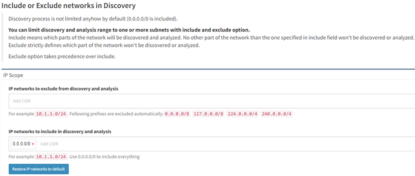

# 04 - Include or Exclude networks in Discovery

By default, there are no limitations on discovery, and all IP addresses are allowed (i.e. *Include scope* is `0.0.0.0/0`).

Discovery can be limited to one or more subnets using **Settings → Advanced → Discovery → IP Scope → IP networks to include in discovery and analysis**. Enter one or more subnets to limit the discovery process to addresses from particular networks.

Specific parts of the network can be also excluded from discovery using **Settings → Advanced → Discovery →  IP Scope → IP networks to exclude from discovery and analysis**.

IP Scope settings are not applied to Vendor API (everything is downloaded and used in discovery).

Exclude option takes precedence over include. For example

- IP networks to include in discovery and analysis: `10.0.0.0/8`
- IP networks to exclude from discovery and analysis: `10.24.0.0/16`

Results in `10.0.0.0/8` being scanned excluding `10.24.0.0/16` subnet.
