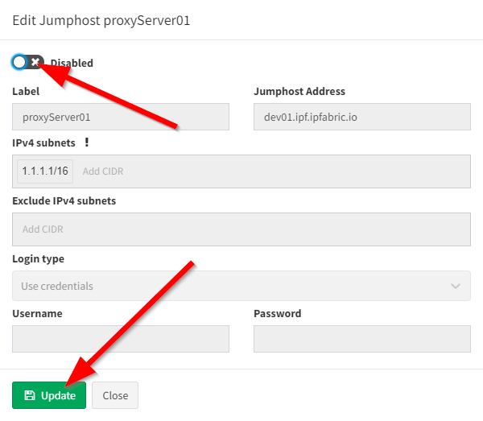

# 06 - CLI Settings

## Fine-Tune SSH/telnet CLI parameters

The IP Fabric's discovery is primarily using Command Line Interface (CLI) to discover network elements. There are certain default CLI parameters that can be found in **Settings → Advanced → SSH/TELNET**:

Network device login timeout
: Timeout before the logging prompt is received. It may take longer for remote branches over low-speed lines, or destined to overloaded devices.

Network device session timeout
: Too many _Command Timeout_ errors during the Discovery process may indicate that _Network device session timeout_ is too short and it may be necessary to expect a delay for a response to arrive.

Maximum number of parallel sessions
: To prevent flooding your network with too many SSH/TELNET sessions set _Maximum number of parallel sessions_. This setting can be also helpful if the AAA server (TACACS/Radius) has a limit of parallel AAA requests for users.

    In rare cases, the Cisco ISE or similar systems may rate limit the command authorization. When there are too many authorization failures and Cisco ISE is in place, try to limit the number of parallel sessions down to 10 and steadily increase.

Basic failure
: How many times to retry a connection for any error, except authentication failure.

Authentication failure
: _Authentication failure_ can occur even if a user is authorized to login but may happen, for example, when an AAA server is overloaded or an authentication packet is lost.

Command Authorization Failure retries
: If you see many examples of *Authentication error* during the Discovery process, please adjust _Authentication failure_ and _Command Authorization Failure retries_.

!!! example "Example of error message in Connectivity Report"

    According to the summary of issues in the very first completed snapshot, the CLI Settings can be adjusted. Here are some of the most common errors and adjustments:

    | Error                                                                           | Error Type                    | How to mitigate                                                                                                    |
    | ------------------------------------------------------------------------------- | ----------------------------- | ------------------------------------------------------------------------------------------------------------------ |
    | connect ETIMEDOUT XX.XX.XX.XX:22                                                | Connection error              | Received no response from the destination.                                                                         |
    | connect ECONNREFUSED XX.XX.XX.XX:22                                             | Connection error              | The connection to the destination is being blocked by an access-list or firewall.                                  |
    | All configured authentication methods failed                                    | Authentication error          | Unable to authenticate to the destination host                                                                     |
    | Authentication failed                                                           | Authentication error          | Unable to authenticate to the destination host                                                                     |
    | Authentication failed - login prompt appeared again                             | Authentication error          | Unable to authenticate to the destination host                                                                     |
    | SSH client not received any data for last 120000 ms! cmd => show vrrp  \| e #^$ | Command timeout               | The command `show vrrp  \| e #^$` timed out. Increase **device session timeout.**                                  |
    | Can't detect prompt                                                             | Command timeout               | Unable to detect CLI prompt. Increase **network device login timeout.**                                            |
    | Command "enable" authorization failed, tried 2x                                 | Command authorization failure | The command wasn't authorized. **Increase command authorization failure retries** or increase the timer value (ms) |

## Jump host

**Jump host** allows to set-up connection to the server which can be used as a **proxy server for discovery** purposes. For connecting, IP Fabric uses the `sshuttle` library that has the [following requirements for the jump host.](https://sshuttle.readthedocs.io/en/stable/requirements.html#client-side-requirements).

!!! warning

    Please bear in mind, that once the connection is established, it will be enabled permanently, until disabled or removed! If there are any network issues, IP Fabric software will try to establish a connection periodically.

!!! warning

    At least one seed IP address has to be provided as a starting point behind Jumphost in seed configuration.

### Set up Jump host

1.  Open jump host settings, using item **Settings → Advanced → SSH/TELNET**

2.  At the bottom of the page, please select **Add** button

    

3.  Fill in all necessary data

    1.  **Label** - the name for configuration (mandatory)
    2.  **Jump host Address** - IP address of FQDN name (mandatory)
    3.  **IPv4 subnets** - subnet in CIDR representation, allows adding more than open, separated with spaces (mandatory)
    4.  **Exclude IPv4 subnets** - subnet to exclude in CIDR representation, allows to add more than open, separated with spaces (optional)
    5.  **Login type**
        1.  **Use credentials** - require to provide username and password
        2.  **Use SSH keys** - if you copied ssh public key to the proxy server, it won’t require providing a password (please jump to the _SSH key configuration_ section)
    6.  **Username** - Username for authentication (mandatory)
    7.  **Password** - password for authentication (mandatory if ‘Use credentials’ is used)

        

4.  Click **Add**.
5.  If a connection is open, you will see the **Running** status in Jumphost list

    

!!! warning

    If you use 0.0.0.0/0 or another subnet that includes your network from which you are connecting to IP Fabric, make sure you put your network to **“Exclude IPv4 subnet”**. Otherwise, your IP connection will be lost and you will have to recover from the console.

### SSH key configuration

!!! note

    Adding ssh key to proxy server allows you to avoid using passwords for authentication.

1.  Download ssh key from Jumphost settings

    

2.  Save `ipf-discovery-public-key.pub`

3.  Copy file content to `~/.ssh/authorized_keys` (or equivalent) file of the user that will authenticate with Jumphost server.

4.  If the key has been copied you can use the option **Use SSH keys** while adding a new Jumphost server, instead of **Use credentials**.

### Disabling Jumphost connection

1.  Edit configuration that needs to be disabled, i.e.

    

2.  Change the setting to **Disabled**,

3.  Click the **Update** button

    

### Remove Jumphost configuration

1.  On Jumphost servers list, check configuration that needs to be removed

2.  Click **Delete** button

    

### Limitations

Only TCP connections work through the Jump host. Traceroute with ICMP is not supported so the discovery process might not be able to get over the unreachable part of the network (for example sites separated by the provider’s network). In this case, you will have to add at least one IP from each site to the seeds settings.

## Custom SSH/Telnet ports

Custom SSH/Telnet ports settings enable the discovery process to use different than standard ports for connecting. The standard for SSH is port 22 and 23 for Telnet.

In the following example we will configure the discovery process to use port `8080` for SSH connections towards firewall at `192.168.168.10`:

As a result of such configuration, we would create a new item under the **Custom SSH/Telnet ports** configuration, which will be applied to every new snapshot created by IP Fabric.

