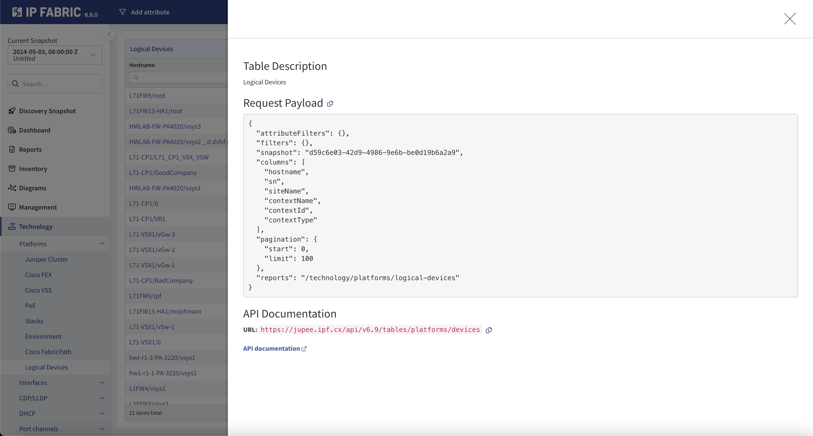

# Overview

IP Fabric is an API-first client, which means that every click in the user
interface (UI) has an associated API call.

## Python IP Fabric (SDK)

API-first principles allow the IP Fabric team to maintain a Software Development
Kit (SDK) that can be used for automation. While the IP Fabric main GUI is written
in TypeScript, we have chosen to write the SDK in Python, as it is the most
common language used by network engineers.

The SDK documentation can be found
at <https://gitlab.com/ip-fabric/integrations/python-ipfabric>.

While using SDK is more straightforward than calling API directly, we recommend
making yourself familiar with the rest of the documentation, as many SDK calls
map directly to API calls.

## Postman Collection

An IP Fabric Postman Collection is also available for testing API calls.
The collection can be found in the [IP Fabric Public Workspace](https://www.postman.com/ipfabric/workspace/ip-fabric-public-workspace/overview), and documentation can be found
here in [Postman Collection](../integrations/postman/index.md).

## Using API Directly

The following documentation is meant to get you started working with the API and
provide you with a tutorial on how it works.

Most of the tables within IP Fabric have a `Table description` option under the
`...` (3-dot menu) in their top-right corner. It describes how to interact with
the API, the data required in the payload, and the endpoint to send the request
to. This is the easiest way to learn how to use the API. For more information,
please see
[Table Description](../IP_Fabric_GUI/tips/navigate_in_tables.md#table-description).

Another option is to use the `Network` tab of the web
browser's `Developer tools`, which will show you the endpoints and data required
to make a successful call to the platform.

!!! example "API Blog Posts"

    Please take a look at the following blog posts about using the IP Fabric API and Python SDK:

    - [Part 1: The Basics](https://ipfabric.io/blog/api-programmability-part-1/) -- Explains creating an API token, finding the API documentation, and retrieving data using Python requests, which can be translated into other coding languages.
    - [Part 2: Python](https://ipfabric.io/blog/api-programmability-python/) -- Utilizing the official [IP Fabric Python SDK](https://pypi.org/project/ipfabric/) to retrieve data.
    - [Part 3: Webhooks](https://ipfabric.io/blog/api-programmability-part-3-webhooks/) -- Creating webhooks to further your automation journey based on IP Fabric events.
    - [Part 4: Diagramming](https://ipfabric.io/blog/api-programmability-part-4-diagramming/) -- Utilizing the official [IP Fabric Python Diagramming SDK](https://pypi.org/project/ipfabric-diagrams/) to automate the creation of Network and Path Lookup Diagrams.

## API Versioning

Starting with version `5.0`, we have adopted a rather fast-moving API versioning
schema. This allows for tighter control over the changes and provides an
opportunity for maintaining backward compatibility for a manageable time frame.

The design still leverages API version directly in the URL over alternative approaches,
such as the extended Accept header. This allows for unambiguous exchange of state
between IP Fabric and customers; nothing more than the URL is needed to identify the
resource being accessed.

### URL Schema a Version in URL

The URL schema looks like:

```shell
https://{hostname}/api/v{major}.{minor}/{resource_path}
```

we use the following shortened version throughout the documentation:

```shell
/api/{api_version}/{resource_path}
```

where:

- `major` and `minor` follow the release version of the platform. So, if
  version `4.4.3` of the IP Fabric platform is deployed, its latest API path
  would be `/api/v4.4/`.

- The whole `.{minor}` is optional, and it is treated as `0` if omitted.

- `{api_version}` stands for the complete version string. For example, `v5.1`.
  Please mind the `v` prefix.

### API Version Deprecation and Allowed Changes

IP Fabric commits to keeping support for all `minor` versions within the particular
`major` version (so, for example, in version `5.4.3`, we allow `/api/v5.1/`
calls). But API may break between major releases.

We call a major release a release that introduces some complex functionality.
This typically means a large code refactoring, changes to the data model, etc.
Keeping backward compatibility is frequently not feasible in such
cases (for example, `v3` brought support for snapshots, `v4` brought graphs, `v5` RBAC).

Naturally, backward-compatible changes (typically addition of a new attribute)
don't need to be gated and can appear in responses even when an older API version
is used within the request.

Changes and depreciations are communicated via the API documentation
and [release notes](../releases/index.md). We will mark attributes
as `deprecated: true` in the OpenAPI schema when we fully migrate to the OpenAPI
3.0+ Specification.

Responses made with `minor < release_minor` will contain a custom header warning
the client about the use of a potentially old API. We leverage
the [IETF Draft for Deprecation header](https://datatracker.ietf.org/doc/html/draft-ietf-httpapi-deprecation-header). It is included and set to `true` (`Deprecation: true`) in every response to
a call made with an older than the current API version.

Requests made with `major < release_major` (obsolete version) will be refused
with the HTTP code `410 Gone` (`406 Not Acceptable` would also be reasonable, but we
explicitly mention this in the apidoc in relationship with the `Accept` header; so
not to confuse these two, the `410` was selected).

Requests made with an API version newer than the currently supported version are
also refused with `410 Gone` (while `404` or `406` would be probably closer
semantically, we don't want to confuse clients and keep `410` for all
version-related errors).

The error body, in both cases, is a JSON depicting current platform version as well
as the current API version:

```json
{
  "message": "Unsupported API version used.",
  "release_version": "5.4.2+1",
  "api_version": "v5.4"
}
```

This may look excessive at first, but it is to promote the client code to be
changed with every update, as to keep track with all small changes and updates
we bring. But in reality, clients would typically be fine if they update the API
version when moving to the new major release only. Frequently, the client code
will not change, except for the API version. Thus, we recommend using a global
constant for it.

## Technology Table Endpoints

The technology tables use `POST` requests **only** for reading information, and
the payload is used to specify or filter requested data from listed tables. The
`POST` and `DELETE` requests can be used for intent verification rules at each
endpoint.

At a technology table, click `...` (3-dot button) in the top right corner of the
table and select the `Table description` option that exposes the endpoints (can
be used with filters as well):




## Payload Definition

```jscript
{
  "attributeFilters": {},
  "columns": ["id", ...],
  "filters": {},
  "pagination": {},
  "snapshot": "<UUID|$last|$prev|$lastLocked>",
  "reports": "<FRONTEND_URL>" | ["REPORT_ID"]
}
```

- `columns` -- Specifies columns that we request for the endpoint.
- `filters` -- (Optional) Filtering options, for any column or intent
  verification.
  - Example: `"filters": {"vendor":["like","cisco"],"family":["eq","lap"],"reload":["color","eq","0"]}`
- `pagination` -- (Recommended) Specifies the pagination and response limits.
  - Example: `{"limit":1000,"start":0}`
  - It is currently recommended to query 1000 rows or fewer at a time.
- `snapshot` -- Specify the snapshot ID or use: `$last`, `$prev`
  , `$lastlocked`
  - Note: some tables (i.e., settings) do not allow the `snapshot` parameter.
- `reports` -- (Optional) Frontend URL where the reports are displayed or an
  array of report IDs as strings.
  - Examples:
    - `"reports": "/inventory/devices"`
    - `"reports": ["304796641"]`
- `attributeFilters` -- (Optional) Applies an attribute filter to the table.
  - Example: `"attributeFilters": {"siteName": ["LAB01"]}`
  - Note: some tables (i.e., settings) do not allow the `attributeFilters`
    parameter.

### Visualization of API Documentation

Refer to the example provided in the [Payload definition](#payload-definition) section for more details.

For comprehensive details on the read-only tables, please refer to our API documentation available through visual UI. It is important to note that this documentation exclusively covers API tables and does not include other endpoints.

Access the documentation at the following URL:
`https://your_ipf_instance/api/rapidoc/`
