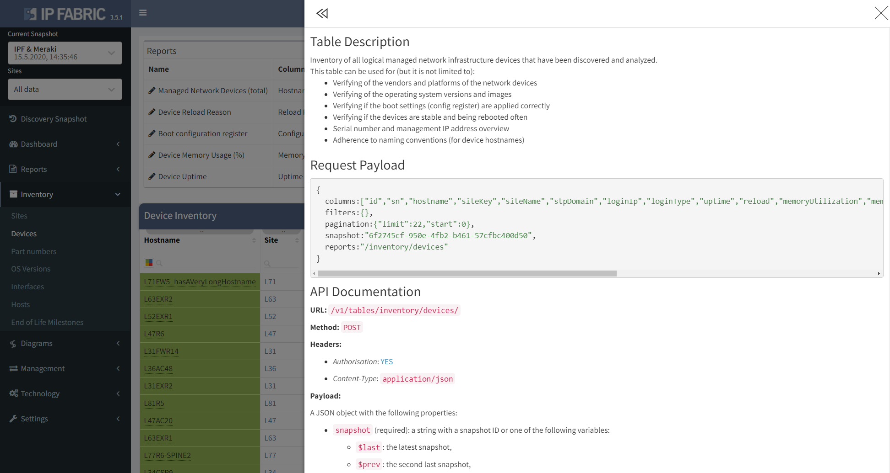

# Overview

IP Fabric is an API first client, that means that any click in the user interface (UI) has an API call associated with the action of the click.

## Python IP Fabric (SDK)

API first principles allow the IP Fabric team to maintain a Software Development Kit (SDK) that can used for automations. While the IP Fabric main GUI is written in TypeScript, we have chosen to write the SDK in Python as it is the most common language used by Network Engineers.

The SDK documentation can be found at [https://gitlab.com/ip-fabric/integrations/python-ipfabric](https://gitlab.com/ip-fabric/integrations/python-ipfabric)
<!--
[https://community-fabric.github.io/python-ipfabric/](https://community-fabric.github.io/python-ipfabric/)
-->

While using SDK is more straightforward then calling API directly, we recommend making yourself familiar with the rest of the documentation as many SDK calls map directly to API calls.

## Using API Directly

The following documentation is meant to get you started working with API and give you a tutorial on how it works.

Many of the tables within IP Fabric have a `?` which provides a description of
how to interact with the API, the data required in the payload, and the endpoint
to send the request to. This is the easiest way to learn how to use the API
and for more information please see
[Table Description](../IP_Fabric_GUI/tips/navigate_in_tables.md#table-description).

Another option is using the network viewer in
the web browser's `Developers Tools` which will show you the endpoints and data
required to make a successful call to the platform.

!!! example "API Blog Posts"

    Please take a look at the following blog posts about using the IP Fabric API and Python SDK:

    - [Part 1: The Basics](https://ipfabric.io/blog/api-programmability-part-1/) Explains creating an API token, finding the API documentation, and retrieving data using Python requests which can be translated into other coding languages.
    - [Part 2: Python](https://ipfabric.io/blog/api-programmability-python/) Utilizing the official [IP Fabric Python SDK](https://pypi.org/project/ipfabric/) to retrieve data.
    - [Part 3: Webhooks](https://ipfabric.io/blog/api-programmability-part-3-webhooks/) Creating Webhooks to further your automation journey based on IP Fabric events.
    - [Part 4: Diagramming](https://ipfabric.io/blog/api-programmability-part-4-diagramming/) Utilizing the official [IP Fabric Python Diagramming SDK](https://pypi.org/project/ipfabric-diagrams/) to automate creation of Network and Path Lookup Diagrams.

## API Versioning

We have adopted a rather fast-moving API versioning schema starting with
release `5.0`. This allows for tighter control over the changes and provides
opportunity for maintaining a backwards compatibility for a manageable time
frame.

Design still leverages API version directly in URL over alternative approaches,
such as extended Accept header. This allows for unambiguous exchange of state
between IPF and customers, nothing more then URL is needed to identify the
resource being accessed.

### URL Schema a Version in URL

URL schema looks like

```shell
https://{hostname}/api/v{major}.{minor}/{resource_path}
```

we use the following shortened version throughout the documentation:

```shell
/api/{api_version}/{resource_path}
```

where

- `major` and `minor` follows the release version of the platform. So, if the
  `4.4.3` version of the IP Fabric platform is deployed, its latest API path
  would be `/api/v4.4/`.

- The whole `.{minor}` is optional and it is treated as `0` if omitted.

- `{api_version}` stands for the complete version string, for example `v5.1`.
  Please, mind the `v` prefix.

### API version deprecation and allowed changes

IPF commits to keep support for all `minor` versions within the particular
`major` version (so for example in release `5.4.3` we allow `/api/v5.1/`
calls). But API may break between major releases.

We call major release a release which introduces some complex functionality.
This typically means a large code refactoring, changes of data model etc. took
place. Keeping the backwards compatibility is frequently not feasible in such
cases (for example v3 brought support for snapshots, v4 brought graphs, v5 RBAC)
.

Naturally backwards compatible changes (typically addition of a new attribute)
don’t need to be gated and can appear in responses even when older API version
is used within the request.

Changes and depreciations are communicated via API documentation
and [Release Notes](../releases/index.md). We will mark attributes
as `deprecated: true` in the OpenAPI schema, when we fully migrate to OpenAPI
3.0+ specification.

Responses made with `minor < release_minor` will contain a custom header warning
client about use of potentially old API. We leverage
the [IETF Draft for Deprecation header](https://datatracker.ietf.org/doc/html/draft-ietf-httpapi-deprecation-header)
. It is included, and set to `true` (`Deprecation: true`) in every response to
call made with older then current API version.

Requests made with `major < release_major` (obsolete version) will be refused
with HTTP code `410 Gone` (also `406 Not Acceptable` would be reasonable, but we
explicitly mention this in the apidoc in relationship with `Accept` header, so
not to confuse these two the `410` was selected).

Requests made with API version newer than the currently supported version are
also refused with `410 Gone` (while `404` or `406` would be probably closer
semantically, we don’t want to confuse clients, and keep `410` for all version
related errors).

Error body, in both cases, is a JSON depicting current platform version as well
as the current API version:

```json
{
  "message": "Unsupported API version used.",
  "release_version": "5.4.2+1",
  "api_version": "v5.4"
}
```

This may look excessive at first, but it is to promote the client code to be
changed with every update, as to keep track with all small changes and updates
we bring. But in reality, clients would be typically fine, if they update API
version when moving to the new major release only. Frequently, the client code
is actually not going to change except of the API version. Thus we recommend
using a global constant for it.

## Technology Table Endpoints

The technology tables use `POST` requests **only** for reading information and
the payload is used to specify or filter requested data from listed tables. The
`POST` & `DELETE` request can be used for Intent verification rules at each
endpoint. At every technology table, search for the question mark button that
exposes the endpoints (can be used with filters as well).



## Payload definition

```jscript
{
  columns:[],
  filters:{},
  pagination:{},
  snapshot:"snapshotID",
  reports:""
}
```

- `columns` -- specifies columns that we request for the endpoint
- `filters` -- filtering options, for any column or intent verification
  `{"vendor":["like","cisco"],"family":["eq","lap"],"reload":["color","eq","0"]}`(
  optional)
- `pagination` - specifies the pagination and response limits
  `{"limit":26,"start":0}` (optional)
- `snapshot` -- defines snapshot ID or we can use: `$last`, `$prev`
  , `$lastlocked`
- `reports` -- Intent rules definition (optional)
