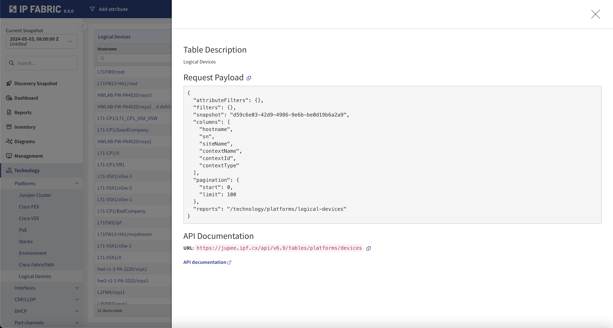

# Overview

The following API endpoints are available in IP Fabric. Descriptions and
allowed methods are coming soon. For more information about IP Fabric
API, please visit [generated IP Fabric API documentation](../api/index.html).

!!! example "API Blog Posts"

    Please take a look at the following blog posts about using the IP Fabric API and Python SDK:
    
      - [Part 1: The Basics](https://ipfabric.io/blog/api-programmability-part-1/) Explains creating an API token, finding the API documentation, and retrieving data using Python requests which can be translated into other coding languages.
      - [Part 2: Python](https://ipfabric.io/blog/api-programmability-python/) Utilizing the official [IP Fabric Python SDK](https://github.com/community-fabric/python-ipfabric) to retrieve data.
      - [Part 3: Webhooks](https://ipfabric.io/blog/api-programmability-part-3-webhooks/) Creating Webhooks to further your automation journey based on IP Fabric events.
      - [Part 4: Diagramming](https://ipfabric.io/blog/api-programmability-part-4-diagramming/) Utilizing the official [IP Fabric Python Diagramming SDK](https://github.com/community-fabric/python-ipfabric-diagrams) to automate creation of Network and Path Lookup Diagrams.


## Technology Table Endpoints

The technology tables use `POST` requests **only** for reading information and
the payload is used to specify or filter requested data from listed tables. The
`POST` & `DELETE` request can be used for Intent verification rules at each
endpoint. At every technology table, search for the question mark button that
exposes the endpoints (can be used with filters as well).



## Payload definition

```jscript
{
  columns:[],
  filters:{},
  pagination:{},
  snapshot:"snapshotID",
  reports:""
}
```

- `columns` -- specifies columns that we request for the endpoint
- `filters` -- filtering options, for any column or intent
  verification
  `{"vendor":["like","cisco"],"family":["eq","lap"],"reload":["color","eq","0"]}`(optional)
- `pagination` - specifies the pagination and response limits
  `{"limit":26,"start":0}` (optional)
- `snapshot` -- defines snapshot ID or we can use: `$last`, `$prev`, `$lastlocked`
- `reports` -- Intent rules definition (optional)

For more information, please, see [Request payload in generated API documentation](../api/#header-request-payload)

## Endpoint definition

### Data Tables

`https://server/api/v1/tables/` + `endpoint`

```
aci/endpoints
aci/vlan
aci/vrf
addressing/arp
addressing/duplicateIp
addressing/hosts
addressing/mac
addressing/managedDevs
addressing/nat
fhrp/balancing
fhrp/glbpForwarders
fhrp/groupMembers
fhrp/groupState
fhrp/stprootAlignment
interfaces/aql
interfaces/connectivityMatrix
interfaces/drops
interfaces/duplex
interfaces/errors
interfaces/inconsistencies
interfaces/load
interfaces/mtu
interfaces/portChannel
interfaces/switchports
interfaces/transceivers
interfaces/transferRates
inventory/devices
inventory/discoveryHistory
inventory/fans
inventory/interfaces
inventory/modules
inventory/phones
inventory/pn
inventory/powerSuppliesFans
inventory/powerSupplies
inventory/sites
management/changes
management/configuration
management/connectivityErrors
management/discoveryRuns
management/flow
management/logging
management/ntp
management/osverConsistency
management/portMirroring
management/snmp
mpls/forwarding
mpls/l2Vpn
mpls/l3Vpn
mpls/ldp
multicast/igmp
multicast/pim
multicast/routes
neighbors/all
neighbors/unidirectional
neighbors/unmanaged
networks/domain
networks/networks
networks/pathLookupChecks
networks/routeStability
networks/routes
networks/summary
platforms/cluster
platforms/fex
platforms/poe
platforms/stack
platforms/vdc
platforms/vpc
qos/marking
qos/policing
qos/policyMaps
qos/priorityQueuing
qos/queuing
qos/randomDrops
qos/shaping
reports/capacity
reports/discoveryErrors
reports/discoveryTasks
reports/eof
reports/performance
reports/settingsOui
routing/protocols
security/aaa
security/acl
security/dhcp
security/dmvpn
security/enabledTelnet
security/ipsec
security/securePorts
security/zoneFirewall
spanningTree/bridges
spanningTree/guards
spanningTree/inconsistencies
spanningTree/instances
spanningTree/neighbors
spanningTree/ports
spanningTree/radius
spanningTree/topology
spanningTree/vlans
vlan/deviceSummary
vlan/device
vlan/networkSummary
vlan/siteSummary
vrf/detail
vrf/interfaces
vrf/summary
vxlan/interfaces
vxlan/peers
vxlan/vni
vxlan/vtep
wireless/accessPoints
wireless/clients
wireless/controllers
wireless/radio
wireless/ssidSummary
```

### Settings & Snapshots

Multiple request verbs are in use (`GET`, `POST`, `PATCH`, `DELETE`, or `PUT`),
depends on the endpoint type.

`https://server/api/v1/` + `endpoint`

```
auth
discovery
filter
graph
license
os
report
settings
site
snapshot
support
user
```
