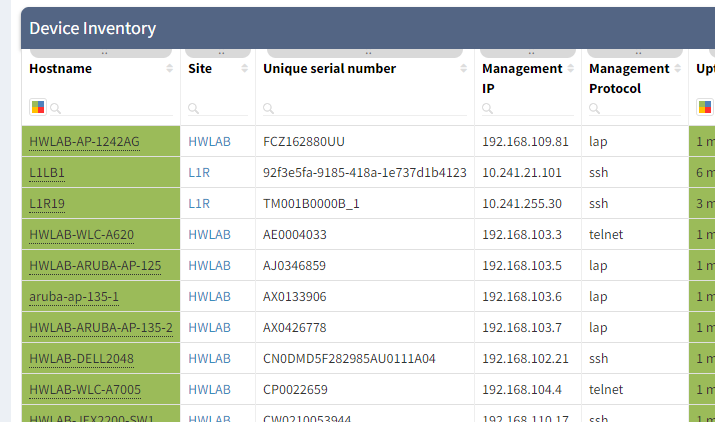
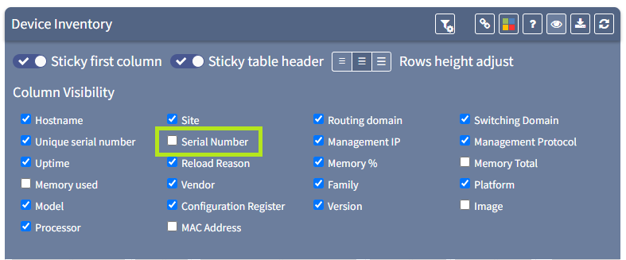
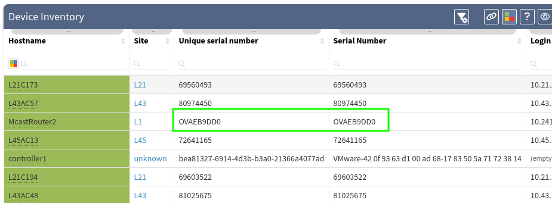

# Serial numbers

IP Fabric uses the serial number field as a key in its tables for a device. In some cases, the same serial number may be required to be used for multiple elements - for example, clusters, stacks or virtualised platforms) and so the serial number is manipulated in some way - anything from a virtual context name to a simple `_1` might be added for example.

This makes it potentially more difficult to match the serial number with other platforms outside IP Fabric.

We have added a new column to the device inventory table in `v3.7.0`, and renamed the previous one to allow us to work around this issue.

!!! example

    This is now the default view: 

    Showing the “Unique serial number” column which has been renamed. This has now been augmented with a new “serial number” column which is the serial number from the captured state of the device itself:

    

    Note when that is enabled, the difference between the two columns:

    

    The "Serial number" column is the one that will match other external captures of the serial number in other platforms.

!!! info

    In the API, these columns are defined in the request body as

    ```json
    {
      "columns": ["sn","snHw"]
    }
    ```

!!! attention

    Where `sn` is the "Unique Serial Number" field and snHw is the "Serial Number" field.
