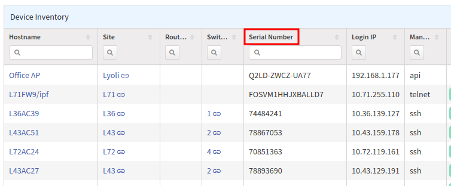
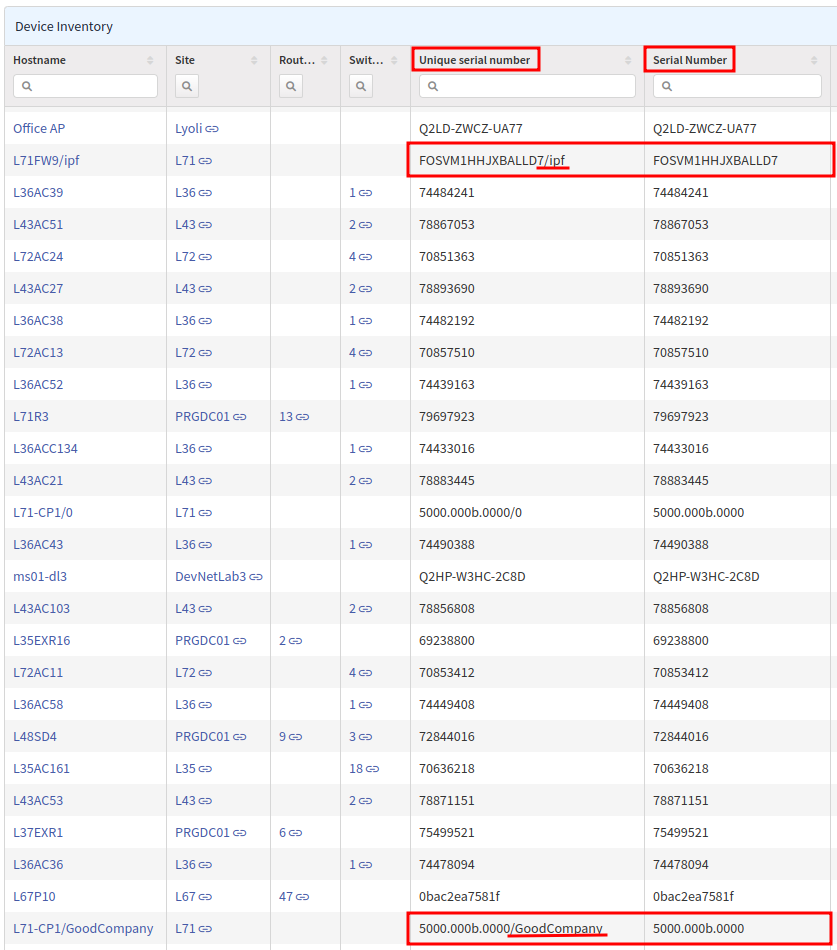

# Serial Numbers

IP Fabric uses the serial number field as a key in its tables for a device. In
some cases, the same serial number may be required to be used for multiple
elements (for example, clusters, stacks or virtualized platforms).

Thus, the serial number is manipulated by IP Fabric in some way - anything from
a virtual context name to a simple `_1` might be added.

This makes it potentially more difficult to match the serial number with other
platforms outside IP Fabric.

To work around the issue, we did the following in version `3.7.0`:

- renamed the previous `Serial Number` column in the **Device Inventory** table
  (in **Inventory --> Devices**) to `Unique serial number` (including
  virtualization unique identifier such as context, vsys, VDC etc.)
- introduced a new `Serial Number` column (containing real serial numbers as
  reported by devices themselves)

By default, only the new `Serial Number` column (with serial numbers as captured
on devices / as seen on other platforms) is shown in the **Device Inventory**
table:



The `Unique serial number` column can be additionally enabled (click `...` in
the top-right corner of the table and select `Display settings`):


As expected, some devices have different values in their `Unique serial number`
and `Serial Number` columns:



!!! info

    In the API, these columns are defined in the request body as:

    ```json
    {
      "columns": [
        "sn",
        "snHw"
      ]
    }
    ```

    where `sn` is the `Unique serial number` field and `snHw` is the `Serial
    Number` field.
